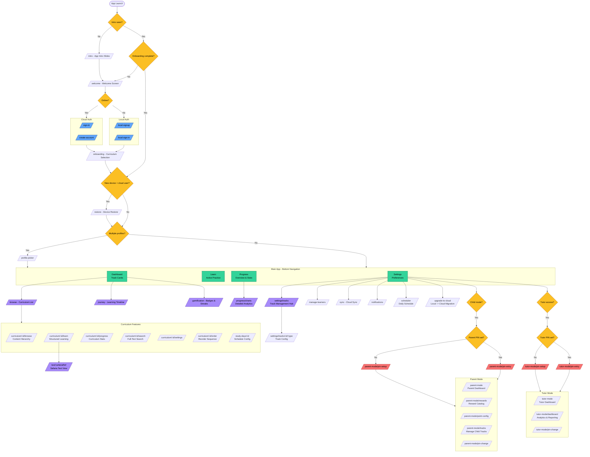
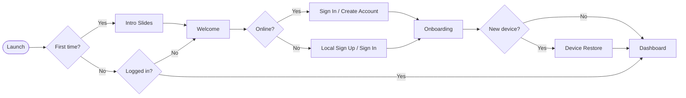

# Learning Tracker - App Flow Diagram

Paste the mermaid code blocks below into [mermaid.live](https://mermaid.live) to visualize them.

---

## Full App Flow

```mermaid
flowchart TD
    Start([App Launch]) --> IntroCheck{Intro seen?}

    %% ── Onboarding ──
    IntroCheck -- No --> Intro[/intro - App Intro Slides/]
    IntroCheck -- Yes --> OnboardCheck{Onboarding complete?}
    Intro --> Welcome[/welcome - Welcome Screen/]
    OnboardCheck -- No --> Welcome
    OnboardCheck -- Yes --> RestoreCheck

    %% ── Auth Split ──
    Welcome --> ConnCheck{Online?}
    ConnCheck -- Yes --> CloudAuth
    ConnCheck -- No --> LocalAuth

    subgraph CloudAuth [Cloud Auth]
        SignIn[/sign-in/]
        CreateAccount[/create-account/]
    end

    subgraph LocalAuth [Local Auth]
        LocalSignup[/local-signup/]
        LocalSignIn[/local-sign-in/]
    end

    CloudAuth --> Onboarding[/onboarding - Curriculum Selection/]
    LocalAuth --> Onboarding

    Onboarding --> RestoreCheck{New device + cloud user?}
    RestoreCheck -- Yes --> Restore[/restore - Device Restore/]
    RestoreCheck -- No --> ProfileCheck
    Restore --> ProfileCheck

    ProfileCheck{Multiple profiles?}
    ProfileCheck -- Yes --> ProfilePicker[/profile-picker/]
    ProfileCheck -- No --> AppShell
    ProfilePicker --> AppShell

    %% ── Main App Shell (4 Tabs) ──
    subgraph AppShell [Main App - Bottom Navigation]
        Dashboard[Dashboard\nTrack Cards]
        Learn[Learn\nActive Practice]
        Progress[Progress\nOverview & Stats]
        Settings[Settings\nPreferences]
    end

    %% ── From Dashboard ──
    Dashboard --> Browse[/browse - Curriculum List/]
    Dashboard --> Journey[/journey - Learning Timeline/]
    Dashboard --> Gamification[/gamification - Badges & Streaks/]

    %% ── Curriculum Deep Dive ──
    Browse --> CurrContent

    subgraph CurrContent [Curriculum Features]
        ContentHierarchy[/curriculum/:id/browse\nContent Hierarchy/]
        CurrLearning[/curriculum/:id/learn\nStructured Learning/]
        CurrProgress[/curriculum/:id/progress\nCurriculum Stats/]
        CurrSearch[/curriculum/:id/search\nFull-Text Search/]
        CurrSettings[/curriculum/:id/settings/]
        LearningOrder[/curriculum/:id/order\nReorder Sequence/]
        StudyDays[/study-days/:id\nSchedule Config/]
    end

    CurrLearning --> TextDisplay[/text/:sefariaRef\nSefaria Text View/]

    %% ── From Progress Tab ──
    Progress --> ProgressCharts[/progress/charts\nDetailed Analytics/]

    %% ── From Settings Tab ──
    Settings --> TrackHub[/settings/tracks\nTrack Management Hub/]
    Settings --> ManageLearners[/manage-learners/]
    Settings --> Sync[/sync - Cloud Sync/]
    Settings --> Notifications[/notifications/]
    Settings --> Scheduler[/scheduler\nDaily Schedule/]
    Settings --> UpgradeCloud[/upgrade-to-cloud\nLocal -> Cloud Migration/]
    TrackHub --> TrackDetail[/settings/tracks/:id/:type\nTrack Config/]

    %% ── Parent Mode (PIN-protected) ──
    Settings --> ParentEntry{Child mode?}
    ParentEntry -- Yes --> PinCheck1{Parent PIN set?}
    PinCheck1 -- No --> ParentPinSetup[/parent-mode/pin-setup/]
    PinCheck1 -- Yes --> ParentPinEntry[/parent-mode/pin-entry/]
    ParentPinSetup --> ParentMode
    ParentPinEntry --> ParentMode

    subgraph ParentMode [Parent Mode]
        ParentDash[/parent-mode\nParent Dashboard/]
        Rewards[/parent-mode/rewards\nReward Catalog/]
        PointConfig[/parent-mode/point-config/]
        ParentTracks[/parent-mode/tracks\nManage Child Tracks/]
        PinChange1[/parent-mode/pin-change/]
    end

    %% ── Tutor Mode (PIN-protected) ──
    Settings --> TutorEntry
    TutorEntry{Tutor access?} -- Yes --> PinCheck2{Tutor PIN set?}
    PinCheck2 -- No --> TutorPinSetup[/tutor-mode/pin-setup/]
    PinCheck2 -- Yes --> TutorPinEntry[/tutor-mode/pin-entry/]
    TutorPinSetup --> TutorMode
    TutorPinEntry --> TutorMode

    subgraph TutorMode [Tutor Mode]
        TutorDash[/tutor-mode\nTutor Dashboard/]
        TutorAnalytics[/tutor-mode/dashboard\nAnalytics & Reporting/]
        PinChange2[/tutor-mode/pin-change/]
    end

    %% ── Styling ──
    classDef guard fill:#fbbf24,stroke:#92400e,color:#000
    classDef auth fill:#60a5fa,stroke:#1e3a5f,color:#000
    classDef main fill:#34d399,stroke:#065f46,color:#000
    classDef feature fill:#a78bfa,stroke:#4c1d95,color:#000
    classDef pin fill:#f87171,stroke:#991b1b,color:#000

    class IntroCheck,OnboardCheck,RestoreCheck,ProfileCheck,ConnCheck,ParentEntry,TutorEntry,PinCheck1,PinCheck2 guard
    class SignIn,CreateAccount,LocalSignup,LocalSignIn auth
    class Dashboard,Learn,Progress,Settings main
    class Browse,Journey,Gamification,ProgressCharts,TrackHub,TextDisplay feature
    class ParentPinSetup,ParentPinEntry,TutorPinSetup,TutorPinEntry pin
```

---

## Simplified Auth Flow Only

```mermaid
flowchart LR
    A([Launch]) --> B{First time?}
    B -- Yes --> C[Intro Slides]
    C --> D[Welcome]
    B -- No --> E{Logged in?}

    D --> F{Online?}
    F -- Yes --> G[Sign In / Create Account]
    F -- No --> H[Local Sign Up / Sign In]

    G --> I[Onboarding]
    H --> I

    I --> J{New device?}
    J -- Yes --> K[Device Restore]
    J -- No --> L[Dashboard]
    K --> L

    E -- Yes --> L
    E -- No --> D
```
