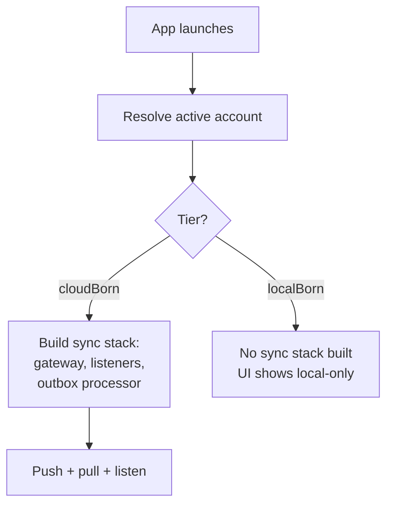
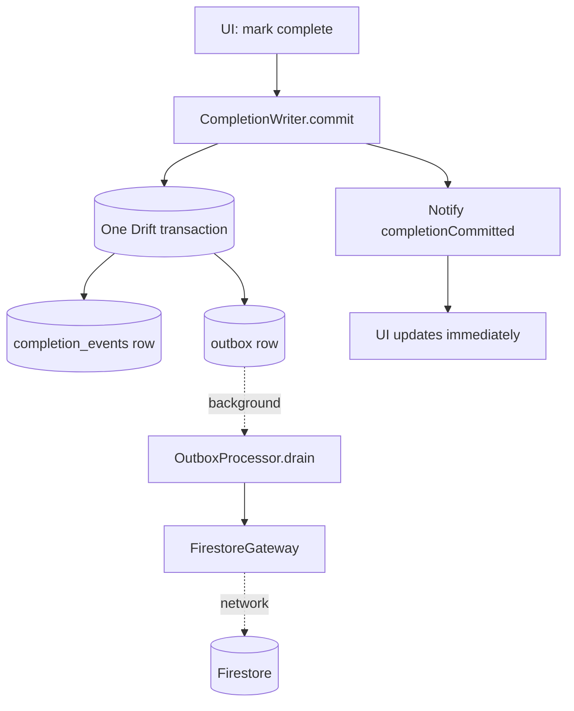
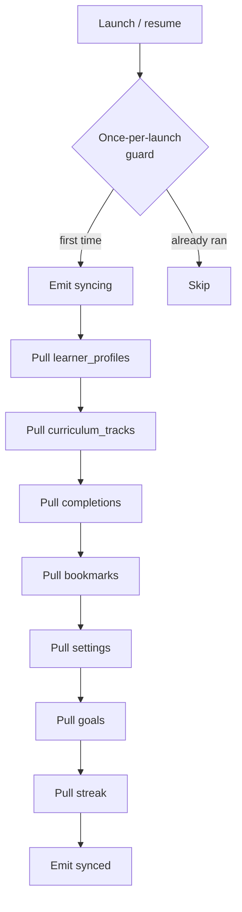
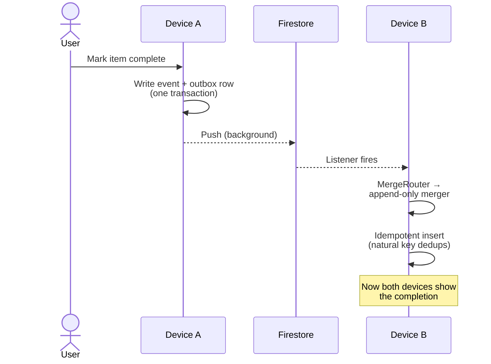

# How the Sync Subsystem Works

> Concept explainer for contributors. Part of the Learning Tracker [documentation set](../index.md).
> Reverse-derived from the codebase as of 2026-07-13. The code is the source of truth; if this document and the code disagree, the code wins.

Learning Tracker is **offline-first**. The app reads and writes a local SQLite database; cloud sync is an additive, optional layer that exists to keep a user's progress safe and consistent across devices. This document explains how that layer is designed, how a write becomes a Firestore document, how a pull merges remote state back in, and what keeps the whole thing correct.

For the Firestore document shapes and security rules, see [api-contracts.md](../api-contracts.md). For the running list of known sync defects, see [architecture.md §12](../architecture.md#12-known-issues--remediation-context).

## The mental model

Sync exists to **preserve and share local state**, not to *be* the state. Every feature in the app reads from and writes to the local database. The cloud is a mirror; the source of truth is the device.

That single decision shapes everything below:

- The UI never blocks on the network. A completion is recorded locally and the cloud catches up in the background.
- A user with no signal — on a flight, in a beis midrash, on the subway — loses nothing.
- The app works fine for users who never sign in to the cloud at all.

## Tier gating: who syncs?

Not every account syncs. Each account has one of two **tiers**:

- **`cloudBorn`** — created with a Firebase account (email, Google, or magic-link). The data syncs to Firestore.
- **`localBorn`** — created without the cloud. The data lives only on this device.

A `localBorn` account can be upgraded once to `cloudBorn` (the "upgrade to cloud" flow), and from then on it syncs.

The gate is `authState.isCloudBorn`. **Every** sync provider returns `null` when the active account is not cloud-born — so a local-only account constructs no sync objects, attaches no listeners, and flushes no queue. There is then defense in depth at lower layers: the gateway re-checks authentication, and the Firestore security rules deny anyone else's data anyway.



*Figure: the account tier decides whether the sync stack is built at all. Local-only accounts pay no cost for sync.*

## One decomposed subsystem

The sync subsystem used to run two implementations side by side: a legacy `SyncEngine` (`features/sync/data/sync_engine.dart`) plus a legacy `OfflineQueue`, alongside a newer, decomposed stack in `lib/core/sync/`. That dual-stack cut-over is finished — `SyncEngine`, `OfflineQueue`, and `FirestoreDataSource` were deleted (commit `e14479af`, "W2.35-W2.39"). Neither symbol nor file exists in `lib/` any more. There is now a single implementation:

- **`SyncOrchestrator`** (`lib/core/sync/sync_orchestrator.dart`) — coordinates pull-on-launch, push, status, and lifecycle. It owns the `LifecycleObserver` that drives resume-triggered pulls.
- **`PullPipeline`** — paginates each collection and hands rows to a **`MergeRouter`**, which dispatches by entity kind to one of the 18 `EntityMerger` implementations under `lib/core/sync/merge/`.
- **`ListenerSupervisor`** — owns the foreground Firestore real-time subscriptions, one broadcast stream per synced collection.
- **`OutboxProcessor`** — drains a transactional outbox through a `PushPipeline` implementation, covering every entity kind that pushes to Firestore.

This is still the highest-risk area in the codebase — not because of an incomplete cutover, but because of its size, its correctness invariants, and how much of the app's data depends on it behaving correctly across two devices.

When you change sync code, run `make test-invariants` — the N1–N8 regression suite encodes the bugs the project has fixed before and does not want back.

## Pushing a write

Writes never go straight to the cloud. They queue locally, in a table, then flush in the background.



*Figure: a completion writes a local event row and an outbox row in one transaction. The UI updates immediately. A background processor drains the outbox to Firestore.*

Every syncable entity pushes through one queue:

- **`Outbox`** (transactional) — completions, streak events, settings, track changes, and every other entity kind. The outbox row is written in the **same Drift transaction** as the local data, so a local commit cannot succeed without an outbound side-effect being queued. The `OutboxProcessor` drains it in batches, with idempotency keys and bounded exponential backoff.

**The UI never awaits the network.** Marking a completion looks instantaneous because it *is* — the cloud catches up later.

## Pulling remote state

A pull happens on three triggers:

1. **App launch**, once per session.
2. **App resume** from background, throttled to once every five minutes.
3. **A foreground listener** receives a change from another device.

The pull-on-launch flow runs seven sequential steps for `cloudBorn` accounts:



*Figure: pull-on-launch paginates each collection in turn and routes pages to the right merger. Each step has its own timeout; the whole pull has an outer timeout so a hung pull never blocks indefinitely.*

Foreground listeners stream live changes from the same set of collections. **Local-echo writes are suppressed** — a write that the client just made (and Firestore is acknowledging back) is filtered out via `hasPendingWrites`, so the same change does not merge over itself.

## How conflicts are resolved

Each entity uses one of two merge strategies, dispatched by kind:

- **Append-only / insert-if-absent** — completions, streak events, ledger entries. Two devices that mark the same item complete produce idempotent inserts that collapse on a unique natural key. **Tombstone-aware:** if a row is locally tombstoned but appears remotely as live, the local tombstone is cleared ("remote is more alive").
- **Last-write-wins (LWW)** — bookmarks, settings, tracks, profiles, stage definitions, goals, learning order, profile programs. Each row carries an `updatedAt`; on a merge, **remote wins only if strictly newer** — ties go to local (anti-flapping). No version vectors, purely timestamp-based.

That trade-off is deliberate. The most data-sensitive things (completions, streaks) cannot conflict, because they are events, not state. The mutable things (preferences, bookmarks) accept the occasional loser in an LWW race, because losing one minor edit is better than the alternatives.

## Two devices, converging

When the same user has the app open on two devices, both push and both pull, and they converge:



*Figure: a completion on Device A flows to Device B via Firestore. The natural-key dedup means the merge is safe even if Device B's listener fires twice.*

## What keeps it correct

Three lines of defense:

1. **Idempotent natural keys** — every event row has a UNIQUE composite key in SQLite (`INSERT OR IGNORE`). Re-applying a merge is harmless.
2. **Tombstones, never deletes** — event-log rows are never physically removed; deletion sets `purgedAt`. Row counts never decrease.
3. **The N1–N8 regression invariants** — `test/story_acceptance/regression_invariants_test.dart` encodes eight invariants the project has paid for in production bugs:

   - The offline queue drains to zero after a successful flush.
   - `syncOrchestratorProvider` does not `ref.watch` volatile dependencies (preventing duplicate observers).
   - A fresh profile shows zero completions and no streak row.
   - Deleting and re-adding a track preserves lifetime completions but resets the current-session count.
   - `restoreOrCreate` stamps `activatedAt` so the new cycle starts fresh.
   - The aggregate count uses distinct refs, so the lifetime percentage agrees with "items done".
   - A pace-goal's projected finish anchors to `goal.createdAt`, not `now`.
   - `purgeHistory` uses tombstones; event-log row counts never decrease.

The invariant suite is the safety net. When you change sync code, run `make test-invariants` — a green run is the price of admission.

## Previously known sharp edges — now resolved

Earlier revisions of this document listed four sync defects as open. Re-verified against the current code, all four are closed:

- ~~`learning_order` has no `EntityMerger` in the new stack~~ — `learning_order_merger.dart` exists and is wired into `MergeRouter` (closed by W2.26).
- ~~The push and read paths for curriculum-import metadata disagree on the collection name~~ — both sides were renamed to a single `import_metadata` collection (W3.34).
- ~~`DriftMergeStore.currentUpdatedAt` returns `null` for some kinds~~ — the `SyncKv` table now persists the last-applied `updated_at` per `(kind, entityKey)` for every LWW merger (Phase 3 of the sync architecture plan), so `remoteIsNewer` is symmetric instead of always letting remote win on the first merge.
- ~~`deleteUserData`'s subcollection list is stale~~ — `FirestoreGatewayImpl.perProfileSubcollectionsForDeletion` is `@visibleForTesting` and kept in sync with the real per-profile collection names (AUD-core-sync-02).

The active list of sync defects and gaps, if any are currently open, lives in [architecture.md §12](../architecture.md#12-known-issues--remediation-context).

## Where the code lives

```text
lib/
├── core/sync/                          # The sync subsystem (single stack)
│   ├── sync_orchestrator.dart          # Coordinates pulls + listeners + lifecycle
│   ├── firestore_gateway.dart          # The single I/O seam to Firestore
│   ├── firestore_gateway_impl.dart     # Only file allowed to import cloud_firestore
│   ├── pull_pipeline.dart              # Paginates and dispatches pulls
│   ├── listener_supervisor.dart        # Owns Firestore real-time subscriptions
│   ├── lifecycle_observer.dart         # Resume-triggered pulls
│   ├── merge/                          # MergeRouter + 18 EntityMergers
│   └── outbox/                         # OutboxProcessor + PushPipeline
└── features/sync/                      # Outbox write facade + sync-status UI
    ├── data/outbox_sync_write_facade.dart   # SyncWriteFacade → outbox rows
    ├── data/local_data_upload_service.dart  # pushAllLocalData (upgrade-to-cloud)
    └── presentation/                        # Sync status indicator, restore screens
```

For the full architectural picture, see [architecture.md §6](../architecture.md#6-sync-architecture).
