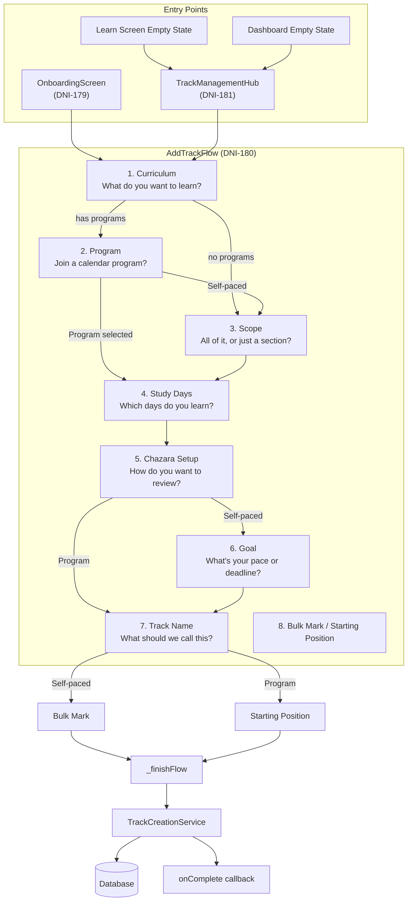
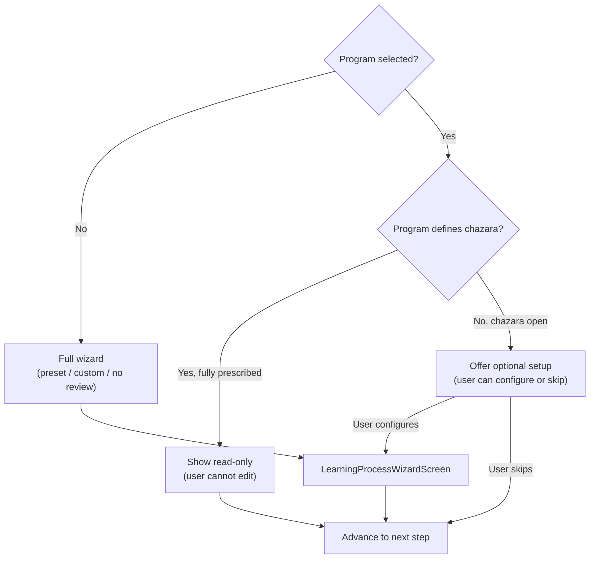
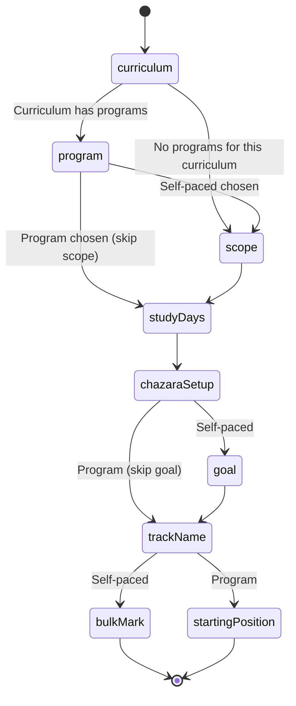
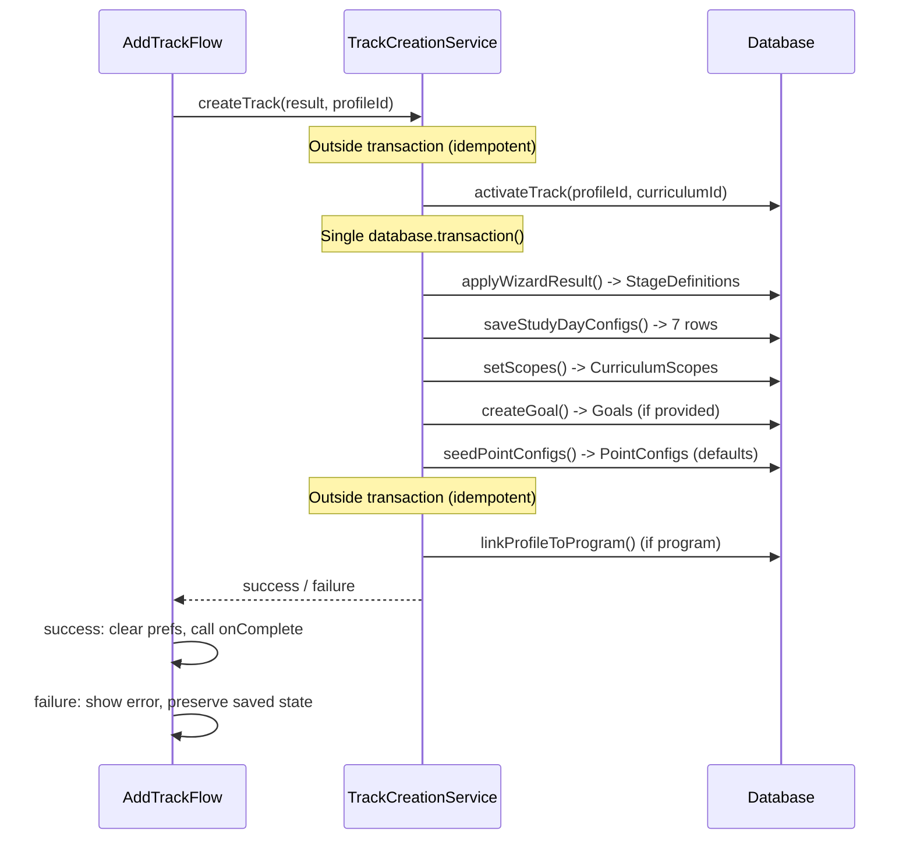
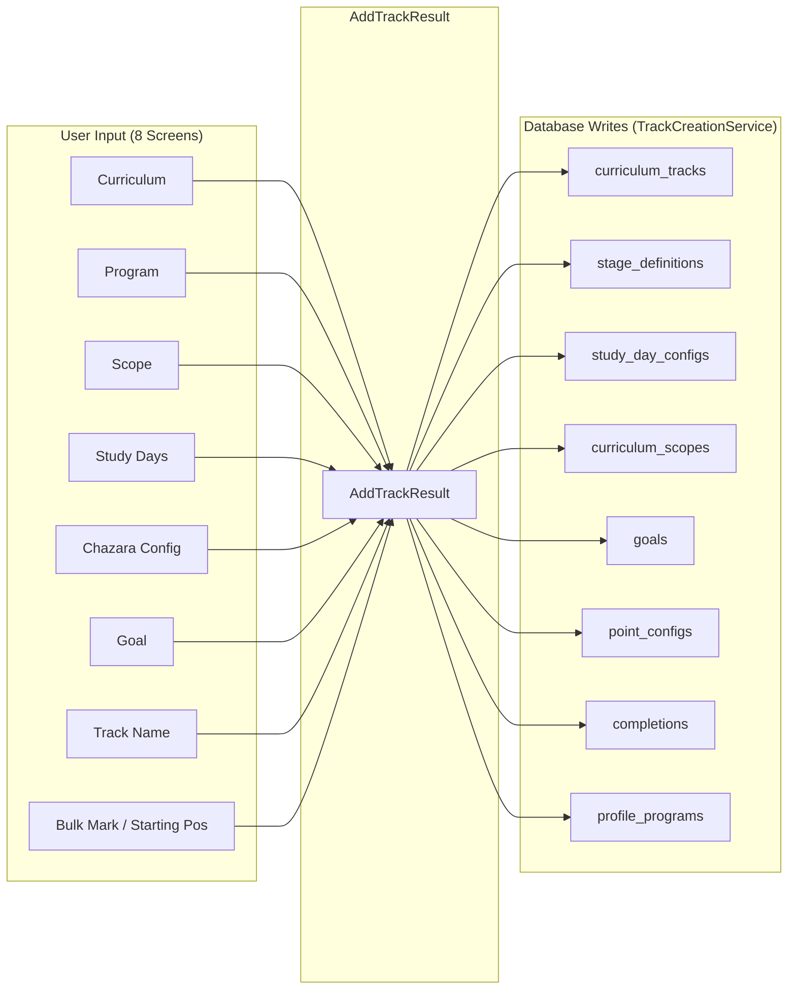

# AddTrackFlow — Developer Reference

## Table of Contents

- [Overview](#overview)
- [Design Principles](#design-principles)
- [Architecture Diagram](#architecture-diagram)
- [File Map](#file-map)
- [Widget API](#widget-api)
- [The 8 Screens](#the-8-screens)
- [Program-Aware Branching](#program-aware-branching)
- [Program Prescription Model](#program-prescription-model)
- [State Management](#state-management)
- [State Persistence (Resume on Restart)](#state-persistence-resume-on-restart)
- [Track Creation Service](#track-creation-service)
- [Data Flow Diagram](#data-flow-diagram)
- [Embedding AddTrackFlow](#embedding-addtrackflow)
- [Models & Types](#models--types)
- [Database Tables Touched](#database-tables-touched)
- [Provider Invalidation](#provider-invalidation)
- [Acceptance Criteria](#acceptance-criteria)
- [Test Coverage](#test-coverage)

---

## Overview

`AddTrackFlow` is a **standalone widget** that sets up ONE learning track. It knows nothing about user onboarding. It can be launched from:

- Onboarding (first track)
- Settings / Track Management Hub (add another track)
- Learn screen empty state
- Dashboard empty state

Same widget, same flow, every time. Each screen asks ONE question. Never mix concepts.

**Source of truth:** [DNI-180](https://linear.app/dniasoff/issue/DNI-180) (Linear)
**Source:** `lib/features/track_setup/presentation/screens/add_track_flow.dart`

---

## Design Principles

**"Show don't ask"** — Anything the program dictates is displayed as informational (read-only), not editable. Anything left open is offered as a choice.

**One concept per screen** — Each of the 8 screens collects exactly one thing. Goals and study days are never on the same screen. Scope and import are never on the same screen.

**Program before scope** — Program (screen 2) comes BEFORE scope (screen 3). If user selects a program, scope is irrelevant (the program defines it), so it is skipped entirely.

**Not in this flow:**

- No rewards setup (parents do that later in Parent Mode)
- No profile creation (that is user onboarding, DNI-179)
- No language selection (that is user onboarding, DNI-179)

---

## Architecture Diagram



---

## File Map

All paths relative to `lib/` within the Flutter project root.

### Domain Layer

| File | Role |
|------|------|
| `features/track_setup/domain/entities/add_track_result.dart` | `AddTrackResult`, `AddTrackState`, `AddTrackStep` enum, `ScopeEntry` |
| `features/track_setup/domain/services/track_creation_service.dart` | Orchestrates all DB writes in a single `_database.transaction()` |

### Presentation Layer

| File | Role |
|------|------|
| `features/track_setup/presentation/screens/add_track_flow.dart` | Main 8-step wizard widget |
| `features/track_setup/presentation/widgets/curriculum_picker_step.dart` | Screen 1 — curriculum grid |
| `features/track_setup/presentation/widgets/program_selection_step.dart` | Screen 2 — program cards + "self-paced" option |
| `features/track_setup/presentation/widgets/track_label_step.dart` | Screen 7 — name field with smart defaults |
| `features/track_setup/presentation/providers/add_track_providers.dart` | `trackCreationServiceProvider` |
| `features/track_setup/presentation/providers/track_management_providers.dart` | `activeTracksProvider`, `archivedTracksProvider` streams |

### External Screens Launched by Step Adapters

| File | Used In Screen |
|------|---------------|
| `features/onboarding/presentation/screens/learning_process_wizard_screen.dart` | Screen 5 — chazara config |
| `features/scheduler/presentation/screens/goal_setup_screen.dart` | Screen 6 — goal setup |
| `features/onboarding/presentation/screens/bulk_mark_screen.dart` | Screen 8 — self-paced bulk mark |
| `features/settings/presentation/screens/scope_selection_screen.dart` | Referenced for scope hierarchy data |
| `features/scheduler/presentation/screens/study_day_config_screen.dart` | Referenced for study day config logic |

### Supporting Infrastructure

| File | Role |
|------|------|
| `core/constants/hebrew_terms.dart` | Hebrew stage names (לימוד, חזרה א׳, etc.) |
| `core/database/daos/track_dao.dart` | Track activation, archiving |
| `core/database/daos/learning_program_dao.dart` | Program lookup by curriculum type |
| `core/database/daos/curriculum_scope_dao.dart` | Scope persistence |
| `core/database/daos/study_day_config_dao.dart` | Study day persistence |
| `core/database/seed/learning_program_seeds.dart` | Preset program definitions |

### Key Patterns

- **Adapter pattern** — Each step is either a dedicated widget (`CurriculumPickerStep`, `ProgramSelectionStep`, `TrackLabelStep`) or an inline private `_*StepAdapter` widget inside `add_track_flow.dart`
- **PageView + NeverScrollableScrollPhysics** — Steps are pages controlled programmatically, not by swiping
- **PopScope** — Intercepts system back button to go to previous step or show exit dialog
- **Local state** — `AddTrackState` (Freezed) manages wizard state locally, NOT via Riverpod providers
- **Clean architecture** — Domain layer must NOT import presentation layer
- **Feature isolation** — No cross-feature module imports; use core providers

---

## Widget API

```dart
AddTrackFlow(
  profileId: int,           // which profile this track belongs to
  isOnboarding: bool,       // minor UX tweaks (header text)
  isChildMode: bool,        // for future child-specific behavior
  onComplete: (AddTrackResult) -> void,  // callback when done
  onCancel: () -> void,      // callback when user backs out
)
```

| Parameter | Purpose |
|-----------|---------|
| `profileId` | Which learner profile this track belongs to |
| `isOnboarding` | `true` during first-run onboarding (affects back-button behavior — returns to language step instead of exit dialog) |
| `isChildMode` | `true` for child profiles (for future child-specific behavior) |
| `onComplete` | Called with `AddTrackResult` after successful track creation |
| `onCancel` | Called when user backs out of screen 1 or confirms exit |

---

## The 8 Screens

### Screen 1: Curriculum — "What do you want to learn?"

**Widget:** `CurriculumPickerStep`

Shows all 9 curricula with Hebrew names. User taps ONE to advance.

| CurriculumId | Hebrew | Has Programs |
|-------------|--------|--------------|
| `mishnayos` | משניות | Yes |
| `bavli` | תלמוד בבלי | Yes |
| `yerushalmi` | תלמוד ירושלמי | Yes |
| `chumash` | חומש | No |
| `nach` | נ"ך | Yes |
| `tanach` | תנ"ך | No |
| `mishna_berurah` | משנה ברורה | Yes |
| `mussar` | מוסר | Yes |
| `torah` | תורה | No |

**Side effect:** Starts loading bundled content into DB in background (invisible to user). No separate "importing" screen.

---

### Screen 2: Program — "Join a calendar program?"

**Widget:** `ProgramSelectionStep`

**AUTO-SKIP** this screen entirely if no programs exist for the selected curriculum.

If programs exist: shows program cards + "Self-paced (no program)" option.

- **Program selected** → skip Scope (screen 3) entirely — program defines scope
- **"Self-paced" selected** → proceed to Scope

Programs load from DB via `LearningProgramDao.getProgramsByCurriculumType()` — no hardcoded IDs.

**On selection:** Stores `programId`, `programName`, and the full `LearningProgram` object (for `stagesConfig` parsing). Clears any previously selected scope.

---

### Screen 3: Scope — "All of it, or just a section?"

**SKIP entirely if a program was selected on Screen 2.** Only shown for self-paced (no program) tracks.

- **"All" button** (default, prominent) — tracks entire curriculum
- **Drill into hierarchy** — pick a subset (e.g., just סדר זרעים, just מסכת ברכות)

If bundled content is not loaded yet from screen 1, shows a brief spinner then the hierarchy.

**Skip = all** (track everything).

**Hierarchy examples:**

| Curriculum | Level 1 | Level 2 | Level 3 | Level 4 |
|-----------|---------|---------|---------|---------|
| Mishnayos | Seder | Masechta | Perek | Mishna |
| Bavli | Masechta | Daf | Amud | — |
| Chumash | Sefer | Parsha | Perek | Pasuk |

---

### Screen 4: Study Days — "Which days do you learn?"

**Layout: Vertical list** — each day on its own row (NOT horizontal chips).

7-day week picker. Default: **all 7 days active** (Sun–Shabbos). Saturday displayed as "Shabbos". User toggles days on/off.

**Skip = use default (all days).**

This screen comes BEFORE חזרה so chazara configuration can reference available study days.

**Program mode:** Auto-fill from program metadata. Show read-only (don't ask).

```dart
const kDefaultStudyDays = <int, String>{
  7: 'study', // Sunday
  1: 'study', // Monday
  2: 'study', // Tuesday
  3: 'study', // Wednesday
  4: 'study', // Thursday
  5: 'study', // Friday
  6: 'study', // Shabbos
};
```

---

### Screen 5: Chazara Setup — "How do you want to review?"

Choose a preset, customize stages, or "no חזרה". Presets show Hebrew: לימוד → חזרה א׳ → חזרה ב׳. All חזרה config on ONE screen.

**Skip = no review.**



**Program mode — two behaviors:**

| Condition | Behavior |
|-----------|----------|
| Program **defines** chazara (Dirshu, Oraysa) | **Show read-only** — display stages, user cannot edit |
| Program **leaves chazara open** (Daf Yomi, Mishnah Yomis, Nach Yomi) | **Offer optional setup** — user can configure or skip |

**Chazara detection:** Parse `stagesConfig` JSON → check for entries where `stage` starts with `'chazara_'`.

**Wizard modes:**

| Mode | Description |
|------|-------------|
| Preset | Parse program's `stagesConfig` into stage definitions with schedule types (`delay`, `weekly`, `rolling`) |
| Custom | User configures 1–5 chazara rounds with timing per round (delay-only, or delay + שבת review, or delay + Friday + שבת) |
| No Review | Creates only a לימוד (learn) stage |

---

### Screen 6: Goal — "What's your pace or deadline?"

Pace-based (e.g., "1 daf/day") OR deadline-based (e.g., "finish by date X"). Just the goal, nothing else.

**Skip = no goal tracking.**

**Program mode: SKIP entirely** — program goal is always "finish the program".

| Mode | User Sets | System Calculates |
|------|-----------|-------------------|
| Deadline | Target date (Gregorian or Hebrew) | Daily pace |
| Pace | Items per day or per week | Projected completion date |

---

### Screen 7: Track Name — "What should we call this?"

**Widget:** `TrackLabelStep`

Text field with RTL support and a **smart default pre-filled**:

```
Priority: programName > lastScopeValue > curriculum displayNameHe
```

| Scenario | Default Label |
|----------|--------------|
| Daf Yomi program | "דף היומי" |
| Bavli scoped to Berachot | "מסכת ברכות" |
| Mishnayos, no scope | "משניות" |

**Program mode:** Auto-fill from program display name.

Near the end so the default knows about program + scope selections.

---

### Screen 8: Starting Position / Bulk Mark

Two variants depending on track type:

**Self-paced mode (no program) → Bulk Mark:**

Mark items already completed. Marks ALL stages done by default, with option to mark stages separately. No future חזרה scheduled for marked items. Skip = nothing pre-marked.

Multi-phase UI:

1. **Selection** — hierarchy drill-down + multi-select + search
2. **Stage selection** — per-selection stage checkboxes, with "Apply to All"
3. **Confirmation** — item count x stage count = total completions
4. **Processing** — `BulkPriorCompletionService.execute()`
5. **Done** — summary

**Program mode → Starting Position:**

Auto-detect current position from local calendar. Display in Hebrew:

> **"Today: בבא קמא דף מ״ב — Start here?"**

Option to adjust. Returns a `startingRef` (Sefaria reference string).

> **Note:** Starting position auto-detection depends on Epic 19 local calendar infrastructure.

---

## Program-Aware Branching

The flow computes `_activeSteps` dynamically — a filtered list of `AddTrackStep` values based on the user's selections so far. The `PageView` only renders pages for active steps.



### Step behavior by track type

| Screen | Self-Paced Track | Program (open chazara) | Program (fully prescribed) |
|--------|-----------------|----------------------|---------------------------|
| 1. Curriculum | Ask | Ask | Ask |
| 2. Program | Ask (or auto-skip if none) | Ask | Ask |
| 3. Scope | Ask | **Skip** | **Skip** |
| 4. Study Days | Ask (editable) | **Auto-fill, show read-only** | **Auto-fill, show read-only** |
| 5. Chazara | Ask (full wizard) | **Offer optional setup** | **Show read-only** |
| 6. Goal | Ask | **Skip** (always "finish") | **Skip** (always "finish") |
| 7. Track Name | Ask (smart default) | **Auto-fill from program name** | **Auto-fill from program name** |
| 8. Completion | Bulk mark | **Starting position from calendar** | **Starting position from calendar** |

---

## Program Prescription Model

Program metadata (`stagesConfig` JSON) in the `learning_programs` table determines flow behavior:

- **Pace** — `"pace": "one_daf"`, `"half_daf"`, `"two_mishnayos"`, `"one_chapter"`
- **Study frequency** — `"frequency": "daily"` in learn stage
- **Chazara stages** — array of `{"stage": "chazara_1", "delay_days": 1}` entries
- **Whether chazara is defined** — programs with chazara stages = fully prescribed; programs with only a learn stage = open

### Fully Prescribed Programs

Auto-fill study days + chazara (shown read-only), skip goal:

| Program | Chazara Stages |
|---------|---------------|
| Oraysa | 4 chazara stages |
| Dirshu Kinyan Torah | 3 rounds (1d, 7d, 21d) |
| Dirshu Amud HaYomi | 3 rounds |
| Dirshu Kinyan Yerushalmi | 3 rounds |
| Dirshu Daf HaYomi B'Halacha | 1 round (7d) |
| Dirshu Kinyan Chochma | 3 rounds |

### Open Chazara Programs

Auto-fill study days, offer optional chazara setup, skip goal:

| Program | Chazara |
|---------|---------|
| Daf Yomi | Truly open and optional |
| Mishnah Yomis | Open |
| Nach Yomi | Open |

---

## State Management

### AddTrackState

Internal mutable state tracking all user selections across the wizard:

```dart
@freezed
class AddTrackState {
  const factory AddTrackState({
    @Default(AddTrackStep.curriculum) AddTrackStep currentStep,
    CurriculumId? curriculumId,
    List<ScopeEntry>? scopeSelections,
    int? programId,
    String? programName,
    Object? selectedProgram,        // Full LearningProgram object
    Map<int, String>? studyDays,
    Object? wizardResult,           // LearningProcessWizardResult
    Object? goalResult,             // GoalFormResult
    String? trackLabel,
    Object? bulkMarkResult,         // BulkMarkResult
    String? startingRef,
    @Default(false) bool contentActivated,
  }) = _AddTrackState;
}
```

**Note on `Object?` fields:** `wizardResult`, `goalResult`, and `bulkMarkResult` are typed as `Object?` rather than their concrete types. This keeps `add_track_result.dart` free of imports from the onboarding and scheduler features — a deliberate clean architecture boundary.

### Step Completion Callbacks

Each step completion updates `_state` and calls `_goToNextStep()`:

| Callback | Updates |
|----------|---------|
| `_onCurriculumSelected(curriculum)` | `curriculumId`, triggers background content activation |
| `_onProgramSelected(id, name, program)` | `programId`, `programName`, `selectedProgram`; clears `scopeSelections` if program changed |
| `_onScopeComplete(scopes)` | `scopeSelections` |
| `_onStudyDaysComplete(days)` | `studyDays` |
| `_onChazaraComplete(wizardResult?)` | `wizardResult` |
| `_onGoalComplete(goalResult?)` | `goalResult` |
| `_onTrackLabelComplete(label)` | `trackLabel` |
| `_onBulkMarkComplete(result?)` | `bulkMarkResult`, calls `_finishFlow()` |
| `_onStartingPositionComplete(ref?)` | `startingRef`, calls `_finishFlow()` |

### Navigation

- `_goToNextStep()` — advances `_pageController` to next active step index, saves state to prefs
- `_goToPreviousStep()` — animates back; on screen 1, shows exit confirmation dialog
- Back button / swipe — triggers `_handleExit()` with confirmation

---

## State Persistence (Resume on Restart)

The wizard saves progress to `SharedPreferences` so users can resume after an app restart or interruption:

```dart
const _kAddTrackStep        = 'add_track_step';           // int - step index
const _kAddTrackCurriculum  = 'add_track_curriculum';      // String - storageKey
const _kAddTrackScope       = 'add_track_scope';           // String - JSON array
const _kAddTrackProgram     = 'add_track_program';         // int - program ID
const _kAddTrackProgramName = 'add_track_program_name';    // String
const _kAddTrackStudyDays   = 'add_track_study_days';      // String - JSON map
const _kAddTrackLabel       = 'add_track_label';           // String
```

**On init:** Reads prefs, reconstructs `_state`, reloads the full `LearningProgram` from the database (by `programId`), then jumps `PageView` to the saved step index.

**On finish:** All keys cleared from `SharedPreferences` ONLY after `TrackCreationService.createTrack()` succeeds. On failure, saved state is preserved so the user can retry.

**On cancel:** All keys are cleared.

---

## Track Creation Service

`TrackCreationService.createTrack(AddTrackResult result, int profileId)` executes all database writes when the flow completes. All writes are wrapped in a single `_database.transaction()`.



**On success:** Clears saved state, invokes `onComplete` callback.

**On failure:** Shows error snackbar. Saved state is NOT cleared so the user can retry. `onComplete` is NOT fired.

### Stage Creation (via LearningProcessWizardService)

Three paths based on wizard result mode:

| Mode | What Happens |
|------|-------------|
| **Preset** | Parses program's `stagesConfig` JSON -> creates stages with parsed schedule types (`delay`, `weekly`, `rolling`) |
| **Custom** | Creates לימוד + N custom חזרה rounds with user-specified delays/weekly days |
| **No Review** | Creates a single לימוד stage |

---

## Data Flow Diagram



---

## Embedding AddTrackFlow

### In OnboardingScreen (DNI-179)

Embedded inline after profile creation (name + mode) + language selection. `isOnboarding: true` changes back-button behavior — `onCancel` returns to language step instead of showing exit dialog.

After the first track completes, OnboardingScreen shows an "Add Another Track" / "Start Learning" prompt. The user can add multiple tracks before proceeding. "Start Learning" goes to Dashboard (adult) or handoff screen (child).

OnboardingScreen's `_ScreenPhase` enum contains ONLY: `profileCreation`, `languageSelection`, `addTrack`, `addAnotherPrompt`, `handoff`, `done`.

### In TrackManagementHubScreen (DNI-181)

The hub toggles `_addingTrack` state via the FAB button. When `true`, the hub renders `AddTrackFlow` inline as the body. Pass `startAdding: true` as a route parameter to open the flow immediately.

```dart
if (_addingTrack) {
  return Scaffold(
    appBar: AppBar(title: const Text('Add Track')),
    body: AddTrackFlow(
      profileId: ref.watch(activeProfileIdProvider),
      isOnboarding: false,
      isChildMode: ...,
      onComplete: _onAddTrackComplete,
      onCancel: () => setState(() => _addingTrack = false),
    ),
  );
}
```

**Track Management Hub features:**

- Lists all active tracks grouped by curriculum
- Each track shows: label, curriculum (Hebrew), program, scope summary
- FAB "Add Track" button embeds AddTrackFlow inline
- Long-press to archive track (preserves data, hides from dashboard/scheduler)
- "Show Archived" FilterChip toggle reveals archived tracks with "Reactivate" option
- Cannot archive last active track
- Empty state: "Add Your First Track" CTA

### From Empty States

- **Learn screen:** "No active tracks" + "Add Track" button -> routes to `TrackManagementHubRoute`
- **Dashboard:** "Add Track" CTA -> routes to `TrackManagementHubRoute`

"Browse Curricula" text is removed from the codebase entirely.

---

## Models & Types

### AddTrackStep Enum

```dart
enum AddTrackStep {
  curriculum,    // Screen 1
  program,       // Screen 2 (auto-skip if no programs)
  scope,         // Screen 3 (auto-skip if program selected)
  studyDays,     // Screen 4 (program: auto-fill read-only)
  chazaraSetup,  // Screen 5 (program: show or offer based on prescription)
  goal,          // Screen 6 (program: skip)
  trackName,     // Screen 7 (program: auto-fill)
  bulkMark,      // Screen 8 (program: starting position)
}
```

### AddTrackResult

```dart
@freezed
class AddTrackResult {
  const factory AddTrackResult({
    required CurriculumId curriculumId,
    required String label,
    int? programId,
    String? programName,
    List<ScopeEntry>? scopeSelections,
    required Map<int, String> studyDays,
    Object? wizardResult,
    Object? goalResult,
    Object? bulkMarkResult,
    String? startingRef,
  }) = _AddTrackResult;
}
```

### ScopeEntry

```dart
@freezed
class ScopeEntry {
  const factory ScopeEntry({
    required int level,
    required String value,
  });
}
```

### GoalFormResult (from goal_setup_screen.dart)

```dart
class GoalFormResult {
  final double targetPercent;
  final DateTime? targetDate;
  final String description;
  final String dateType;   // 'gregorian' | 'hebrew'
  final String goalType;   // 'deadline' | 'pace'
  final int? paceValue;
  final String? paceUnit;  // 'per_day' | 'per_week'
}
```

### BulkMarkResult (from bulk_mark_screen.dart)

```dart
class BulkMarkResult {
  final int itemCount;
  final int completionCount;
}
```

---

## Database Tables Touched

| Table | Written By | When |
|-------|-----------|------|
| `active_curricula` | `CurriculumActivationService` | Always — idempotent activation |
| `curriculum_tracks` | `TrackDao.activateTrack()` | Always — creates/reactivates the track row |
| `stage_definitions` | `LearningProcessWizardService.applyWizardResult()` | Always — defines learn + chazara stages |
| `study_day_configs` | `TrackCreationService._saveStudyDays()` | Always — delete + insert 7 rows |
| `curriculum_scopes` | `CurriculumScopeDao.setScopes()` | Self-paced with scope selections only |
| `goals` | `GoalRepository.createGoal()` | When user sets a deadline or pace goal |
| `point_configs` | `PointConfigDao.seedDefaults()` | When no configs exist — seeds 10/5/3 points |
| `completions` | `BulkPriorCompletionService.execute()` | When user marks prior completions (self-paced, via BulkMarkScreen) |
| `profile_programs` | `TrackCreationService` | When user selects a program — links profile to program |

---

## Provider Invalidation

After track creation, the `onComplete` callback invalidates these providers to trigger UI rebuilds:

| Provider | Why |
|----------|-----|
| `activeTracksProvider` | New track appears in track list |
| `stageListProvider` | New stage definitions created |
| `allDailyTasksProvider` | Scheduler needs to include new track |
| `studyDayConfigsProvider` | New study day configs seeded |
| `dashboardPaceStatusProvider` | Pace recalculation with new goal |

---

## Acceptance Criteria

From [DNI-180](https://linear.app/dniasoff/issue/DNI-180):

| AC | Requirement |
|----|-------------|
| AC-1 | `AddTrackFlow` is standalone with NO dependency on OnboardingScreen |
| AC-2 | Exactly 8 screens, each with ONE concept |
| AC-3 | Program (screen 2) comes BEFORE Scope (screen 3) — if program selected, scope is skipped |
| AC-4 | Program screen auto-skips when no programs exist for the curriculum |
| AC-5 | Content loading from bundled assets is invisible — no "import" screen |
| AC-6 | Track name defaults are smart: program name > scope name > curriculum name |
| AC-7 | Bulk mark marks ALL stages complete by default, with option to mark stages separately |
| AC-8 | Back navigation preserves all selections on every screen |
| AC-9 | State persists across app interruption (SharedPreferences) |
| AC-10 | On completion, creates the track in DB with all settings applied |
| AC-11 | No rewards step in this flow |
| AC-12 | Study days uses **vertical layout** (each day on its own row) |
| AC-13 | Study days (screen 4) comes BEFORE חזרה (screen 5) |
| AC-14 | Program: study days auto-filled and shown read-only |
| AC-15 | Program with defined chazara: shown read-only (not editable) |
| AC-16 | Program with open chazara: offer optional setup |
| AC-17 | Goal step skipped for all program tracks |
| AC-18 | Track name auto-fills from program display name when program selected |
| AC-19 | Starting position shows current calendar position in Hebrew with option to adjust |
| AC-20 | Self-paced tracks go through the full flow unchanged |
| AC-21 | `ProgramSelectionStep` loads programs from DB via DAO — no hardcoded IDs |
| AC-22 | Default study days = all 7 days active (Sun–Shabbos). Saturday displayed as "Shabbos" |

---

## Test Coverage

### Acceptance Tests

`test/story_acceptance/epic_18_track_overhaul_test.dart`:

- Verifies `AddTrackStep` has exactly 8 values in correct order
- Confirms `program` (index 1) comes before `scope` (index 2)
- Confirms `studyDays` (index 3) comes before `chazaraSetup` (index 4)
- Confirms no rewards step exists in the enum
- Validates `AddTrackResult` compiles without a rewards field
- Tests point config seeding on track creation

### Widget Tests

| File | Covers |
|------|--------|
| `curriculum_picker_step_test.dart` | Grid rendering, all 9 curricula shown, tap selection callback |
| `program_selection_step_test.dart` | Program cards from DB, self-paced option, empty state auto-skip |
| `track_label_step_test.dart` | Smart defaults, RTL direction, non-empty validation |

### Unit Tests

| File | Covers |
|------|--------|
| `add_track_result_test.dart` | 16 tests — AddTrackResult construction, ScopeEntry, AddTrackState, AddTrackStep enum ordering |
