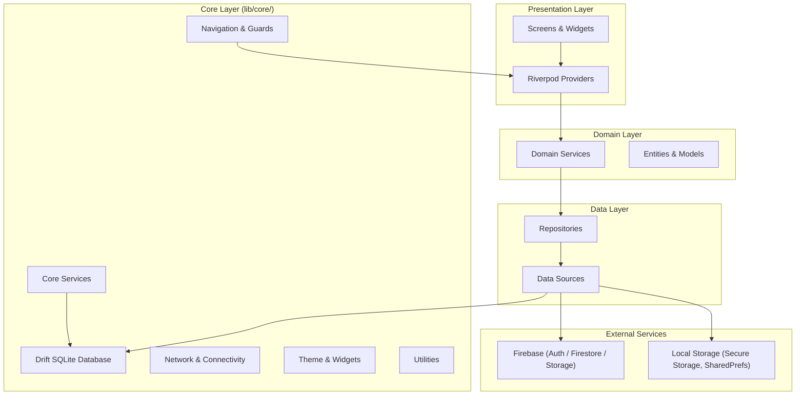
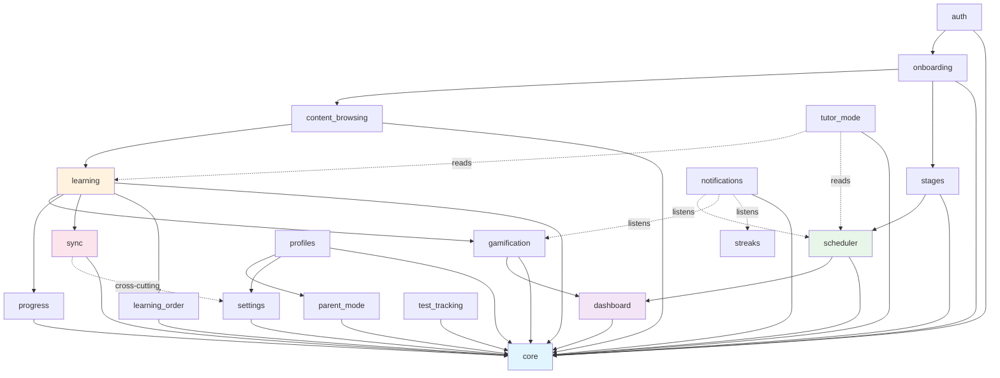
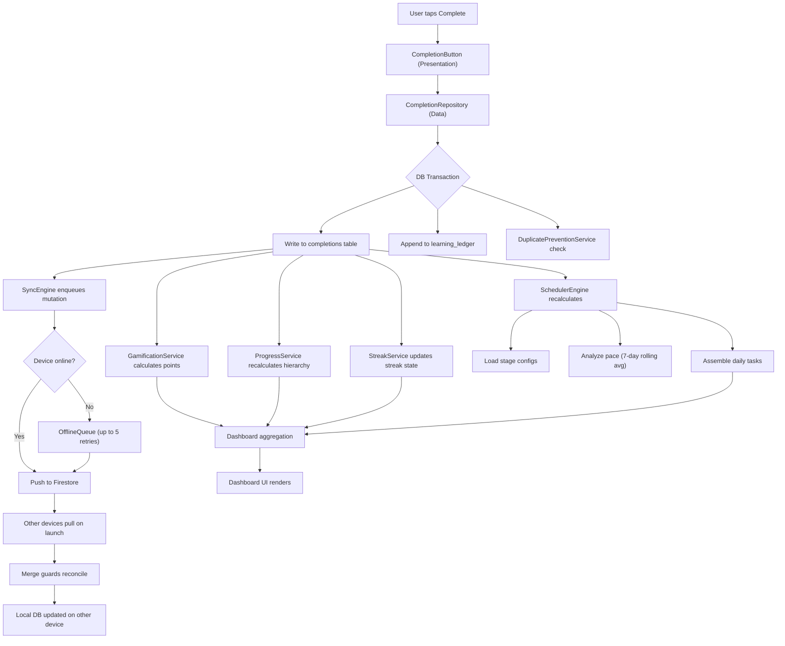
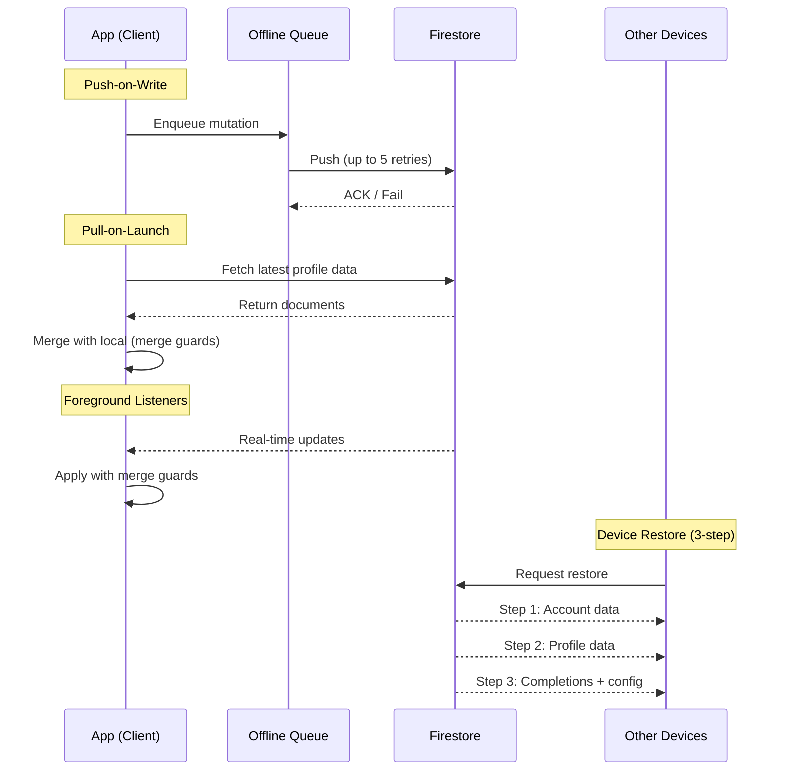

# Learning Tracker Architecture

## Table of Contents

- [Architecture at a Glance](#architecture-at-a-glance)
- [High-Level Architecture](#high-level-architecture)
- [Core Layer](#core-layer)
- [Feature Modules](#feature-modules)
- [Feature Dependency Graph](#feature-dependency-graph)
- [Data Flow](#data-flow)
- [Sync Architecture](#sync-architecture)
- [Key Algorithms](#key-algorithms)
- [Key Architectural Patterns](#key-architectural-patterns)
- [Anti-Patterns to Avoid](#anti-patterns-to-avoid)
- [Security Model](#security-model)
- [Database Schema](#database-schema)
- [Technology Stack](#technology-stack)

## Architecture at a Glance

The Learning Tracker application follows a **feature-first Clean Architecture** pattern built with Flutter. The codebase is organized into a shared core layer and 18 feature modules, each internally structured with data, domain, and presentation layers. State management uses Riverpod, persistence uses Drift (SQLite), and cloud sync uses Firebase.

---

## High-Level Architecture



### Layer Responsibilities

| Layer | Responsibility |
|---|---|
| **Presentation** | Screens, widgets, Riverpod providers. No business logic. |
| **Domain** | Business rules, service interfaces, entity definitions. |
| **Data** | Repository implementations, data source adapters, DTOs. |
| **Core** | Shared infrastructure: database, navigation, networking, theme, utilities. |

---

## Core Layer

The core layer (`lib/core/`) provides shared infrastructure that all feature modules consume.

### Database

- **ORM:** Drift (SQLite)
- **Three-database split:** User DB (read-write, 23 tables, schema v4) + Content DB (read-only, 3 tables: TextCache, CalendarCycles, SeedMetadata; schema v3) + Device Registry DB (2 tables: DeviceAccounts, DeviceState; schema v1). See [`planning/two-database-architecture.md`](planning/two-database-architecture.md).
  - **Content DB** (Epic 19) — read-only seed shipped as `assets/db/content.db.gz`, decompressed on first launch.
  - **User DB** (Epic 19) — per-account file (`user_acc_<id>.db`). Each account on the device gets its own DB file.
  - **Device Registry DB** (Epic 21) — single workspace-level DB tracking up to 5 accounts on a device and the last active account.
- **Profile scoping:** All user-facing tables include `profileId` in their primary keys, enabling multi-profile isolation
- **Append-only tables:** `completions` and `learning_ledger` are append-only for data integrity and audit trails
- **Migrations:** User DB is at v4 — v2→v3 hard-tier auth refactor (Epic 23), v3→v4 StreakEvents/XpEvents audit tables

### Navigation

- **Router:** auto_route with 40+ routes
- **Guards (7):** Auth, Profile, Restore, ChildMode, ParentPin, TutorPin, plus route-level guards
- **Shell:** AppShell with 4-tab bottom navigation

### Services

| Service | Purpose |
|---|---|
| PinService | bcrypt hashing via flutter_secure_storage, 5-attempt lockout with 15-min cooldown |
| TrackService | Manages Personal track assignments (single track type in the shipped product) |
| DuplicatePreventionService | Idempotent completion enforcement |
| CrossCurriculumAggregator | Aggregates metrics across all 9 curricula |
| DailyScheduleComposer | Assembles the daily task list from scheduler output |

### Theme

- Material Design 3 light theme
- 9 distinct curriculum colors, per-track colors
- Bidirectional text support: Roboto (LTR) + Noto Sans Hebrew (RTL)
- `AppTextStyles` with full BiDi support

### Utilities

- **DateTimeFactory / DateUtils:** UTC storage, local display (Pattern P5)
- **HebrewUtils:** Nikud (vowel mark) stripping for search normalization
- **HebrewCalendarUtils:** kosher_dart wrapper for zmanim and Hebrew date calculations

### Reusable Widgets

11 shared widgets including AnimatedProgressBar, HebrewText, PinEntryWidget, and others used across feature modules.

---

## Feature Modules

The application contains 18 feature modules. Each follows the same internal layering:

```
lib/features/<feature>/
  data/
    repositories/     # Repository implementations
    services/         # Data-layer services, API clients
    models/           # DTOs, data models
  domain/
    entities/         # Domain entities
    services/         # Business logic services
    repositories/     # Repository interfaces
  presentation/
    screens/          # Full-page widgets
    widgets/          # Feature-specific widgets
    providers/        # Riverpod providers
```

### Feature Summary

| # | Feature | Description |
|---|---|---|
| 1 | **auth** | Firebase Auth with email/password and Google Sign-In, provider management |
| 2 | **content_browsing** | Bundled JSON content from assets, in-memory caching, Hebrew search with nikud stripping |
| 3 | **dashboard** | Cross-curriculum aggregation, streaks, points, today's tasks |
| 4 | **gamification** | Per-curriculum points (configurable per stage), global streaks, mystery rewards |
| 5 | **learning** | Core completion logic (transactional, idempotent), stage progression, bookmarks, append-only ledger |
| 6 | **learning_order** | Drag-and-drop reordering at configurable level, parent control restriction, optimistic UI |
| 7 | **notifications** | Daily reminders, streak alerts, reward milestones. Shabbos/Yom Tov quiet mode with location-based zmanim. 3 channels. |
| 8 | **onboarding** | Account creation, mode selection, curriculum activation, bulk prior completions, learning process wizard |
| 9 | **parent_mode** | PIN-protected dashboard, per-curriculum analytics, engagement metrics, reward catalog management |
| 10 | **profiles** | Multi-profile support (up to 10), cascade delete across 11 tables, profile switching |
| 11 | **progress** | Hierarchy-based progress, charts (daily, cumulative, points, streak calendar), Learning Journey, milestones |
| 12 | **scheduler** | Three-phase engine, adaptive pacing, 3 schedule types (delay/weekly/rolling), 7-day rolling average |
| 13 | **settings** | Account management, curriculum activation (min 1), data export/import (11 tables as JSON) |
| 14 | **stages** | Stage definitions with 3 schedule types, max 10 stages, protected Learn stage, 2-pass reordering |
| 15 | **sync** | Hybrid push/pull, Firestore profile-scoped collections, merge guards, offline queue (max 5 retries) |
| 16 | **test_tracking** | Test score trend analysis, test reminder scheduling |
| 17 | **track_setup** | Track management hub, track detail and editing screens |
| 18 | **tutor_mode** | PIN-protected read-only mode for tutors, TutorDashboardAggregator. Fully wired; not actively promoted in v1 roadmap — see [`_archive/scrapped-ideas/tutor-mode-epic-11.md`](_archive/scrapped-ideas/tutor-mode-epic-11.md). |

---

## Feature Dependency Graph



### Dependency Notes

- **core** is the foundation; every feature module depends on it for database, navigation, and shared services.
- **auth** feeds into **onboarding**, which activates curricula and sets up stages.
- **learning** is the central feature, producing completion data that **gamification**, **progress**, and **sync** consume.
- **stages** defines stage configurations that drive the **scheduler**, which in turn feeds **dashboard**.
- **profiles** scopes **parent_mode** and **settings**.
- **notifications** listens to **scheduler**, **gamification**, and **streaks** for reminder and alert triggers.
- **tutor_mode** reads from **learning** and **scheduler** in a read-only capacity.
- **sync** operates as a cross-cutting concern, triggered by mutations in **learning** and **settings**.

---

## Data Flow

The following diagram traces the full lifecycle of a user action from UI interaction through local persistence, scheduling, and cloud sync.



### Content Pipeline

Content is bundled as JSON in the app assets directory. On load, the `ContentRepository` reads and deserializes the JSON, populating an in-memory cache. Riverpod providers expose this cached content to the UI. Hebrew search normalizes queries by stripping nikud before matching.

### Completion Pipeline

When a user completes an item, the `CompletionRepository` executes a database transaction that writes to both the `completions` table and the append-only `learning_ledger`. The transaction also triggers the `SyncEngine` to push the completion to Firestore. Duplicate prevention ensures idempotency.

### Scheduling Pipeline

The `SchedulerEngine` runs a three-phase process:

1. **Data loading** -- Reads completions, stage configurations, and the content tree
2. **Analysis** -- Calculates pace using a 7-day rolling average, determines what is due
3. **Task assembly** -- Produces the daily task list based on schedule type (delay, weekly, or rolling)

---

## Sync Architecture



### Sync Strategy

- **Hybrid push/pull** model (Design Decision D4)
- **Push-on-write:** Every local mutation is enqueued in the `OfflineQueue` and pushed to Firestore. Failed writes retry up to 5 times.
- **Pull-on-launch:** On app start, the `SyncEngine` pulls the latest data from Firestore and merges it with local state using merge guards and quota monitoring.
- **Foreground listeners:** Real-time Firestore listeners keep the app updated while in the foreground.
- **Device restore:** The `DeviceRestoreService` implements a 3-step restore process for new device setup.
- **Firestore structure:** Flat collections with deterministic IDs (Pattern P4), profile-scoped.

---

## Key Algorithms

### Scheduler Engine (3-Phase)

The scheduler runs three distinct phases each time it recalculates:

1. **Phase 1 -- Data Loading:** Reads all completions for the active profile, loads stage configurations for each curriculum, and fetches the content tree structure from the in-memory cache.
2. **Phase 2 -- Analysis:** Evaluates the learner's current position in each stage, calculates pace metrics using the Pace Calculator, and determines which items are due based on the active schedule type (delay, weekly, or rolling).
3. **Phase 3 -- Task Assembly:** Produces the final daily task list by combining due items from all active curricula and stages, respecting stage ordering and priority rules. The `DailyScheduleComposer` formats the output for dashboard consumption.

### Pace Calculator (Linear Interpolation + 7-Day Rolling Average)

The Pace Calculator determines how fast a learner progresses through content:

1. **7-day rolling average:** Counts completions over the trailing 7-day window and divides by 7 to produce a smoothed daily completion rate.
2. **Linear interpolation:** Projects the expected completion date for the current stage by interpolating between the current position and the stage target using the rolling average rate.
3. **Pace status:** Compares the projected completion date against the stage deadline (if configured) and classifies pace as ahead, on-track, or behind.

### Streak Calculation (Local Timezone Day Boundaries)

Streak logic determines whether a learner maintains their daily learning streak:

1. **Day boundary detection:** Converts the current UTC timestamp to the user's local timezone and extracts the calendar date. Compares this against the last completion's local calendar date.
2. **Streak continuation:** If the last completion falls on the current local date or the immediately preceding local date, the streak continues. Any gap of two or more local calendar days resets the streak to zero.
3. **Shabbos/Yom Tov handling:** The notifications module suppresses streak-related alerts during Shabbos and Yom Tov periods, calculated using kosher_dart zmanim for the user's location. Streak logic itself does not skip these days -- it only affects notification delivery.

### Stage Progression Validation (Sequential Enforcement)

Stage progression enforces a strict sequential order:

1. **Sequential gate:** A learner cannot begin items in stage N+1 until stage N reaches its completion threshold. The system validates this constraint on every completion attempt.
2. **Protected Learn stage:** The first stage (Learn) cannot be deleted or reordered, ensuring every curriculum always has an entry point.
3. **Max 10 stages:** The system enforces a hard limit of 10 stages per curriculum. Stage creation requests beyond this limit are rejected.
4. **2-pass reordering:** When a user reorders stages, the system performs a two-pass update: first it assigns temporary sort indices to avoid unique constraint violations, then it assigns the final sort indices.

---

## Key Architectural Patterns

### Pattern Reference

| ID | Pattern | Description |
|---|---|---|
| P1 | Snake-case storage keys | `CurriculumId` values stored as snake_case strings |
| P2 | Nullable singles, empty collections | Single-item queries return `null` on miss; collection queries return `[]` |
| P3 | Family providers | Riverpod `family` providers parameterized by `CurriculumId` for curriculum-scoped state |
| P4 | Flat Firestore collections | Deterministic document IDs, no nested sub-collections |
| P5 | UTC storage | All dates stored as UTC, converted to local time only at the display layer |
| P6 | Cross-curriculum core services | Shared services that aggregate across curricula live in `lib/core/services/` |

### Enumerations

- **CurriculumId:** 9 values — `mishnayos`, `bavli`, `yerushalmi`, `mishna_berurah`, `mishneh_torah`, `chumash`, `nach`, `tanach`, `mussar`.
- **TrackType:** `personal` (mandatory), `school`, `tutor`. `personal` is the default user-facing flow. `school` and `tutor` are activated by parents via the parent-mode track management screen. See [`_archive/scrapped-ideas/school-and-tutor-tracks.md`](_archive/scrapped-ideas/school-and-tutor-tracks.md) for history.
- **UserMode:** `child`, `adult`
- **UserTier:** `cloudBorn`, `localBorn` (Epic 23 hard-tier auth)

---

## Anti-Patterns to Avoid

### Hardcoded 3-Stage Assumption

Do not assume every curriculum has exactly 3 stages. The system supports up to 10 stages per curriculum, and users configure the count during onboarding. Always query the stages table for the active curriculum rather than hardcoding stage counts or indices.

### Global Points Accumulation

Do not aggregate points into a single global counter. Points are tracked per-curriculum and per-stage, with configurable point values at the stage level. The `CrossCurriculumAggregator` handles cross-curriculum totals when the dashboard needs them. Writing directly to a global accumulator bypasses per-curriculum isolation.

### Curriculum-Specific Hardcoding

Do not embed curriculum-specific logic (content structure, stage names, scheduling rules) into feature code. All curriculum differences are driven by configuration data and the content JSON. Feature modules must remain curriculum-agnostic by reading configuration at runtime.

### Feature Module Cross-Imports

Do not import directly from one feature module's internal files into another feature module. Features communicate through core services, shared domain interfaces, or Riverpod providers. Direct cross-feature imports create tight coupling and break the modular architecture.

### Local-Time Storage

Do not store dates or timestamps in local time. All persistence uses UTC (Pattern P5). Conversion to local time happens exclusively in the presentation layer. Storing local time causes bugs when users travel across timezones or when devices have incorrect timezone settings.

### Direct Firebase Writes from Presentation

Do not call Firebase APIs (Firestore, Auth, Storage) from presentation-layer code (screens, widgets, providers). All Firebase interaction goes through data-layer repositories and services, which the domain layer orchestrates. This preserves testability and keeps the sync/offline queue in the loop.

---

## Security Model

### Authentication

Firebase Authentication handles account-level auth with email/password and Google Sign-In support.

### PIN Protection

- PINs are hashed with **bcrypt** and stored in **flutter_secure_storage** (device-local only, never synced)
- **5-attempt lockout** with a **15-minute cooldown** period
- Separate PIN gates for parent mode and tutor mode

### Data Protection

- **Firestore security rules** enforce user-scoped access; completions are append-only at the rules level
- **Log filtering** via `AppLogger` wrapping Talker -- redacts emails, passwords, PINs, and tokens from all log output

---

## Database Schema

- **User DB:** 23 tables, 20 DAOs, current schema version **4** (v2 was the last pre-split schema; v3 shipped the hard-tier auth refactor in Epic 23; v4 added event-log tables)
- **Content DB:** 3 read-only tables (TextCache ~52K rows, CalendarCycles ~35K rows, SeedMetadata), schema v3. Shipped as `assets/db/content.db.gz` and upgraded atomically on app update.
- **Device Registry DB:** 2 tables (DeviceAccounts, DeviceState), schema v1. Tracks up to 5 accounts on a device and the last active account.
- **Profile isolation:** `profileId` is part of the primary key on all user-facing tables
- **Append-only tables:** `completions` and `learning_ledger` are never updated or deleted, preserving a full audit trail of learning activity
- **Cascade deletes:** Profile deletion cascades across dependent tables
- See [`planning/two-database-architecture.md`](planning/two-database-architecture.md) for the detailed design

---

## Technology Stack

| Concern | Technology |
|---|---|
| Framework | Flutter |
| State Management | Riverpod (with code generation) |
| Local Database | Drift (SQLite) |
| Cloud Auth | Firebase Authentication |
| Cloud Database | Cloud Firestore |
| Cloud Storage | Firebase Storage |
| Navigation | auto_route |
| PIN Hashing | bcrypt |
| Secure Storage | flutter_secure_storage |
| Hebrew Calendar | kosher_dart |
| Logging | Talker |
| HTTP | Dio |
