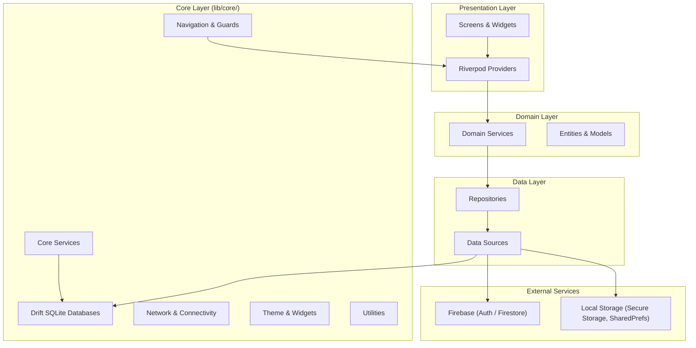
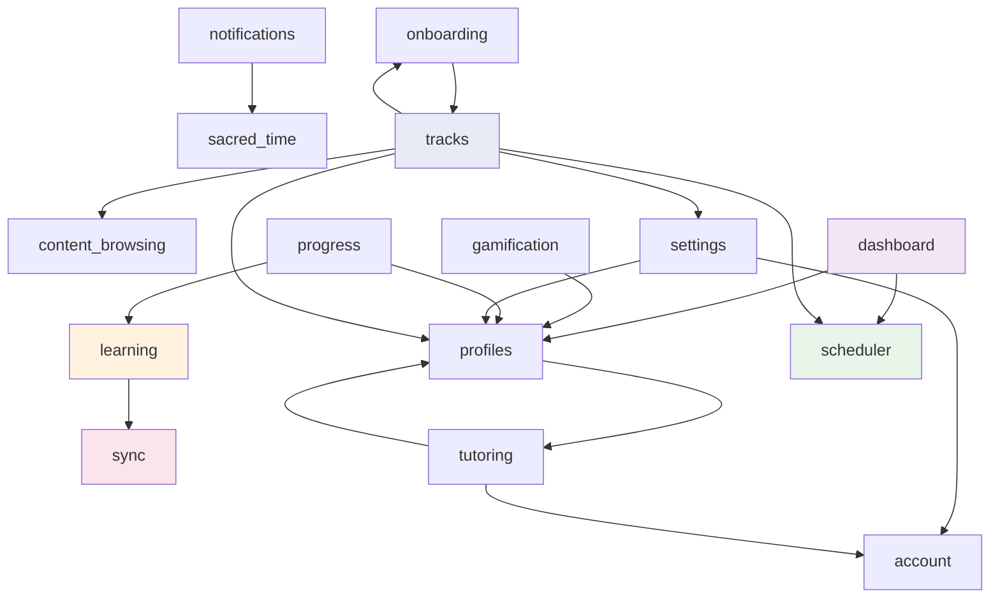
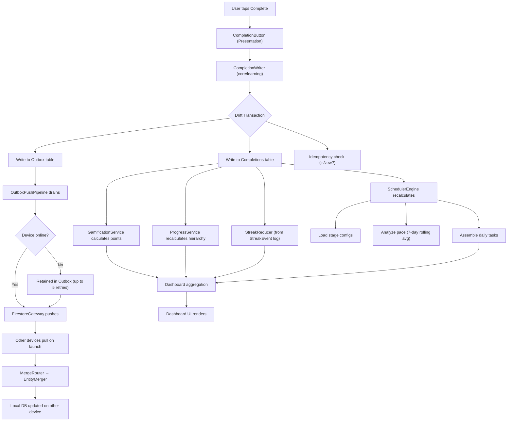
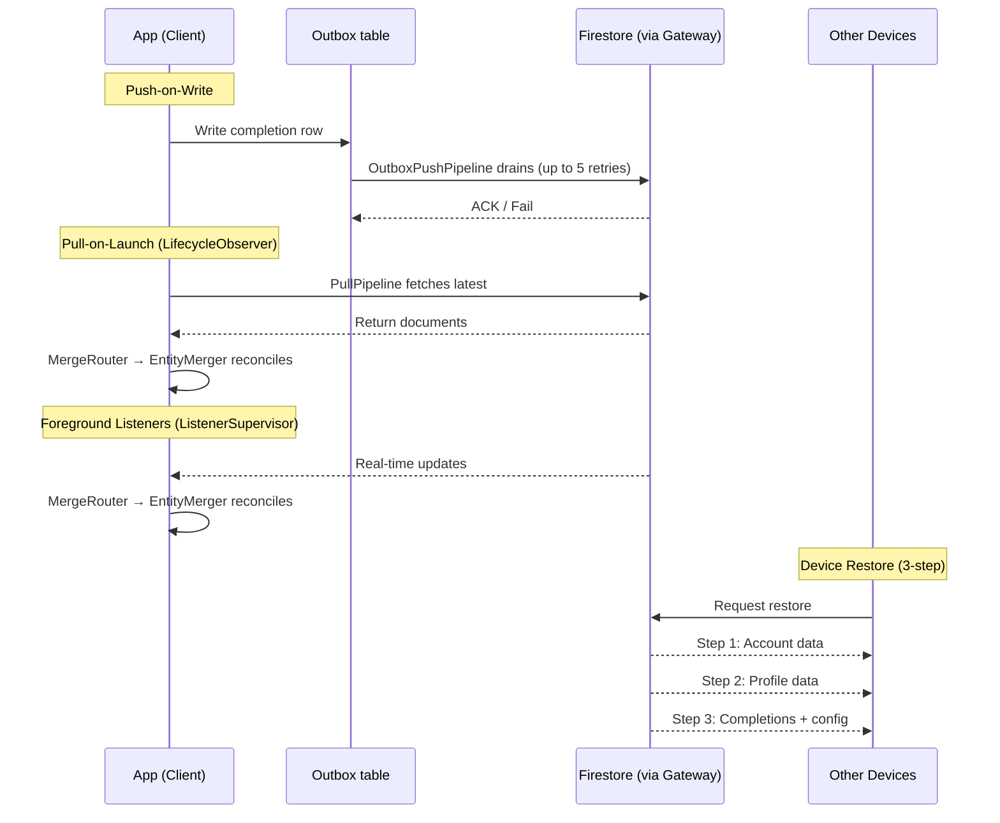

# Learning Tracker Architecture

## Table of Contents

- [Architecture at a Glance](#architecture-at-a-glance)
- [High-Level Architecture](#high-level-architecture)
- [Core Layer](#core-layer)
- [Feature Modules](#feature-modules)
- [Feature Dependency Graph](#feature-dependency-graph)
- [Data Flow](#data-flow)
- [Sync Architecture](#sync-architecture)
- [Key Algorithms](#key-algorithms)
- [Key Architectural Patterns](#key-architectural-patterns)
- [Anti-Patterns to Avoid](#anti-patterns-to-avoid)
- [Security Model](#security-model)
- [Database Schema](#database-schema)
- [CI Matrix](#ci-matrix)
- [Technology Stack](#technology-stack)

## Architecture at a Glance

The Learning Tracker application follows a **feature-first Clean Architecture** pattern built with Flutter. The codebase is organized into a shared core layer and 18 feature modules, each internally structured with data, domain, and presentation layers. State management uses Riverpod, persistence uses Drift (SQLite), and cloud sync uses Firebase.

Post-rebuild highlights (Epic 25/26/27):

- **Schema v14** (User DB) — clean rebuild; all migration steps deleted; `schemaVersion` is the authoritative version number.
- **7-class sync layer (core/sync/)** — `FirestoreGateway`, `PushPipeline`, `PullPipeline`, `MergeRouter`, `EntityMerger`, `ListenerSupervisor`, `LifecycleObserver`. Built in E25; not yet wired into production (monolithic `SyncEngine` in `features/sync/` remains live pending Wave D migration).
- **Single `CompletionWriter`** — one transactional path for recording completions (idempotent, outbox-paired).
- **Single `StreakReducer`** — pure function over UTC days from the `StreakEvent` log.
- **Single `ContentIndex` + `ProgramRefResolver`** — O(1) ref lookup across all curricula.
- **Locale auto-detection** — `MaterialApp.locale = null`; Flutter resolves `en`/`he` from the device locale; no in-app language picker.
- **4 guardrail lints** (planned, Stories 27.10–27.11): `no-curriculum-display-name-bypass`, `no-feature-cross-import`, `no-firebase-outside-core`, `no-raw-talker`.

---

## High-Level Architecture



### Layer Responsibilities

| Layer | Responsibility |
| --- | --- |
| **Presentation** | Screens, widgets, Riverpod providers. No business logic. |
| **Domain** | Business rules, service interfaces, entity definitions. |
| **Data** | Repository implementations, data source adapters, DTOs. |
| **Core** | Shared infrastructure: databases, navigation, networking, theme, utilities. |

---

## Core Layer

The core layer (`lib/core/`) provides shared infrastructure that all feature modules consume.

### Database

- **ORM:** Drift (SQLite)
- **Three-database split:**
  - **User DB** (`user_acc_<id>.db`) — per-account, read-write; schema **v14**. 21 tables, 22 DAOs. Holds all user-generated data: profiles, progress, configuration, streaks, sync state.
  - **Content DB** (`content.db.gz`) — read-only seed shipped in the APK assets, decompressed on first launch; schema **v5**. 4 tables (TextCache ~52K rows, CalendarCycles ~35K rows, DailyContent, SeedMetadata).
  - **Device Registry DB** (`device_registry.db`) — workspace-level, schema **v1**. 2 tables: DeviceAccounts + DeviceState; tracks up to 5 accounts per device and the last active account.
- **Profile scoping:** All user-facing tables include `profileId` participating in the primary key or a composite unique index, enforcing multi-profile isolation.
- **Append-only tables:** `Completions`, `CompletionEvents`, and `LearningLedger` are never updated or deleted, preserving a full audit trail.
- **Cascade deletes:** Profile deletion cascades across dependent tables.

### Navigation

- **Router:** `auto_route` with 40+ typed routes (no string-based navigation).
- **Guards (4):** `AuthGuard`, `ProfileGuard`, `ChildModeGuard`, and `PinGuard` — parameterized by `PinScope` (parent) so adding a PIN-gated route is one line. (`RestoreGuard` was deleted along with the rest of the Drift-era sync engine — see the SyncEngine section below, which is stale pending a post-migration rewrite.)
- **Shell:** `AppShell` with 4-tab bottom navigation.

### SyncEngine (7 classes — core/sync/, built but not yet production)

> **Status note:** The 7 classes below live in `lib/core/sync/` and are fully implemented (E25, Stories 25.12–25.14). However, they are **not yet wired into production**. The active production sync path remains the monolithic `features/sync/data/sync_engine.dart` (≈3 250 lines), consumed via `syncEngineProvider`. Migration of the production path to `core/sync/` is tracked as Wave D.

The SyncEngine was decomposed from a monolith into 7 focused classes (Epic 25, Stories 25.12–25.14):

| Class | Responsibility |
| --- | --- |
| `FirestoreGateway` / `FirestoreGatewayImpl` | Single chokepoint for all Firestore I/O; the only file that imports `cloud_firestore`. |
| `PushPipeline` / `OutboxPushPipeline` | Drains the `Outbox` table; single-flight per entity kind; retries up to 5 times. |
| `PullPipeline` | Paginates Firestore queries via the gateway and dispatches batches to `MergeRouter`. |
| `MergeRouter` | Dispatches incoming documents to the correct `EntityMerger<T>` strategy by entity kind. |
| `EntityMerger<T>` | Sealed base; concrete implementations per entity (completions, streaks, bookmarks, tracks, settings, etc.). |
| `ListenerSupervisor` | Manages long-lived Firestore real-time listeners; re-opens channels on reconnect. |
| `LifecycleObserver` | Hooks into `AppLifecycleState` to trigger pull-on-launch and suspend listeners in background. |

### CompletionWriter (single transactional path)

`core/learning/completion_writer.dart` is the **only** path for recording a completion at runtime (FR15). It opens one Drift transaction that atomically inserts:

1. The `Completions` row (projection).
2. The `Outbox` row that drives the cloud push.

Either both commit or both roll back. Duplicate commands (same `profileId + sefariaRef + stageId + trackType`) return the existing row with `isNew = false` and do not enqueue a second push. Incoming Firestore pulls bypass `CompletionWriter` to avoid looping remote writes back through the push pipeline.

### StreakReducer (pure function from event log)

`core/streak/streak_reducer.dart` is a **pure function** (`StreakReducer.reduce`) that computes `(currentStreak, maxStreak)` from a sequence of `StreakEvent` records:

- Only `completion` events count.
- Each distinct **UTC day** with at least one completion is a "streak day".
- Two consecutive UTC days extend the run; any gap resets it.
- `currentStreak` is 0 if today is more than one UTC day past the last completion (streak lapsed).

The event log (`core/streak/streak_event_log.dart`) persists events in the `StreakEvents` table and round-trips through Firestore sync.

### ContentIndex + ProgramRefResolver

`core/content/content_index.dart` — built once and held in a `keepAlive` Riverpod provider. Provides O(1) `lookup(ref)` and `adjacent(ref)` across all 9 curricula; replaces the prior O(N×9) scan.

`core/content/program_ref_resolver.dart` — resolves a `(programId, dayOffset)` pair to a canonical `sefariaRef` via the `ContentIndex`. Dashboard, scheduler, and reader all share this resolver so they agree on which `ContentItem` a calendar entry points to.

### Services

| Service | Purpose |
| --- | --- |
| `PinService` | bcrypt hashing via flutter_secure_storage; 5-attempt lockout with 15-min cooldown |
| `TrackService` | Manages Personal track assignments (single track type in v1) |
| `CrossCurriculumAggregator` | Aggregates metrics across all 9 curricula |
| `DailyScheduleComposer` | Assembles the daily task list from scheduler output |
| `CalendarProgramService` | Hebrew-calendar-aware program day resolution |

### Theme

- Material Design 3 light theme + system dark theme.
- 9 distinct curriculum colors, per-track colors.
- Bidirectional text support: Roboto (LTR) + Noto Sans Hebrew (RTL).
- `AppTextStyles` with full BiDi support.
- Locale auto-detection: `MaterialApp.locale = null`; Flutter resolves `en` or `he` from the device locale against `AppLocalizations.supportedLocales`. No in-app language picker.

### Utilities

- **`DateTimeFactory` / `DateUtils`:** UTC storage, local display (Pattern P5).
- **`HebrewUtils`:** Nikud (vowel mark) stripping for search normalization.
- **`HebrewCalendarUtils`:** `kosher_dart` wrapper for zmanim and Hebrew date calculations.

### Reusable Widgets

Shared widgets in `lib/core/widgets/` including `AnimatedProgressBar`, `HebrewText`, `PinEntryWidget`, and others used across feature modules.

---

## Feature Modules

> **AUD-docs-15 regenerated 2026-07-13.** Node/feature list derives from `ls lib/features/`; file counts from `find lib/features/<f> -name '*.dart' | wc -l`. Previous revision named 6 nonexistent features (`auth`, `stages`, `parent_mode`, `track_setup`, `learning_order`, `track_learning_order` — folded into `tracks/` or renamed to `account`) and omitted `sacred_time`, `tutoring`, and `tracks` entirely.

The application contains **15 active feature modules**. Each follows the same internal layering:

```text
lib/features/<feature>/
  data/
    repositories/     # Repository implementations
    services/         # Data-layer services, API clients
    models/           # DTOs, data models
  domain/
    entities/         # Domain entities
    services/         # Business logic services
    repositories/     # Repository interfaces
  presentation/
    screens/          # Full-page widgets
    widgets/          # Feature-specific widgets
    providers/        # Riverpod providers
```

`tracks/` additionally nests `setup/`, `stages/`, `track_order/`, and `whole_curriculum_order/` sub-packages (the former standalone `track_setup`/`stages`/`track_learning_order` features, unified under Epic 25/26).

### Feature Summary

| # | Feature | Files | Description |
| --- | --- | --- | --- |
| 1 | **account** | 35 | Firebase Auth (email/password + Google Sign-In), local-born account support (argon2id hash), hard-tier upgrade flow, account onboarding |
| 2 | **content_browsing** | 22 | Bundled content from ContentDB; in-memory ContentIndex; Hebrew search with nikud stripping |
| 3 | **dashboard** | 31 | Cross-curriculum aggregation, streaks, points, today's tasks |
| 4 | **gamification** | 45 | Per-curriculum points (configurable per stage), global streaks, mystery rewards |
| 5 | **learning** | 33 | Core completion logic via CompletionWriter (transactional, idempotent), stage progression, bookmarks, append-only ledger |
| 6 | **notifications** | 14 | Daily reminders, streak alerts, reward milestones; Shabbos/Yom Tov quiet mode with location-based zmanim |
| 7 | **onboarding** | 29 | Mode selection (child/adult), curriculum activation, bulk prior completions, learning-process wizard |
| 8 | **profiles** | 40 | Multi-profile support, cascade delete across dependent tables, profile switching, parent-mode PIN-protected dashboard |
| 9 | **progress** | 42 | Hierarchy-based progress, charts (daily, cumulative, points, streak calendar), Learning Journey, milestones |
| 10 | **sacred_time** | 20 | Shabbos/Yom Tov lock overlay; zmanim-based start/end times; city picker |
| 11 | **scheduler** | 59 | Three-phase engine, adaptive pacing, multiple schedule types, rolling-average pace tracking |
| 12 | **settings** | 19 | Account management, curriculum activation, data export/import |
| 13 | **sync** | 10 | `SyncWriteFacade`/outbox-driven push entry points consumed by other features (the sync engine internals live in `core/sync/`, not this feature module) |
| 14 | **tracks** | 67 | Track management hub, track setup/detail/editing, stage definitions (max 10 stages, protected Learn stage), custom learning order |
| 15 | **tutoring** | 36 | Cross-user tutor access — invite/accept/revoke grant lifecycle, tutor dashboard, tutor write proxies via Cloud Functions (see `docs/api-contracts.md` §1.3/§2, AUD-docs-07) |

---

## Feature Dependency Graph

> **AUD-docs-15 regenerated 2026-07-13** by `tool/gen_feature_graph.dart` (`make gen-feature-graph` to reprint; `make check-feature-graph` fails CI if this node set drifts from `ls lib/features/`). Nodes are exactly `ls lib/features/`; edges are derived from a real grep of `import 'package:learning_tracker/features/...'` across every file. The full cross-feature import graph is dense — **101 edges among 15 nodes** — so this diagram keeps only "significant" dependencies (an edge survives if ≥6 distinct files make that import) plus, for any node that would otherwise be edge-less at that threshold, its single heaviest real edge (this is how `sacred_time` stays visible). Run `dart run tool/gen_feature_graph.dart --full` for every edge, or `--min-weight=N` for a different cutoff. `core` is omitted as a node here — every feature module imports `core/` (databases, navigation, shared services); that edge is universal, not differentiating, and was true of the prior revision's `core` fan-out too.



### Dependency Notes

- **tracks** (67 files — the largest feature) is the hub of the current graph: it depends on `content_browsing`, `onboarding`, `profiles`, `scheduler`, and `settings`, reflecting the Epic 25/26 unification of the former `track_setup`/`stages`/`track_learning_order` features.
- **progress --> learning** and **dashboard --> scheduler** (both corrected from the prior revision's reversed direction — the consumer imports the producer, not the reverse): `progress` reads completion data that `learning` produces; `dashboard` reads schedule state that `scheduler` produces.
- **tutoring --> account** / **tutoring --> profiles**: the tutoring feature is a consumer of the account/profile domain models, not a producer other features depend on — see `docs/api-contracts.md` §1.3 for the Firestore-side (`tutor_grants`/`tutor_active_access`) picture, which is the inverse relationship (Cloud Functions writing into the owner's data on the tutor's behalf).
- **settings --> account** / **settings --> profiles**: settings screens read and mutate account/profile state directly rather than through an abstraction layer.
- **notifications --> sacred_time**: the Shabbos/Yom Tov quiet-mode check is notifications' only architecturally-real edge above the noise floor of one-off imports elsewhere in the codebase.
- Every feature module also imports `core/` for databases, navigation, and shared services — a universal edge omitted from the diagram above as non-differentiating (see the diagram's own caption).

---

## Data Flow

The following diagram traces the full lifecycle of a user action from UI interaction through local persistence and cloud sync.



### Content Pipeline

Content is bundled as a pre-built `content.db.gz` seed shipped in the APK. On first launch the `SeedManager` decompresses and opens it as a read-only `ContentDatabase`. The `ContentIndex` (keepAlive Riverpod provider) builds O(1) ref → item maps from each curriculum's content list. Hebrew search normalizes queries by stripping nikud.

### Completion Pipeline

When a user completes an item, `CompletionWriter.commit` opens a single Drift transaction that atomically inserts the `Completions` projection row and the `Outbox` row that drives the cloud push. The `OutboxPushPipeline` drains the outbox via `FirestoreGateway`. Idempotency is enforced inside the transaction: duplicate `(profileId, sefariaRef, stageId, trackType)` returns the existing row without enqueuing a second push.

### Scheduling Pipeline

The `SchedulerEngine` runs three phases each time it recalculates:

1. **Data loading** — Reads completions, stage configurations, and the content tree.
2. **Analysis** — Calculates pace using a 7-day rolling average; determines what is due.
3. **Task assembly** — Produces the daily task list based on schedule type (delay, weekly, or rolling).

---

## Sync Architecture



### Sync Strategy

- **Hybrid push/pull** model (Design Decision D4).
- **Push-on-write:** Every local mutation is written to the `Outbox` table and pushed to Firestore. Failed writes retry up to 5 times.
- **Pull-on-launch:** `LifecycleObserver` triggers `PullPipeline` on app start; results flow through `MergeRouter` → `EntityMerger` strategies.
- **Foreground listeners:** `ListenerSupervisor` maintains real-time Firestore listeners; re-opens channels when the app returns to foreground.
- **Device restore:** `DeviceRestoreService` implements a 3-step restore for new device setup.
- **Firestore structure:** Flat collections with deterministic document IDs (Pattern P4), profile-scoped.

---

## Key Algorithms

### Scheduler Engine (3-Phase)

1. **Phase 1 — Data Loading:** Reads completions for the active profile; loads stage configs for each curriculum; fetches the content tree from ContentIndex.
2. **Phase 2 — Analysis:** Evaluates learner position in each stage; calculates pace via the Pace Calculator; determines which items are due based on the active schedule type (delay, weekly, or rolling).
3. **Phase 3 — Task Assembly:** Produces the final daily task list by combining due items from all active curricula; `DailyScheduleComposer` formats it for dashboard consumption.

### Pace Calculator (Linear Interpolation + 7-Day Rolling Average)

1. **7-day rolling average:** Counts completions over the trailing 7-day window and divides by 7.
2. **Linear interpolation:** Projects the expected completion date for the current stage.
3. **Pace status:** Compares the projection against the stage deadline (if configured): ahead, on-track, or behind.

### StreakReducer (UTC Day Boundaries)

The `StreakReducer` is a **pure function** that takes a sequence of `StreakEvent` records and a reference `today` (UTC):

1. Collects all distinct UTC days that have at least one `completion` event.
2. Sorts and walks the day list to compute the current run and the all-time max run.
3. If `today` is more than one UTC day past the last completion day, `currentStreak` = 0 (streak lapsed); `maxStreak` is preserved.

**No local-timezone math** — streak boundaries are always UTC midnight.

### Stage Progression Validation (Sequential Enforcement)

1. **Sequential gate:** A learner cannot begin stage N+1 until stage N reaches its completion threshold.
2. **Protected Learn stage:** The first stage cannot be deleted or reordered.
3. **Max 10 stages:** Hard limit per curriculum.
4. **2-pass reordering:** Avoids unique constraint violations during reorder.

---

## Key Architectural Patterns

### Pattern Reference

| ID | Pattern | Description |
| --- | --- | --- |
| P1 | Snake-case storage keys | `CurriculumId` values stored as snake_case strings |
| P2 | Nullable singles, empty collections | Single-item queries return `null` on miss; collection queries return `[]` |
| P3 | Family providers | Riverpod `family` providers parameterized by `CurriculumId` for curriculum-scoped state |
| P4 | Flat Firestore collections | Deterministic document IDs, no nested sub-collections |
| P5 | UTC storage | All dates stored as UTC, converted to local time only at the display layer |
| P6 | Cross-curriculum core services | Shared services that aggregate across curricula live in `lib/core/services/` |
| P7 | Single writer | `CompletionWriter` is the only path for recording completions at runtime |
| P8 | Event-log streaks | `StreakReducer` derives streak state from the append-only `StreakEvents` log |

### Enumerations

- **`CurriculumId`:** 9 values — `chumash`, `nach`, `tanach`, `mishnayos`, `bavli`, `yerushalmi`, `mishnehTorah`, `mishnaBerurah`, `mussar`. Declaration order is canonical learning order (Tanakh → Mishnah → Talmud → Halakhah → Mussar).
- **`TrackType`:** `personal` only in v1. (`school` and `tutor` are archived — see `_archive/scrapped-ideas/`.)
- **`UserMode`:** `child`, `adult`.
- **`UserTier`:** `cloudBorn`, `localBorn` (Epic 20 hard-tier auth).

---

## Anti-Patterns to Avoid

### Bypass CompletionWriter

Do not insert directly into `completions` (or call DAOs directly) at runtime. All completion recording must go through `CompletionWriter.commit` so the outbox row is always created atomically. The only exception is incoming Firestore pull merges, which bypass the writer to avoid looping remote writes back through the push pipeline.

### Bypass StreakReducer

Do not compute streak state from the `Streaks` table directly. Derive streak state by calling `StreakReducer.reduce` on the `StreakEvent` log, which is the authoritative source. The `Streaks` projection table is a cached snapshot only.

### Hardcoded 3-Stage Assumption

Do not assume every curriculum has exactly 3 stages. The system supports up to 10 stages per curriculum. Always query the `StageDefinitions` table for the active curriculum.

### Global Points Accumulation

Do not aggregate points into a single global counter. Points are tracked per-curriculum and per-stage. The `CrossCurriculumAggregator` handles cross-curriculum totals.

### Curriculum-Specific Hardcoding

Do not embed curriculum-specific logic into feature code. All curriculum differences are driven by configuration data and the ContentDB. Feature modules must remain curriculum-agnostic.

### Feature Module Cross-Imports

Do not import directly from one feature module's internal files into another. Features communicate through core services, shared domain interfaces, or Riverpod providers.

### Local-Time Storage

Do not store dates or timestamps in local time. All persistence uses UTC (Pattern P5). Conversion to local time happens exclusively in the presentation layer.

### Direct Firebase Writes from Presentation

Do not call Firebase APIs from presentation-layer code. All Firebase interaction goes through `FirestoreGateway` (the single Firestore chokepoint in `core/sync/`).

---

## Security Model

### Authentication

Firebase Authentication handles cloud-born accounts (email/password and Google Sign-In). Local-born accounts use argon2id password hashing. The hard-tier upgrade flow (`localBorn` → `cloudBorn`) is atomic.

### PIN Protection

- PINs are hashed with **bcrypt** and stored in **flutter_secure_storage** (device-local only, never synced).
- **5-attempt lockout** with a **15-minute cooldown** period.
- `PinGuard` is parameterized by `PinScope` — currently only `parent`.

### Data Protection

- **Firestore security rules** enforce user-scoped access; completions are append-only at the rules level.
- **Log redaction** via `AppLogger` wrapping Talker — redacts emails, passwords, PINs, and tokens from all log output.

---

## Database Schema

> **AUD-docs-15/16 regenerated 2026-07-13** by `tool/gen_arch_tables.dart` (`make gen-arch-tables` to reprint; `make check-arch-tables` fails CI if this section drifts from a fresh run). The tool and Makefile target this section has claimed to be generated by since schema v14 did not actually exist until this pass — the numbers below had drifted arbitrarily (v14/21 tables/22 DAOs claimed vs. real v35/24/24) with no mechanical check catching it.

Schema versions:

| Database | Schema Version | Tables | DAOs |
| --- | --- | --- | --- |
| User DB (`user_acc_<id>.db`) | **v36** | 24 | 24 |
| Content DB (`content.db.gz`) | **v5** | 4 | 4 |
| Registry DB (`device_registry.db`) | **v1** | 2 | — (inline) |

### Database Schema — Generated Table List

The table below is generated by `tool/gen_arch_tables.dart` from the Drift `@DriftDatabase` annotations. Run `make gen-arch-tables` to regenerate.

| Database | Table | Columns |
| --- | --- | --- |
| User DB | Accounts | 8 |
| User DB | LearnerProfiles | 11 |
| User DB | CurriculumTracks | 8 |
| User DB | CurriculumScopes | 8 |
| User DB | ProfilePrograms | 6 |
| User DB | StageDefinitions | 9 |
| User DB | PointConfigs | 6 |
| User DB | StudyDayConfigs | 6 |
| User DB | CompletionEvents | 11 |
| User DB | DailyPlans | 16 |
| User DB | LearningLedger | 15 |
| User DB | Bookmarks | 6 |
| User DB | LearningOrder | 7 |
| User DB | TrackLearningOrder | 5 |
| User DB | Goals | 14 |
| User DB | StreakEvents | 7 |
| User DB | TextDownloadStatuses | 5 |
| User DB | Outbox | 9 |
| User DB | SacredWindowEntries | 8 |
| User DB | PriorCompletionImports | 8 |
| User DB | SyncKv | 4 |
| User DB | PointsBalance | 3 |
| User DB | PointsLedger | 9 |
| User DB | RewardRedemptions | 9 |
| Content DB | TextCache | 4 |
| Content DB | CalendarCycles | 5 |
| Content DB | DailyContent | 3 |
| Content DB | SeedMetadata | 7 |
| Registry DB | DeviceAccounts | 9 |
| Registry DB | DeviceState | 2 |

_Generated by `tool/gen_arch_tables.dart`. Total: 24 User DB + 4 Content DB + 2 Registry DB = 30 tables._

### Key Schema Notes

- **Profile isolation:** `profileId` participates in the primary key or a composite unique index on all user-facing tables (enforced by `tool/schema_check.dart` — DNI-327).
- **Append-only tables:** `CompletionEvents` and `LearningLedger` are never updated or deleted, preserving a full audit trail. The legacy `Completions`/`Streaks`/`SyncQueue` tables named in the prior revision of this section were dropped outright in the schema-v1 rebuild (see `user_database.dart`'s migration comments) — they no longer exist, not merely renamed.
- **Cascade deletes:** Profile deletion cascades across dependent tables.
- **`Outbox` table** (`core/sync/outbox/`): staging area for all cloud pushes; drained by `OutboxPushPipeline`.
- **`StreakEvents` table**: append-only event log; `StreakReducer` derives streak state from it.
- **`TextDownloadStatuses` table**: confirmed dead code as of 2026-07-13 (zero live provider consumers) — tracked for removal, not yet removed; see `docs/stories/implementation/19-10-navigation-state-cleanup.md` (AUD-docs-06).

---

## CI Matrix

The GitHub Actions CI (`ci.yml`) runs 4 jobs on every PR and push to `main`/`dev`/`dev/**`:

| Job | Timeout | Key Steps |
| --- | --- | --- |
| `format` | 5 min | `dart format --set-exit-if-changed` |
| `analyze` | 10 min | `dart analyze --fatal-infos` (after code-gen + asset prep) |
| `test` | 15 min | `flutter test --concurrency=4 --coverage`; uploads to Codecov |
| `firestore-rules` | 10 min | Firebase emulator + `node --test learning_tracker/functions/test/firestore_rules.test.mjs` (the old `test/firestore-rules/` Jest suite was deleted, AUD-t-cross-18 — obsolete `accounts/{uid}` model, ENOENT rules path) |

Local equivalent: `make ci` runs `analyze + format + schema-check + test-all`.

### Epic 27 Test Stories (planned)

| Story | Test name(s) |
| --- | --- |
| 27.3 | DAO and repository suite — real in-memory Drift (no MockUserDatabase) |
| 27.4 | Widget + golden suite — TrackCard, StatCard, StreakHero, CurriculumPicker, ProgressOverview + Hebrew variants |
| 27.5 | `bulk_mark_prior_does_not_credit_streak` |
| 27.6 | `streak_reducer_reconciles` + `cloud_restore_preserves_streak` |
| 27.7 | `multi_profile_isolation` + `track_card_canonical_layout` |
| 27.8 | `firestore_rules` (emulator) + `offline_completion_flushes` |
| 27.9 | `pin_lockout_cycle` + `log_redaction` + `bookmark_advance_atomic` |
| 27.10 | Custom lints Part 1 — `no-curriculum-display-name-bypass`, `no-feature-cross-import` |
| 27.11 | Custom lints Part 2 — `no-firebase-outside-core`, `no-raw-talker`, RTL discipline |
| 27.12 | Full CI matrix gate (analyze, format, audit, lint, test, coverage-floor, Firestore rules, golden, arb-parity) |

---

## Technology Stack

| Concern | Technology |
| --- | --- |
| Framework | Flutter (stable channel) |
| State Management | Riverpod (with code generation) |
| Local Database | Drift (SQLite) |
| Cloud Auth | Firebase Authentication |
| Cloud Database | Cloud Firestore |
| Navigation | auto_route |
| PIN Hashing | bcrypt |
| Secure Storage | flutter_secure_storage |
| Hebrew Calendar | kosher_dart |
| Logging | Talker (wrapped by AppLogger) |
| Crash Reporting | Firebase Crashlytics |
| HTTP | Dio |
| Localizations | flutter_localizations + AppLocalizations (en, he) |
