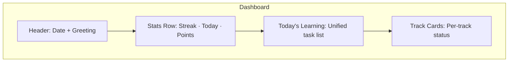

# Dashboard & Progress Redesign — Complete Analysis

## Table of Contents

- [The Core Problem](#the-core-problem)
- [The Permutation Matrix](#the-permutation-matrix)
- [What "On Track" Means — Every Scenario](#what-on-track-means--every-scenario)
- [Track Card Variants](#track-card-variants)
- [Chazara Overlay](#chazara-overlay)
- [Dashboard Composition](#dashboard-composition)
- [Today's Tasks — Unified Task List](#todays-tasks--unified-task-list)
- [Consolidated Stats](#consolidated-stats)
- [Progress Screen Redesign](#progress-screen-redesign)
- [Edge Cases](#edge-cases)
- [Data Model Gaps](#data-model-gaps)
- [Open Questions](#open-questions)

---

## The Core Problem

The dashboard must answer two questions instantly:

1. **"What should I do right now?"** — Today's tasks, prioritized
2. **"Am I making progress?"** — Per-track feedback that means something

The second question is the hard one. "Am I making progress?" has a different answer depending on whether you joined Daf Yomi, set a deadline to finish Mishnayos by Pesach, decided to learn 2 dapim per week at your own pace, or just started exploring Nach with no particular plan. Each of these is a valid way to learn, and each needs its own definition of "on track."

**Design principle from UX spec:** *"Open the app, see what's next, tap done, feel progress."* The dashboard is the hero. The scheduler curates. The user taps and feels forward motion. If the progress signal is wrong — too vague, too punishing, or just meaningless for their setup — they stop opening the app.

---

## The Permutation Matrix

Three independent dimensions determine how a track should be displayed:

### Dimension 1: Track Origin

| Type | Description | Scope | Daily Item Source |
|------|-------------|-------|-------------------|
| **Program** | Joined a structured calendar program | Program-defined | Calendar (today's daf/mishna/chapter) |
| **Self-paced** | Personal learning, user-configured | User-defined or all | Scheduler algorithm |

### Dimension 2: Chazara Configuration

| Type | Description | Who Controls |
|------|-------------|-------------|
| **Prescribed** | Program defines review stages (read-only) | Program metadata |
| **User-configured** | User set up review via wizard | User choice |
| **None** | No review configured; learn-only | User chose to skip |

### Dimension 3: Goal Mode

| Type | Description | Applicable To |
|------|-------------|--------------|
| **Calendar** | Keep up with program schedule | Program tracks only |
| **Deadline** | Finish scope by a date | Self-paced only |
| **Velocity** | Maintain X items per day/week | Self-paced only |
| **No goal** | No explicit target set | Self-paced only |

### The Real-World Scenarios

Combining these dimensions, here are the actual scenarios users create:

| # | Example | Origin | Chazara | Goal | "On Track" Signal |
|---|---------|--------|---------|------|-------------------|
| **P1** | Daf Yomi (no review) | Program | None | Calendar | Calendar position |
| **P2** | Daf Yomi + user-added review | Program | User-configured | Calendar | Calendar position + review compliance |
| **P3** | Oraysa (prescribed 4-stage review) | Program | Prescribed | Calendar | Calendar position + chazara compliance |
| **P4** | Dirshu (prescribed review + tests) | Program | Prescribed | Calendar | Calendar position + chazara + test prep |
| **S1** | "Finish Berachot by Pesach" | Self-paced | User-configured | Deadline | Pace vs deadline |
| **S2** | "2 mishnayos per day" | Self-paced | User-configured | Velocity | Current rate vs target |
| **S3** | "Learning Nach, no rush" | Self-paced | None | No goal | Personal momentum |
| **S4** | "Deep Chumash study with chazara" | Self-paced | User-configured | No goal | Momentum + review compliance |
| **S5** | "Finish all Mishnayos, 3/week" | Self-paced | User-configured | Velocity | Rate vs target + review load |

---

## What "On Track" Means — Every Scenario

### Program Tracks (P1–P4): Calendar Position

For all program tracks, "on track" means **keeping up with the calendar**. The program defines what you should learn each day. You are either caught up, ahead, or behind.

**Calculation:**

```
expected_position = program_calendar[today]
actual_position = latest_completion_ref (or starting_ref if none)
delta = actual_position - expected_position  (in units)

Status:
  delta >= 0  → "Caught up" or "X ahead"
  delta == -1 → "1 behind"
  delta <= -2 → "X behind"
```

**What about chazara compliance?** For prescribed programs (P3, P4), the user also needs to know whether they are completing their review stages. This is a **secondary signal** overlaid on the primary calendar status.

```
Chazara compliance:
  all_due_reviews_completed → "Reviews: ✓"
  some_overdue              → "Reviews: 3 overdue"
  no_reviews_configured     → (not shown)
```

### Self-Paced + Deadline (S1): Pace vs Schedule

"On track" = **your current pace puts you at or before the deadline.**

**Calculation:**

```
total_items = scoped content count
completed = items with all stages done
remaining = total - completed
days_remaining = deadline - today
required_daily_pace = remaining / days_remaining
actual_pace = 7-day rolling average of daily completions

Status:
  actual_pace >= required_pace → "On track for [date]" or "X days ahead"
  actual_pace < required_pace  → "X days behind" or "May miss by [N days]"

Projected completion = today + ceil(remaining / actual_pace)
```

### Self-Paced + Velocity (S2, S5): Rate vs Target

"On track" = **your actual rate matches or exceeds your target rate.**

**Calculation:**

```
target_rate = user-set pace (e.g., 2/day, 10/week)
actual_rate = 7-day rolling average, normalized to same unit

Status:
  actual_rate >= target * 0.9 → "On pace" (within 10%)
  actual_rate >= target        → "Above target" 
  actual_rate < target * 0.9  → "Below target"

Show: "2.3/day (target: 2.0)" or "12/week (target: 10)"
```

### Self-Paced + No Goal (S3, S4): Personal Momentum

This is the hardest one. There is no external target. But the user still needs feedback — otherwise the track feels dead.

**Design insight (Freya):** Without a goal, the only meaningful baseline is *the user's own behavior*. We measure them against themselves, not against an arbitrary standard. The signal is: "Are you maintaining your own rhythm?"

**Calculation:**

```
recent_pace = completions in last 7 days
personal_average = completions per 7-day window over last 30 days
  (if < 14 days of history: use all available data)
  (if < 3 completions ever: show "Getting started" instead)

Momentum status:
  recent >= personal_avg * 0.8  → "Active" (maintaining rhythm)
  recent < personal_avg * 0.8   → "Slowing" (below your own pace)
  recent == 0 && days_since > 3 → "Paused" (neutral, not judgmental)
  
Show: "3 this week (avg: 2.5)" or "Active — keeping your rhythm"
```

**Tone matters here.** "Slowing" is not a failure — it is information. "Paused" is neutral. We never say "behind" when there is no target to be behind on.

**If chazara is configured (S4):** The momentum signal covers new learning. Review compliance is the secondary signal, same as other scenarios.

### Summary Table

| Scenario | Primary Signal | Status Categories | Tone |
|----------|---------------|-------------------|------|
| Program (P1-P4) | Calendar position | Caught up / Ahead / Behind | Factual |
| Deadline (S1) | Days ahead/behind | On track / Ahead / Behind | Motivating |
| Velocity (S2, S5) | Rate vs target | On pace / Above / Below | Encouraging |
| No goal (S3, S4) | Personal momentum | Active / Slowing / Paused | Gentle |

---

## Track Card Variants

Every track on the dashboard gets a card. The card has a **consistent structure** but **variant-specific content**.

### Common Card Structure

```
┌─ curriculum color border (4dp light / 6dp dark) ──────┐
│                                                         │
│  Track Label                            curriculum tag  │
│  ─────────────────────────────────────────────────────  │
│  [PRIMARY METRIC — variant-specific]                    │
│  [STATUS LINE — variant-specific]                       │
│  ─────────────────────────────────────────────────────  │
│  [SECONDARY — chazara status, if applicable]            │
│  ─────────────────────────────────────────────────────  │
│  Today: X tasks                          [Continue →]   │
│                                                         │
└─────────────────────────────────────────────────────────┘
```

**Common elements across all variants:**

| Element | Content | Always Present |
|---------|---------|---------------|
| Track label | User's name for the track (e.g., "דף היומי") | Yes |
| Curriculum tag | Small chip: "בבלי", "משניות" | Yes |
| Curriculum color | Left border color from design system | Yes |
| Task count | "X tasks today" | Yes |
| Continue button | Navigates to most relevant task | Yes |

### Variant 1: Program Calendar Card (P1–P4)

```
┌─ blue border ──────────────────────────────────────────┐
│                                                         │
│  דף היומי                                     בבלי     │
│                                                         │
│  בבא קמא דף מ״ב                                        │
│  Day 142 / 2,711                                        │
│  ✓ Caught up                                            │
│                                                         │
│  Today: 1 task                            [Continue →]  │
│                                                         │
└─────────────────────────────────────────────────────────┘
```

**With prescribed chazara (P3):**

```
┌─ blue border ──────────────────────────────────────────┐
│                                                         │
│  אורייתא                                      בבלי     │
│                                                         │
│  בבא קמא דף מ״ב                                        │
│  Day 142 / 2,711                                        │
│  ✓ Caught up                                            │
│  ─────────────────────────────────────────────────────  │
│  חזרה: 2 due · 0 overdue                                │
│                                                         │
│  Today: 4 tasks                           [Continue →]  │
│                                                         │
└─────────────────────────────────────────────────────────┘
```

**Behind schedule (P1):**

```
┌─ blue border ──────────────────────────────────────────┐
│                                                         │
│  דף היומי                                     בבלי     │
│                                                         │
│  בבא קמא דף מ׳                                          │
│  Day 140 / 2,711                                        │
│  ⚠ 2 behind                                             │
│                                                         │
│  Today: 3 tasks                           [Continue →]  │
│                                                         │
└─────────────────────────────────────────────────────────┘
```

**Primary metric:** Today's content reference (Hebrew) + cycle position
**Status:** Caught up (green) / X ahead (green) / X behind (amber/red)
**Chazara line:** Only if chazara is configured (prescribed or user-added)

---

### Variant 2: Deadline Card (S1)

```
┌─ amber border ─────────────────────────────────────────┐
│                                                         │
│  מסכת ברכות                                  משניות     │
│                                                         │
│  ████████████░░░░░░░░  34%                              │
│  28 / 82 items complete                                 │
│  ✓ On track for ט״ו ניסן (Apr 13)                       │
│  ─────────────────────────────────────────────────────  │
│  חזרה: 1 due · 0 overdue                                │
│                                                         │
│  Today: 3 tasks                           [Continue →]  │
│                                                         │
└─────────────────────────────────────────────────────────┘
```

**Behind schedule:**

```
│  ████████████░░░░░░░░  34%                              │
│  28 / 82 items complete                                 │
│  ⚠ 3 days behind — may finish Apr 16                    │
```

**Primary metric:** Progress bar + percentage + item count
**Status:** On track for [date] / X days ahead / X days behind + projected date
**Chazara line:** If configured

---

### Variant 3: Velocity Card (S2, S5)

```
┌─ amber border ─────────────────────────────────────────┐
│                                                         │
│  משניות                                      משניות     │
│                                                         │
│  ████████░░░░░░░░░░░░  12%                              │
│  87 / 725 items complete                                │
│  ↑ 2.3/day — target: 2.0                                │
│  ✓ Above target                                         │
│  ─────────────────────────────────────────────────────  │
│  חזרה: caught up ✓                                      │
│                                                         │
│  Today: 4 tasks                           [Continue →]  │
│                                                         │
└─────────────────────────────────────────────────────────┘
```

**Below target:**

```
│  ↓ 1.4/day — target: 2.0                                │
│  ⚠ Below target                                         │
```

**Primary metric:** Progress bar + percentage + item count
**Rate line:** Current rate vs target (same units)
**Status:** Above target (green) / On pace (green) / Below target (amber)
**Chazara line:** If configured

---

### Variant 4: Momentum Card — No Goal (S3, S4)

```
┌─ green border ─────────────────────────────────────────┐
│                                                         │
│  נ״ך                                         נ״ך       │
│                                                         │
│  ████░░░░░░░░░░░░░░░░  8%                               │
│  19 / 237 items complete                                │
│  3 this week · avg 2.5/week                              │
│  ✓ Active                                               │
│                                                         │
│  Today: 1 task                            [Continue →]  │
│                                                         │
└─────────────────────────────────────────────────────────┘
```

**Slowing down:**

```
│  1 this week · avg 2.5/week                              │
│  → Slowing                                               │
```

**Paused (no completions in 3+ days):**

```
│  0 this week · avg 2.5/week                              │
│  ⏸ Paused · last: 5 days ago                             │
```

**New track (< 3 completions, not enough data for average):**

```
│  2 items complete                                        │
│  ✦ Getting started                                       │
```

**Primary metric:** Progress bar + percentage + item count
**Momentum line:** This week vs personal average
**Status:** Active (green) / Slowing (amber) / Paused (neutral gray) / Getting started (blue)
**Chazara line:** If configured
**Tone:** Never punishing. "Paused" not "stalled." "Slowing" not "failing."

---

## Chazara Overlay

Chazara status is a **secondary signal** that appears on any card variant when review stages are configured. It answers: "Am I keeping up with my review schedule?"

### Display Rules

| Chazara State | Display | Color |
|--------------|---------|-------|
| No chazara configured | (line not shown) | — |
| All reviews caught up | "חזרה: caught up ✓" | Green |
| Reviews due today (none overdue) | "חזרה: X due today" | Default |
| Overdue reviews exist | "חזרה: X overdue" | Amber |
| Severely overdue (5+ items) | "חזרה: X overdue ⚠" | Red |

### Chazara Compliance for Program Tracks (P3, P4)

Prescribed programs define specific chazara stages. Compliance means: for every item you have learned that has a review stage due, have you completed that review?

```
prescribed_reviews_due = items where learn completed AND
                         chazara stage delay has elapsed AND
                         chazara stage NOT completed
compliance = 1 - (overdue_count / total_due_count)
```

### Chazara Load for Self-Paced Tracks

User-configured chazara creates review tasks via the scheduler. The chazara line shows the load:

```
reviews_due_today = scheduler tasks with priority overdueChazara or scheduledChazara
overdue_count = tasks with priority overdueChazara
```

---

## Dashboard Composition

### Layout Structure



### Header

```
Good morning, Daniel
ד׳ ניסן תשפ״ו · April 1, 2026
```

### Stats Row — 3 Indicators

| Indicator | Content | Notes |
|-----------|---------|-------|
| **Streak** | "47 days" | Global across all tracks |
| **Today** | "2/4 tracks" or "8/12 tasks" | See design question below |
| **Points** | "127 pts" | Child mode only; adult shows pages/items completed today |

**Design question:** Should "Today" show tracks touched (2/4) or tasks completed (8/12)?

**Recommendation:** Show **tasks completed** as the number (8/12). It is more actionable — "I have 4 left" — and changes with each completion, creating micro-feedback loops. Track completion can be shown in the track cards themselves.

### Today's Learning Section

Shows the next tasks across all tracks, priority-ordered. Each task tagged with its track label. See [Unified Task List](#todays-tasks--unified-task-list) below.

### Track Cards Section

Scrollable list of track cards (one per active track). Order:

1. Tracks with tasks due today (most tasks first)
2. Tracks with overdue items
3. Tracks with no tasks today (e.g., rest day for that track)

### Scaling Behavior

| Track Count | Layout |
|-------------|--------|
| 1 track | Single card, expanded — can show more detail |
| 2-3 tracks | Cards in a vertical list, comfortable spacing |
| 4+ tracks | Cards with slightly reduced internal spacing; consider collapsible detail |

**No horizontal scrolling for cards.** Horizontal scroll obscures content. Vertical list with cards is scannable and accessible.

---

## Today's Tasks — Unified Task List

### Priority Order

All tasks from all tracks, merged and sorted:

| Priority | Source | Example |
|----------|--------|---------|
| 1. Overdue program items | Program tracks | "דף היומי · Yesterday's daf" |
| 2. Today's program items | Program tracks | "דף היומי · Today's daf" |
| 3. Overdue chazara | Any track | "מסכת ברכות · חזרה א׳ (1d overdue)" |
| 4. Scheduled chazara | Any track | "אורייתא · חזרה ב׳" |
| 5. New learning | Self-paced tracks | "נ״ך · יהושע פ״ג" |

### Task Item Design

```
┌─────────────────────────────────────────────────┐
│  ○  דף היומי · בבא קמא דף מ״ב                   │
│     לימוד                              [✓ Done] │
├─────────────────────────────────────────────────┤
│  ○  מסכת ברכות · ברכות פ״ג מ״ד                   │
│     חזרה א׳ · 1 day overdue            [✓ Done] │
├─────────────────────────────────────────────────┤
│  ○  אורייתא · בבא קמא דף מ״א                    │
│     חזרה ב׳                             [✓ Done] │
└─────────────────────────────────────────────────┘
                               View all (12) →
```

**Key changes from current:**

1. **Track label shown** — "דף היומי" not "בבלי"
2. **Stage name in Hebrew** — "חזרה א׳" not "Review 1"
3. **Overdue indicator** — "1 day overdue" on the stage line
4. **Quick-complete button** — single tap, optimistic UI (per 18.8)
5. **"View all" link** — when more than 5 tasks, links to full scheduler view

### Task List Interaction

- Tap task row → navigate to content (learning screen with that item)
- Tap ✓ button → mark complete (optimistic, 5s undo snackbar)
- After completion: task animates out, next task slides up
- "All done" state: celebration (child) or summary (adult)

---

## Consolidated Stats

### What the Global Numbers Mean

| Stat | Definition | Notes |
|------|-----------|-------|
| **Streak** | Consecutive days with at least 1 completion across any track | Global. Grace period: 1 missed day allowed per 7 days |
| **Today's completions** | Tasks completed today / tasks scheduled today | Cross-track sum |
| **Points** | Lifetime points from all completions | Child mode only |
| **Active tracks** | Non-archived tracks for active profile | Shown in Progress, not Dashboard |

### What We Do NOT Show Globally

- **Global completion %** — meaningless when tracks have different scopes and goals
- **Global pace status** — "ahead" on Daf Yomi and "behind" on Mishnayos does not average to "on pace"
- **Cross-track progress bar** — implies a single finish line that does not exist

**Each track tells its own progress story.** The dashboard consolidates *activity* (streak, today's tasks) but NOT *progress* — progress is always per-track.

---

## Progress Screen Redesign

The Progress screen provides deeper views than the dashboard cards. It should maintain the per-track model.

### Structure

```
PROGRESS
│
├── Overview
│   ├── Streak: 47 days (max: 62)
│   ├── Total completions: 1,284 (lifetime)
│   ├── Active tracks: 4
│   └── Points: 127 (child mode)
│
├── By Track (expandable tiles)
│   │
│   ├── דף היומי (Program · בבלי)
│   │   ├── Calendar: Day 142 / 2,711
│   │   ├── Status: ✓ Caught up
│   │   ├── No chazara configured
│   │   ├── Completions this cycle: 142
│   │   └── [View Charts] [View History]
│   │
│   ├── מסכת ברכות (Self-paced · משניות · Scoped)
│   │   ├── Scope: ברכות only (82 items)
│   │   ├── Progress: 34% (28/82 all stages)
│   │   ├── Goal: Finish by ט״ו ניסן
│   │   ├── Pace: ✓ On track (2.1/day, need 1.8)
│   │   ├── Chazara: caught up ✓
│   │   ├── Projected: Apr 11 (2 days early)
│   │   └── [View Charts] [View History]
│   │
│   ├── משניות (Self-paced · משניות · Velocity)
│   │   ├── Scope: All (725 items)
│   │   ├── Progress: 12% (87/725 all stages)
│   │   ├── Target: 3/week
│   │   ├── Actual: 2.8/week (7-day avg)
│   │   ├── Status: ✓ On pace
│   │   ├── Chazara: 2 overdue
│   │   └── [View Charts] [View History]
│   │
│   └── נ״ך (Self-paced · נ״ך · No goal)
│       ├── Scope: All (237 items)
│       ├── Progress: 8% (19/237 all stages)
│       ├── This week: 3 (avg: 2.5/week)
│       ├── Status: ✓ Active
│       ├── No chazara
│       └── [View Charts] [View History]
│
├── Charts (filterable by track)
│   ├── Completions over time (bar chart)
│   ├── Pace trend (line chart — actual vs target/average)
│   └── Streak calendar (heat map)
│
├── Learning Journey (lifetime milestones)
│   └── (All tracks, chronological)
│
└── Completion History (filterable by track)
```

### Track Detail View

Tapping a track tile opens a detail view with:

**Program track detail:**
- Calendar timeline (visual position in cycle)
- Daily completion log
- Chazara stage compliance (if prescribed)
- Missed items list

**Self-paced track detail (with goal):**
- Scope progress breakdown (hierarchy levels)
- Pace chart: actual vs required (deadline) or actual vs target (velocity)
- Projected completion date
- Chazara stage compliance
- Items by status: completed / in progress / not started

**Self-paced track detail (no goal):**
- Scope progress breakdown
- Momentum chart: weekly completion trend
- Personal average line for context
- Chazara compliance (if configured)

---

## Edge Cases

### Brand New Track (< 7 days old)

Not enough data for rolling averages or trend signals.

| Element | Behavior |
|---------|----------|
| Primary metric | "X completed so far" |
| Status | "✦ Getting started" (blue, neutral) |
| Momentum | Not shown (need 7+ days) |
| Pace (velocity) | Show target, actual shows "—" until 7 days |
| Pace (deadline) | Can calculate required pace immediately |

### Stalled Track (no completions in 14+ days)

| Element | Behavior |
|---------|----------|
| Status | "⏸ Paused · last: X days ago" (gray, neutral) |
| Task count | "0 tasks today" (if study day) or still shows scheduled tasks |
| Card position | Sorted to bottom of card list |
| Suggestion | Subtle: "Tap to resume" on continue button |

### Archived Track

Not shown on dashboard. Shown in Progress > Learning Journey as historical data. Completions from archived tracks are NOT counted in active track progress.

### Track With No Completions Yet

Just created, never used.

| Element | Behavior |
|---------|----------|
| Progress | "0%" with empty progress bar |
| Status | "✦ Ready to start" |
| Tasks | Shows first scheduled task |

### Single Track Dashboard

When user has exactly one track, the dashboard can be simpler:

- No "Your Tracks" section header needed
- Card can be expanded with more detail
- Today's tasks do not need track labels (only one track)
- Stats row can show track-specific stat instead of "tracks touched"

### Rest Day / Review Day

When today is configured as a review-only day for a track:

| Element | Behavior |
|---------|----------|
| Tasks | Only chazara tasks shown (no new learning) |
| Day type | "Review day" badge on that track's card |
| Card status | Normal — rest days are expected, not a problem |

---

## Data Model Gaps

### What Must Change

**1. Completions need track attribution**

Currently, `completions` has `curriculumId` + `trackType` (personal/school/tutor) but no `trackId`. With multiple tracks per curriculum, we cannot attribute a completion to a specific named track.

Options:
- Add `trackId INTEGER NULL` to completions table (nullable for backward compatibility)
- Or: add `trackLabel TEXT NULL` (denormalized but survives track deletion)
- **Recommendation:** Add `trackId` as foreign key to `curriculum_tracks`. Nullable — existing completions get null. The scheduler and mark-complete flow always set it for new completions.

**2. Program calendar data**

Program tracks need a calendar mapping (day N -> content ref). Currently does not exist. Options:
- `program_calendar` table: `(programId, dayNumber, sefariaRef)`
- Computed from program start date + ordered content list
- **Dependency:** Epic 19 local calendar infrastructure
- **Interim:** Can compute from program start date + curriculum content ordering

**3. Pace provider needs track scope**

`dashboardPaceStatus(curriculum)` computes pace per curriculum. Needs to compute per track, respecting:
- Track scope (only scoped items count)
- Track goal (if any)
- Track completions (not all curriculum completions)

**4. Task generation needs track context**

`DailyTask` model needs a `trackId` and `trackLabel` field so the UI can display which track a task belongs to.

**5. Momentum calculation (new)**

No existing provider computes personal momentum (rolling average vs recent). Need:
- `trackMomentumProvider(trackId)` — returns `MomentumStatus` with recent count, average, status enum

### What Can Stay

- **Streak** — global across all tracks, works as-is
- **Points** — global sum, works as-is (child mode)
- **Stage definitions** — per-curriculum, work as-is
- **Study day configs** — per-curriculum per-profile, work as-is
- **Completion DAO** — needs a per-track filter but existing queries are fine for global views

### New Provider Architecture

```
Current:
  dashboardActiveCurricula → List<CurriculumId>
  dashboardCompletionPercentage(curriculum) → double
  dashboardPaceStatus(curriculum) → PaceStatus?

Proposed:
  activeTracksProvider → List<Track>  (already exists)
  trackProgressProvider(trackId) → TrackProgress
    - For program: calendarPosition, delta, chazaraCompliance
    - For self-paced: scopeProgress, paceStatus, momentum
  trackTasksProvider(trackId) → List<DailyTask>
  trackMomentumProvider(trackId) → MomentumStatus
  trackChazaraStatusProvider(trackId) → ChazaraStatus
```

### New Domain Models

```dart
/// Unified progress model — variant determined by track type + goal
class TrackProgress {
  final int trackId;
  final String trackLabel;
  final CurriculumId curriculumId;
  final TrackProgressVariant variant;
  final double? scopePercentage;       // null for program tracks (or optional)
  final int completedItems;
  final int totalItems;
  final PaceStatus? paceStatus;        // deadline or velocity tracks
  final CalendarPosition? calendarPos; // program tracks
  final MomentumStatus? momentum;      // no-goal tracks
  final ChazaraStatus? chazaraStatus;  // if chazara configured
  final int tasksToday;
}

enum TrackProgressVariant {
  programCalendar,    // P1-P4
  deadlineGoal,       // S1
  velocityGoal,       // S2, S5
  momentum,           // S3, S4
}

class CalendarPosition {
  final int currentDay;
  final int totalDays;
  final String todayRef;          // Sefaria ref for today's item
  final String todayDisplayHe;    // Hebrew display for today's item
  final int delta;                // positive = ahead, negative = behind
  final CalendarStatus status;    // caughtUp, ahead, behind
}

enum CalendarStatus { caughtUp, ahead, behind }

class MomentumStatus {
  final int recentCount;          // completions in last 7 days
  final double personalAverage;   // avg per 7 days over last 30 days
  final MomentumLevel level;
  final int? daysSinceLastCompletion;
}

enum MomentumLevel { 
  gettingStarted,  // < 3 completions ever
  active,          // recent >= 80% of average
  slowing,         // recent < 80% of average
  paused,          // 0 completions in last 3+ days
}

class ChazaraStatus {
  final int dueToday;
  final int overdue;
  final bool isCaughtUp;
  final ChazaraSource source;     // prescribed or userConfigured
}

enum ChazaraSource { prescribed, userConfigured }
```

---

## Decisions Made

All open questions resolved through discussion on 2026-04-01.

### Q1: Completions are track-isolated — no sharing

**Decision:** Each track has its own completions. No sharing between tracks.

- Completions table gets a `trackId` column (FK to `curriculum_tracks`)
- Progress calculations only count completions attributed to that track
- Scheduler only considers completions for the current track
- Starting a new track = clean slate, regardless of prior completions in same curriculum
- Existing completions backfilled with `trackId` during migration

### Q2: Stats row shows tasks (8/12)

**Decision:** Tasks completed / total. Most actionable — changes with every tap, creating micro-feedback loops. Track coverage visible in the track cards below.

### Q3: Mock calendar data, don't block redesign

**Decision:** Define the `CalendarPosition` model and provider interface now, stub with mock data for development. Swap in real computation later (interim calculation or Epic 19). The redesign proceeds without waiting.

### Q4: "Continue" navigates to specific track's next task

**Decision:** Each track card has its own "Continue" button that navigates to that track's most relevant next task. The learning screen accepts a `trackId` parameter. No ambiguity — the card provides the context.

### Q5: Always full cards, vertical scroll

**Decision:** All cards always shown in a vertical list. No horizontal scroll, no collapsing. The cards are compact enough (~4 lines) that 5 tracks is manageable with scroll. Matches UX spec's "Clean List" direction.

### Q6: Archived track completions excluded from active progress, included in lifetime view

**Decision:** With track isolation, this is natural — archived track completions have a `trackId` pointing to an archived track, so they don't appear in active track queries. They DO appear in the lifetime curriculum view (Learning Journey, Completion History).

**Lifetime view is curriculum-based** — "what have I learned" not "which track was I using." Track labels don't appear in the lifetime view. But **review counts do** — per-item review counts across all stages, all tracks, all time. "Berachot 3:4 — learned 1x, reviewed 3x."

### Q7: Card variant determined at render time

**Decision:** When the user changes their goal mode, the card instantly reflects the new variant. No migration needed — completions are unchanged, only the interpretation changes. Momentum history doesn't reset either — rolling average is computed from completions.

---

## Restart / "Out of Track" Scenarios

Life happens. Users fall behind, stall, or get overwhelmed. The system must handle this gracefully without punishing or patronizing.

### Program Track — Falling Behind

User is 20 dapim behind on Daf Yomi. The calendar keeps moving. Options:

| Action | What Happens | What Does NOT Happen |
|--------|-------------|----------------------|
| **Catch up** (grind) | Learn the missed items naturally | — |
| **"Jump to today"** | Resets calendar position to today. Missed items skipped. Status becomes "Caught up." | Missed items are NOT marked as completed. They remain unlearned in lifetime view. |
| **Archive + new track** | Completely fresh start at today's position | Old completions stay in lifetime view |

**UX:** When a program track is 5+ items behind, show a subtle "Jump to today" action on the track card or in track detail. Tone: "Pick up from here" — not "give up on catching up."

### Self-Paced — Stalled or Overwhelmed

User had velocity target of 2/day, hasn't learned in 3 weeks. 40 chazara items overdue.

| Action | What Happens | What Does NOT Happen |
|--------|-------------|----------------------|
| **Just resume** | Start learning again. Rolling average recovers over 7 days. | — |
| **"Reset pace"** | Clears the velocity/momentum baseline. System measures pace from today forward. | Does NOT clear overdue chazara. Does NOT delete completions. Does NOT mark anything as done. |
| **Archive + new track** | Completely fresh start | Old completions stay in lifetime view |

**Critical rule: Overdue chazara can NEVER be cleared or dismissed.** Clearing overdue reviews defeats the entire purpose of the review system. The overdue items stay in the queue and get worked through as the user resumes. The user chose to set up review — the system respects that choice.

**What "Reset pace" does:**
- For velocity tracks: resets the baseline date for rolling average calculation. The "2.3/day (target: 2.0)" starts measuring from today instead of including the 3-week gap.
- For momentum tracks (no goal): resets the personal average baseline. "Getting started" status instead of "Paused — last: 21 days ago."
- For deadline tracks: does not apply — the deadline is the deadline. If they want to change the date, they edit the goal.

**UX:** When a self-paced track shows "Paused" status, show a subtle "Reset pace" action. Tone: "Fresh start" — not "you failed."

### Summary

| Track Type | Recovery Actions Available |
|-----------|---------------------------|
| Program — behind | "Jump to today" (skips missed, does NOT mark complete) |
| Self-paced — stalled | "Reset pace" (resets measurement baseline, does NOT clear overdue chazara) |
| Any — want clean slate | Archive track + create new one |

---

## Page Audit Results

Exhaustive audit of every screen, provider, DAO, and service that touches completion data. All findings assume the decision that **completions are track-isolated** (each completion has a `trackId`).

### Screens That Must Change

| Screen | Current Scope | What Breaks | Change Needed |
|--------|--------------|-------------|---------------|
| **Dashboard** | One card per curriculum | Multiple tracks per curriculum not shown | Per-track cards with variant-specific content |
| **Dashboard — quick complete** | Hardcodes `trackType: 'personal'` | Can't attribute completion to correct track | Task carries `trackId`, completion uses it |
| **Learning screen** | Per-curriculum progress bars | Doesn't show per-track progress | Accept `trackId` param, filter content |
| **Progress screen** | Aggregate stats across all tracks | Completion count blends tracks | Per-track tiles with track-specific metrics |
| **Curriculum progress** | All completions for curriculum | Hierarchy breakdown blends tracks | Filter by `trackId`, show track-scoped progress |
| **Completion history** | Filters by TrackType enum | Can't distinguish named tracks | Filter by specific track (label + ID) |
| **Progress charts** | Optional curriculum filter only | No track filtering | Add track selector to all chart queries |
| **Learning journey** | Aggregated ledger entries | Track label not shown | Curriculum-based view (no track labels), show review counts per item |
| **Gamification** | Global points sum | Points blend all tracks | Keep global total on dashboard, add per-track breakdown in detail |
| **Parent mode** | Per-curriculum aggregation | Doesn't show per-track progress for child | Per-track breakdown |
| **Tutor mode** | Curriculum filter only | Can't show per-track pace | Per-track filtering |

### Providers That Must Change

| Provider | Current Signature | New Signature |
|----------|-------------------|---------------|
| `dashboardCompletionPercentage` | `(CurriculumId)` | `(trackId)` |
| `dashboardLastCompletion` | `(CurriculumId)` | `(trackId)` |
| `dashboardPaceStatus` | `(CurriculumId)` | `(trackId)` |
| `aggregateCount` | `(CurriculumId)` | `(trackId)` |
| `curriculumProgress` | `(CurriculumId)` | `(trackId)` |
| `completionHistoryForCurriculum` | `(CurriculumId)` | `(trackId)` or `(CurriculumId)` for lifetime view |
| `trackBreakdown` | `(CurriculumId)` → `Map<TrackType, int>` | Remove or repurpose — no longer meaningful |
| Chart data service methods | `(dateRange, CurriculumId?)` | `(dateRange, trackId?)` |

**Unchanged providers:**
- `dashboardStreak` — global, no change
- `dashboardGlobalPoints` — keep as global aggregate
- `activeTracksProvider` — already returns track list
- `archivedTracksProvider` — already returns archived tracks

### DAO Changes

| DAO Method | Change |
|-----------|--------|
| `getCompletionsByCurriculumAndProfile()` | Add `trackId` parameter |
| `getAggregateCountByProfile()` | Add `trackId` parameter |
| `getCompletionsForContentAndProfile()` | Add `trackId` parameter |
| All chart data queries | Add `trackId` parameter |
| `getCompletionsByProfile()` | Keep as-is for lifetime view |

### Schema Changes — Complete Track Isolation

**Architectural decision:** Every track is completely isolated. Two tracks in the same curriculum have independent study days, stage definitions, goals, scopes, completions, and scheduler runs. No per-curriculum sharing of any config.

| Table | Current Key | Change |
|-------|------------|--------|
| `completions` | `(profileId, curriculumId)` | Add `trackId INTEGER NOT NULL` (FK to `curriculum_tracks.id`) |
| `study_day_configs` | `(profileId, curriculumId, dayOfWeek)` | Add `trackId` — each track has its own 7-day config |
| `stage_definitions` | `(profileId, curriculumId, stageOrder)` | Add `trackId` — each track has its own chazara stages |
| `goals` | `(profileId, curriculumId)` | Add `trackId` — each track has its own goal (or none) |
| `curriculum_scopes` | `(profileId, curriculumId)` | Add `trackId` — each track has its own scope filter |
| `learning_ledger` | `(profileId, curriculumId)` | Add `trackId` for attribution; lifetime view queries ignore it |
| `point_configs` | `(profileId, curriculumId)` | Add `trackId` — tied to track's stage definitions |
| `streaks` | `(profileId)` | No change — global |

**Migration:** Existing rows in all affected tables need `trackId` backfilled from the corresponding `curriculum_tracks` row. For profiles with one track per curriculum, this is a straightforward lookup.

**Scheduler:** Runs per-track, not per-curriculum. Each track has its own `SchedulerEngine.generateDailyTasks()` invocation using that track's completions, scope, stages, and study days. The `allDailyTasksProvider` merges results from all tracks and priority-sorts.

### What Stays Unchanged

| Component | Why |
|-----------|-----|
| Streaks | Global — any completion on any track on any day |
| Points total | Global aggregate for dashboard |
| Track DAO | Track lifecycle, not completions |
| Onboarding | Already delegates to AddTrackFlow |
| `curriculum_tracks` table | Already has the right structure — becomes the FK target for everything |
