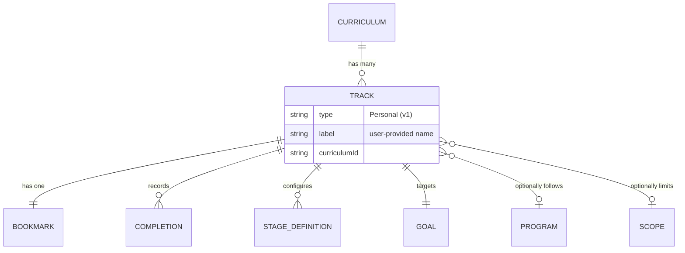
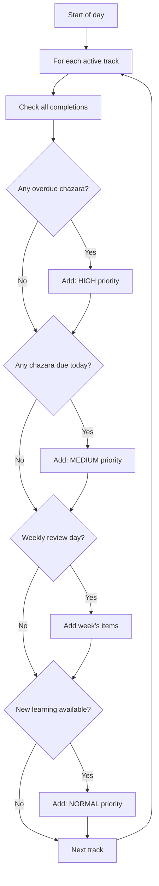
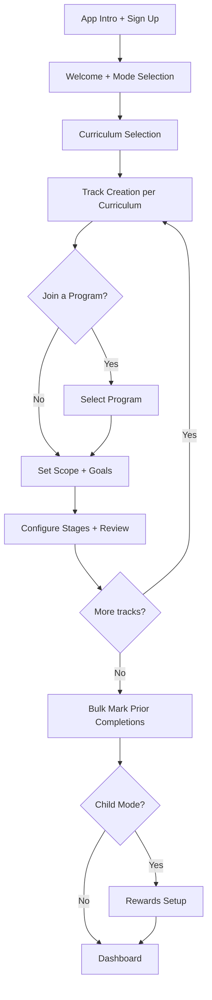

# Developer Guide

## Table of Contents

- [Why This App Exists](#why-this-app-exists)
- [Jewish Learning Concepts for the Uninitiated](#jewish-learning-concepts-for-the-uninitiated)
- [The Curricula](#the-curricula)
  - [Biblical Texts](#biblical-texts) — Chumash, Torah, Nach, Tanach
  - [Oral Law](#oral-law) — Mishnayos, Talmud Bavli, Talmud Yerushalmi
  - [Law Codes](#law-codes) — Mishna Berurah
  - [Ethics and Character Development](#ethics-and-character-development) — Mussar
- [Core Domain Model: The Track](#core-domain-model-the-track)
- [Track Types](#track-types)
- [Programs: Learning With the World](#programs-learning-with-the-world)
- [Scheduling and Chazara](#scheduling-and-chazara)
- [User Modes: Adult vs Child](#user-modes-adult-vs-child)
- [Onboarding: The Critical UX Challenge](#onboarding-the-critical-ux-challenge)
- [Daily Tracking Flow](#daily-tracking-flow)
- [The Dashboard Problem](#the-dashboard-problem)
- [Tech Stack and Architecture](#tech-stack-and-architecture)

---

## Why This App Exists

Learning Torah at scale is hard. A committed learner juggles multiple texts — Mishnah, Talmud, Bible, law codes — each with their own review cycles, progress markers, and deadlines. Some follow a global calendar shared by thousands of learners worldwide; others are self-paced.

Most people track this with spreadsheets, paper, or memory. It breaks.

Learning Tracker turns large-scale learning goals into a clear daily plan. You choose what to study, set your pace, and the app tells you what to do today — including what needs review and when. It handles the cognitive overhead so the learner can focus on learning.

### Who Uses It

- **Children** (ages 10-13): Bar mitzvah-age learners who need daily structure and motivation. The app provides full gamification — points, streaks, mystery rewards — with a parent dashboard for oversight.
- **Adults**: Self-directed learners pursuing personal learning goals. The app provides clean progress tracking without the gamification.
- **Parents**: Configure and monitor their child's learning — set up curricula, activate tracks, manage rewards.

---

## Jewish Learning Concepts for the Uninitiated

If you have no background in Jewish texts, this section gives you the minimum context to understand the domain.

### Key Terms

| Term | Hebrew | Meaning |
|---|---|---|
| **Chazara** | חזרה | Review. You don't read something once — you review it on a structured cycle to retain it. This is the app's core scheduling challenge. |
| **Sefaria** | — | An [open-source library](https://www.sefaria.org) of Jewish texts. The app's content source — every learnable item has a `sefariaRef` (Sefaria reference string) that uniquely identifies it. |
| **Shabbos / Shabbat** | שבת | The Jewish Sabbath (Friday evening to Saturday night). Many learners use Shabbos as a weekly review day. |
| **Siyum** | סיום | Completion celebration — finishing an entire unit (a tractate, a book, etc.). Tracked in the learning ledger. |

### Programs (Daf Yomi, Dirshu, Oraysa)

Established global study programs where thousands of people worldwide learn the same material on the same day, following a fixed calendar. Think of it like a massive book club with a daily reading schedule. The social dimension is powerful — you can discuss today's material with anyone in the world who follows the same program.

---

## The Curricula

The app supports nine curricula grouped into four categories. Each curriculum is an independent body of text with its own hierarchical structure. All content is sourced from Sefaria and bundled with the app — no internet connection is required.

### Biblical Texts

#### Chumash (חומש) — The Five Books of Moses

The foundational text of Judaism: Genesis, Exodus, Leviticus, Numbers, and Deuteronomy. ~5,845 verses.

| Level | Transliteration | Hebrew | English |
|---|---|---|---|
| 1 | Sefer | ספר | Book |
| 2 | Parsha | פרשה | Weekly portion |
| 3 | Perek | פרק | Chapter |
| 4 | Pasuk | פסוק | Verse |

#### Torah (תורה)

Can refer to the same Five Books as Chumash, or more broadly to the entire body of Jewish law and teaching. Used when the learner's scope extends beyond the biblical text itself. Same hierarchy as Chumash.

#### Nach (נ"ך) — Prophets and Writings

The rest of the Hebrew Bible beyond the Five Books. Nach is short for **N**evi'im (Prophets) + **K**etuvim (Writings). Includes books like Joshua, Isaiah, Psalms, and Proverbs.

| Level | Transliteration | Hebrew | English |
|---|---|---|---|
| 1 | Section | סעיף | Section (Nevi'im or Ketuvim) |
| 2 | Sefer | ספר | Book |
| 3 | Perek | פרק | Chapter |
| 4 | Pasuk | פסוק | Verse |

#### Tanach (תנ"ך) — The Complete Hebrew Bible

The complete Hebrew Bible as a single curriculum. Tanach is an acronym: **T**orah + **N**evi'im + **K**etuvim. Activating Tanach tracks the whole Bible as one unit, whereas Chumash and Nach break it into two separate curricula. Same hierarchy as Nach.

### Oral Law

#### Mishnayos (משניות) — The Mishnah

The first written compilation of Jewish oral law (~200 CE). Organized into 6 orders covering everything from agriculture to family law to temple rituals. 63 tractates, ~4,192 individual mishnayos.

| Level | Transliteration | Hebrew | English |
|---|---|---|---|
| 1 | Seder | סדר | Order (one of 6 major divisions) |
| 2 | Masechta | מסכת | Tractate (a topical volume) |
| 3 | Perek | פרק | Chapter |
| 4 | Mishna | משנה | Individual paragraph of law |

#### Talmud Bavli (תלמוד בבלי) — Babylonian Talmud

Extensive rabbinical discussion and analysis built on top of the Mishnah, compiled in Babylon (~500 CE). The most studied text in traditional Jewish education. ~2,711 folio pages of legal debate, stories, and rulings.

| Level | Transliteration | Hebrew | English |
|---|---|---|---|
| 1 | Masechta | מסכת | Tractate |
| 2 | Daf | דף | Folio page |
| 3 | Amud | עמוד | Page side (each daf has side a and side b) |

#### Talmud Yerushalmi (תלמוד ירושלמי) — Jerusalem Talmud

An alternative, shorter compilation of rabbinical discussion on the Mishnah, compiled in the Land of Israel. Less commonly studied than the Bavli.

| Level | Transliteration | Hebrew | English |
|---|---|---|---|
| 1 | Masechta | מסכת | Tractate |
| 2 | Daf | דף | Folio page |
| 3 | Halacha | הלכה | Legal ruling (leaf unit) |

### Law Codes

#### Mishna Berurah (משנה ברורה) — Practical Jewish Law

A widely studied guide to daily Jewish practice (early 1900s). A practical distillation of Talmudic law — "here's what to actually do." Organized as commentary on an earlier law code (the Shulchan Aruch). 697 sections.

| Level | Transliteration | Hebrew | English |
|---|---|---|---|
| 1 | Siman | סימן | Section |
| 2 | Se'if | סעיף | Sub-section |
| 3 | Se'if Katan | סעיף קטן | Minor sub-section |

### Ethics and Character Development

#### Mussar (מוסר) — Ethical Literature

A collective grouping of ethical and character-development texts from various authors and eras. Not a single book but a genre — the specific texts available are defined by the app's content library.

| Level | Transliteration | Hebrew | English |
|---|---|---|---|
| 1 | Sefer | ספר | Book (individual work within the genre) |
| 2 | Section | פרק | Section |
| 3 | Chapter | פרק | Chapter |

---

## Core Domain Model: The Track

The **track** is the atomic unit of this app. Everything hangs off it.

A track is a named, independent learning instance within a curriculum. It represents one context in which a person is learning one body of text.

### What a Track Owns

| Property | Description |
|---|---|
| **Type** | `Personal` in v1 (School and Tutor types planned for v2) |
| **Label** | User-provided name (e.g., "Daf Yomi", "My Mishnayos", "Morning Seder") |
| **Curriculum** | Which body of text this track covers |
| **Scope** | Optional subset of the curriculum (e.g., only Masechta Berachos within Bavli) |
| **Program** | Optional global calendar (e.g., Daf Yomi) |
| **Bookmark** | Current position in the learning sequence |
| **Goals** | Deadline, target completion percentage, study days |
| **Stage definitions** | Chazara (review) schedule configuration |
| **Points** | Accumulated score (child mode only) |
| **Streak** | Consecutive-day learning counter |

### Multiple Tracks per Curriculum

A user can have **multiple tracks of the same type** within the same curriculum. Each gets a label to distinguish it.

Example — a learner studying Bavli:

| Track Label | Type | Program | Scope |
|---|---|---|---|
| Daf Yomi | Personal | Daf Yomi | All of Bavli |
| Berachos Deep Dive | Personal | — | Masechta Berachos only |

Example — a learner studying Mishnayos:

| Track Label | Type | Program | Scope |
|---|---|---|---|
| My Mishnayos | Personal | — | All of Mishnayos |
| Zeraim Focus | Personal | — | Seder Zeraim |

> **Note**: "Seder" has two meanings in this domain. A **Seder** (Order) is one of the 6 major divisions of the Mishnah. A **seder** (study session) is a colloquial term for a scheduled block of learning time (e.g., "morning seder" = morning study session). Context makes the meaning clear.

### Content Overlap

The same content item (e.g., Berachos 3:1) can exist in multiple tracks simultaneously. Each track independently schedules its own chazara for that item. A learner might see "Berachos 3:1 — Chazara 1 (Daf Yomi)" and "Berachos 3:1 — Chazara 1 (Berachos Deep Dive)" as two separate tasks.

### Why Tracks Matter

The track model reflects how learning actually works: a learner might study the same text in different contexts (a global program and a personal deep-dive), at different paces, with different goals. The app doesn't force these into one timeline — it respects each context as independent.



---

## Track Types

In v1, all tracks are **Personal** — self-directed learning at your own pace or following a program.

The track type is a category label, not a behavioral difference. The scheduling engine, chazara system, and completion logic are type-agnostic — designed so new track types plug in without changing core logic.

### v2: School and Tutor Tracks

v2 introduces two additional track types for children:

- **School** — Parent-activated. Tracks what a child covers in a classroom setting.
- **Tutor** — Parent-activated. Tracks what a child covers in tutoring sessions.

These add visibility in the parent dashboard and separate configuration ownership (parent creates and manages them), but use the same underlying engine as Personal tracks.

---

## Programs: Learning With the World

A **program** is a global, calendar-based study schedule shared by thousands of learners worldwide. Programs are optionally attached to a track.

### How Programs Differ From Custom Learning

| Aspect | Custom (Self-Paced) | Program |
|---|---|---|
| **Schedule source** | User-configured goals and deadlines | Fixed global calendar |
| **What to learn today** | App calculates based on pace and chazara | Calendar dictates today's material |
| **Social dimension** | Individual | Thousands learning the same thing daily |
| **Review** | User-configured chazara stages | Some programs include review; user can layer on additional chazara |

### Supported Programs (v1)

| Program | Curriculum | Description |
|---|---|---|
| **Daf Yomi** | Bavli | One folio page of Talmud per day. Completes the entire Babylonian Talmud in ~7.5 years. The most widely followed program. |
| **Dirshu** | Mishna Berurah | Structured study of practical Jewish law with periodic tests. |
| **Oraysa** | Bavli | An alternative Talmud study program. |

### Program + Chazara

Programs define *what* to learn each day, but don't necessarily define review. A user can layer the app's chazara system on top of any program — adding delay-based spaced repetition and/or weekly review to program-assigned material.

### Program Data

Program calendars are bundled with the app. No internet connection is needed to know today's assignment.

---

## Scheduling and Chazara

The scheduling system answers two questions: **What should I review?** and **When?**

### Stages

Each track has configurable **stages** — steps in a review cycle. The default configuration:

| Stage | Name | Delay |
|---|---|---|
| 0 | Learn | — (first encounter) |
| 1 | Chazara 1 | 1 day after Learn |
| 2 | Chazara 2 | 7 days after Chazara 1 |

Users can customize this per curriculum:

- Add more stages (3, 5, or more review rounds)
- Rename stages (e.g., "Iyun" (in-depth study) instead of "Learn", "Bekius" (broad review) instead of "Chazara")
- Adjust delays between stages

### Schedule Type

Each curriculum uses one schedule type — chosen at configuration:

| Type | How It Works | Use Case |
|---|---|---|
| **Delay** | Review item X days after completing the previous stage. Classic spaced repetition. | Self-paced learning of any curriculum — Mishnayos, Gemara, etc. |
| **Friday/Shabbos Review** | Review the week's learned material on both Friday and Shabbos, layered on top of delay-based chazara. | Learners who want a weekly consolidation pass in addition to spaced repetition. |
| **Shabbos Review** | Review the week's material on Shabbos only, layered on top of delay-based chazara. | Same concept, single review day. |

**Important**: Delay is the core engine. Friday/Shabbos and Shabbos-only are **additional layers** — they don't replace delay-based chazara, they supplement it with a weekly review session.

### How the Scheduler Builds a Day's Tasks



Priority order across all tracks and curricula:

1. **Overdue chazara** — items that should have been reviewed but weren't
2. **Scheduled chazara** — items due for review today (delay-based)
3. **Weekly review** — items from this week (Friday/Shabbos layer)
4. **New learning** — next items in the learning sequence

---

## User Modes: Adult vs Child

The app serves two audiences from a single codebase, gated by a mode flag on the user profile.

| Aspect | Adult Mode | Child Mode |
|---|---|---|
| **Track types** | Personal only | Personal (v2 adds School + Tutor) |
| **Configuration** | Self-managed | Parent-managed (PIN-protected) |
| **Gamification** | None | Points, streaks, mystery rewards, celebrations |
| **UI tone** | Clean, minimal | Animated, playful |
| **Completion feedback** | Subtle snackbar | Points popup, celebration animation |
| **Parent dashboard** | N/A | PIN-protected analytics and reward management |
| **Reward system** | N/A | Configurable mystery rewards tied to point thresholds |

### Points and Rewards (Child Mode)

- **Points** accumulate per track. Each completion earns points based on the stage (configurable in `point_configs`).
- **Streaks** are per track — consecutive days with at least one completion on that track.
- **Mystery rewards** are set up by parents. When a child's points on a track cross a threshold, a reward is revealed.

---

## Onboarding: The Critical UX Challenge

Onboarding is where the domain complexity hits the user. The app needs to collect enough configuration to build a personalized daily plan — without overwhelming a learner (or their parent) who just wants to start studying.

### What Needs to Be Configured

For each track the user creates, the app needs:

1. Which curriculum
2. Track label
3. Scope (all of it, or a subset)
4. Program (join a global program, or self-pace)
5. Goals (deadline, study days, target percentage)
6. Stage configuration (review schedule)
7. Optionally: bulk-mark prior completions (for users switching from another system)
8. Child mode: rewards setup

### The UX Problem

A power user might create 5+ tracks across multiple curricula, each with different programs, scopes, and schedules. A first-time user might want one track with sensible defaults. The onboarding flow must serve both — likely through progressive disclosure: start simple, reveal complexity as needed.

### Onboarding Flow



### Why This Matters

If onboarding is too complex, users abandon the app before learning anything. If it's too simple, users get a poorly configured experience that doesn't match their actual learning. Getting this right is one of the hardest UX problems in the app.

---

## Daily Tracking Flow

Once onboarded, the day-to-day experience follows this loop:

### 1. Open the App → Dashboard

The dashboard shows a cross-track, cross-curriculum summary: what's due today, streak status, pace indicators.

### 2. Pick a Task or Browse

Two paths:

- **Recommended tasks**: The scheduler surfaces a prioritized list — overdue reviews first, then scheduled reviews, then new learning. Each task shows the item reference, stage, and which track it belongs to.
- **Manual browse**: Navigate the curriculum hierarchy (e.g., Seder → Masechta → Perek → Mishna) and pick items directly.

### 3. Learn and Mark Complete

Open an item to see the Hebrew and English text (sourced from Sefaria). Mark it complete, selecting which track and stage.

### 4. Post-Completion

- **Bookmark advances** to the next item (if all stages of current item are done on that track).
- **Chazara recalculates** — the scheduler updates the review queue.
- **Child mode**: points popup, celebration animation, possible reward reveal.
- **Adult mode**: subtle confirmation.

### 5. Repeat

Work through the day's tasks across tracks and curricula.

### Offline Behavior

All completions write to the local SQLite database immediately. If offline, writes queue for sync when connectivity returns. The app is fully functional without internet — content is bundled, scheduling is local.

---

## The Dashboard Problem

The dashboard is the first thing users see and the hardest screen to get right.

### What It Must Synthesize

For a given user, the dashboard aggregates:

- **Multiple curricula**, each with **multiple tracks**
- Each track has its own **streak**, **points**, **progress percentage**, **pace status**, and **daily task count**
- Tasks are prioritized across all tracks: overdue chazara from one track competes with new learning from another
- Program tracks have external calendar pressure ("you're 3 days behind Daf Yomi")
- Child mode adds reward progress, celebration states, and visual gamification

### The Design Challenge

A child with 3 curricula and 5 total tracks could have 20+ daily tasks across different contexts. The dashboard needs to present this without:

- Overwhelming with information
- Burying urgent items (overdue chazara)
- Losing the motivational elements (streaks, rewards, progress)
- Confusing which task belongs to which track

This is an open design problem. The dashboard must balance information density with clarity — and the solution likely differs between adult mode (data-focused) and child mode (motivation-focused).

---

## Tech Stack and Architecture

### Stack Summary

| Category | Technology |
|---|---|
| Framework | Flutter (Dart) |
| Platform | Android (iOS planned) |
| State Management | Riverpod 3.x with code generation |
| Navigation | auto_route 11.x (type-safe) |
| Local Database | Drift (SQLite ORM) |
| Backend | Firebase Auth + Cloud Firestore + Firebase Storage |
| Content Source | Sefaria (bundled, not live) |
| Calendar | kosher_dart (Hebrew dates) |
| Code Generation | build_runner (Drift, Riverpod, Freezed, auto_route, json_serializable) |

### Architecture

The project follows **feature-first Clean Architecture** with 17 feature modules. Each module has three layers:

```text
feature/
  data/          # Repositories, data sources, DTOs
  domain/        # Entities, use cases, repository interfaces
  presentation/  # Screens, widgets, providers
```

Cross-feature services live in `lib/core/services/` and depend on abstract repository interfaces to avoid circular dependencies.

### Key Patterns

- **Riverpod family providers** scope state per curriculum and per track — preventing cross-track data leaks.
- **Offline-first**: all writes hit local SQLite immediately, then queue for Firestore sync. The app works fully offline.
- **Append-only completions**: the `completions` table only permits inserts — full history is preserved.
- **Last-write-wins sync** for bookmarks, goals, and settings — conflicts resolve by UTC timestamp comparison.
- **Content as bundled assets**: curriculum text is downloaded once and stored locally. No runtime dependency on Sefaria API or internet connectivity.

For detailed data models and schema, see [Data Models](./data-models.md). For project structure and module inventory, see [Project Overview](./project-overview.md).
