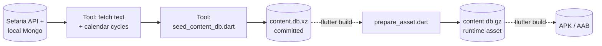
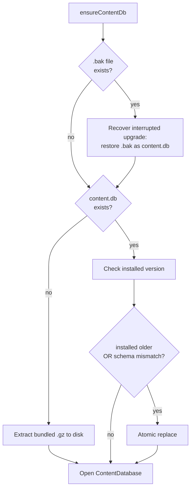
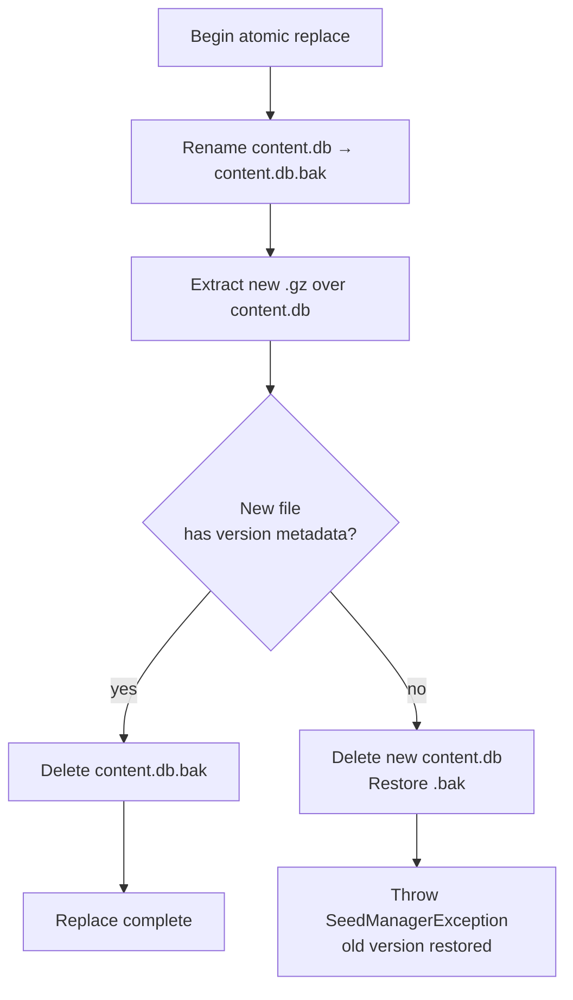
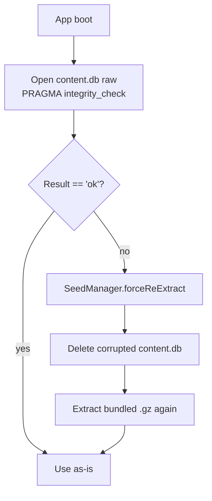

# How the Content Database Works

> Concept explainer for contributors. Part of the Learning Tracker [documentation set](../index.md).
> Reverse-derived from the codebase as of 2026-05-19. The code is the source of truth; if this document and the code disagree, the code wins.

The **Content Database** is the Torah library that ships inside Learning Tracker. It holds the text the user reads, the pre-computed learning-calendar cycles, and the metadata that lets the app verify it has the right version installed. It is **read-only at runtime** and works completely offline.

This explainer walks through the lifecycle: from the build pipeline that produces the seed file, to the runtime checks that keep it valid, to what the app does when something is wrong.

For the column-level schema, see [data-models.md § Content Database](../data-models.md#2-content-database-contentdatabase-schema-v5). For the wider storage picture, see the [data model explainer](./data-model.md).

## What is in it

The Content DB is a SQLite database with four tables:

- **`text_cache`** — the bilingual Torah text (Hebrew + English), keyed by `sefariaRef`. Tens of thousands of rows.
- **`calendar_cycles`** — one row per `(programKey, dateKey)` for every calendar-driven learning program (Daf Yomi, Mishnah Yomis, Nach Yomi, the Dirshu programs, and so on). Tens of thousands of rows.
- **`daily_content`** — pre-resolved bilingual text keyed by a calendar display ref.
- **`seed_metadata`** — a single-row table describing the build: version, build ID, content hash, minimum app version, and counts.

The runtime never writes to any of these. The database is opened with `PRAGMA query_only = ON` and stays read-only for its entire life.

## The build pipeline

The content does not appear in the database by magic. A separate **build pipeline** in `learning_tracker/tool/` assembles it once, from Sefaria, into a file the app can ship.



*Figure: the content moves from Sefaria, through build tooling, to a committed `.xz` source-of-truth, then is repackaged as a `.gz` asset at app-build time.*

A few notes on this:

- The `.xz` file is committed to the repository as the canonical source. It is the smaller of the two compression formats — small enough to fit GitHub's 100 MB file limit.
- The `.gz` file is **not committed** (it is in `.gitignore`). `tool/prepare_asset.dart` produces it from the `.xz` at build time, because Dart's standard library decompresses gzip natively at runtime but does not include an `.xz` decoder.
- CI runs `prepare_asset.dart` before `flutter build`, and the resulting `.gz` is what the app bundles in its APK/AAB.

The validation tooling that lives alongside the builders — `validate_seed_coverage.dart`, `verify_seed_calendar.dart` — asserts that every `(program, date)` pair has a reference and that the reference resolves against the bundled hierarchy. **Calendar correctness is a domain requirement**: if Daf Yomi shows the wrong daf for today's date, users notice immediately.

## What happens at first launch

The first time a user runs the app there is no content database on the device yet. `SeedManager.ensureContentDb()` is the function that establishes it, and it runs *before* any provider that might query content.



*Figure: ensureContentDb makes one of four decisions — recover from a crash, extract for the first time, replace an older version, or do nothing.*

The four outcomes are deliberate:

1. **Interrupted-upgrade recovery.** A `.bak` file means a previous upgrade was interrupted (the app was killed mid-replace). Any partial `content.db` is discarded and `.bak` is renamed back into place.
2. **First-launch extraction.** No `content.db` on disk — the bundled `.gz` is loaded from assets, decompressed with `dart:io`'s native gzip decoder (fast enough that no isolate is needed), and written to the app documents directory.
3. **Version upgrade.** The installed version is older than the bundled one, or the schema number does not match what the runtime expects. The app does an atomic replace (see below).
4. **No-op.** The installed content is current — open it and proceed.

## The version checks (what is compared)

Two version numbers are checked with raw `sqlite3` (no Drift), so opening the database does not trigger any migration on a file that may be replaced:

- **Seed version** — `SELECT version FROM seed_metadata`, compared to `SeedManager.bundledSeedVersion` (a constant in `seed_version.dart`).
- **Schema version** — `PRAGMA user_version`, compared to `ContentDatabase.expectedSchemaVersion` (a static constant on the database class).

A replace is forced if any of the following hold:

- The installed seed metadata is missing or unreadable.
- `bundledSeedVersion` is strictly greater than the installed version.
- The schema version is missing or differs from the runtime's `expectedSchemaVersion`.

Using `PRAGMA user_version` instead of opening Drift means a Content DB at an unexpected schema version cannot trigger an unintended migration — it is simply replaced.

## Atomic replace — never leaving a half-written database

When a replace is needed, the sequence is designed to **always leave a valid `content.db` on disk** — either the old one or the new one, never half of either.



*Figure: a replace either completes and deletes the backup, or rolls back and restores it.*

If the app is killed at any point during a replace, the `.bak` file remains on disk. The next launch detects it in step 1 of `ensureContentDb` and recovers automatically — the user never sees a partial state.

## Corruption recovery

Even a successfully installed content database can be damaged later — a filesystem error, an OS-level crash mid-write, a corrupted block on disk. `ContentDbHealthChecker` runs an integrity check on the installed file:



*Figure: a corrupted Content DB is detected and rebuilt from the bundled seed without losing any user data.*

Because the Content DB has **no user data** in it — only bundled content — re-extracting from the asset is always safe. No backup is required.

## What gets shipped versus what does not

A quick reference, since the formats look similar:

| File | In the repository? | In the APK? | Created by | Used by |
|---|---|---|---|---|
| `assets/db/content.db.xz` | **yes** (source-of-truth) | no | the build tooling | `prepare_asset.dart` |
| `assets/db/content.db.gz` | no (gitignored) | **yes** (runtime asset) | `prepare_asset.dart` at build | `SeedManager` at first launch |
| `content.db` | no | no | `SeedManager` at first launch | the app at runtime |
| `content.db.bak` | no | no | `SeedManager` mid-upgrade | recovered by `SeedManager` on a later launch |

Three of the four files exist only on a user's device. Only one is committed to the repository, and only one is bundled in the APK.

## What the user sees if anything fails

The error paths are quiet by design:

- **Extraction fails on a fresh install** — `SeedManager.ensureContentDb` throws `SeedManagerException` with a user-facing message. The error is reported to Crashlytics; the user can retry from the UI (`forceReExtract`).
- **A replace fails part-way** — the previous version is restored; the app continues. The new version simply has not landed yet.
- **The installed file is corrupted** — `ContentDbHealthChecker` re-extracts the bundled seed; the user sees a brief delay at startup but no data loss.
- **First launch on a device with no Play Services or no network** — nothing about the Content DB depends on the network, so the app is fully functional anyway. This is the offline-first guarantee in practice.

## Where the code lives

```text
lib/core/database/
├── content/
│   ├── content_database.dart           # The Drift class (read-only, query_only ON)
│   └── daos/                           # Read-only DAOs for the 4 tables
├── tables/                             # AUD-docs-16 (2026-07-13): shared with User DB — TextCache,
│                                        # CalendarCycles, DailyContent, SeedMetadata live here, NOT
│                                        # under content/tables/ (that directory doesn't exist)
├── seed_manager.dart                   # ensureContentDb, atomic replace, .bak recovery
├── content_db_health_checker.dart      # Integrity check + forceReExtract
└── seed/
    ├── learning_program_seeds.dart     # Hard-coded learning-program presets
    └── test_date_seeds.dart            # Runtime-computed Dirshu test dates

learning_tracker/tool/                  # The build pipeline
├── prepare_asset.dart                  # .xz → .gz at build time
├── seed_content_db.dart                # Build the seed
├── seed_content.dart                   # Fetch per-curriculum content
├── seed_text_content.dart              # Fetch bilingual text from Sefaria
├── validate_seed_coverage.dart         # CI gate: every (program, date) resolves
└── verify_seed_calendar.dart           # Cross-check calendar against live Sefaria
```

For where the Content DB sits in the broader storage model, see the [data model explainer](./data-model.md) and the schema reference in [data-models.md](../data-models.md).
