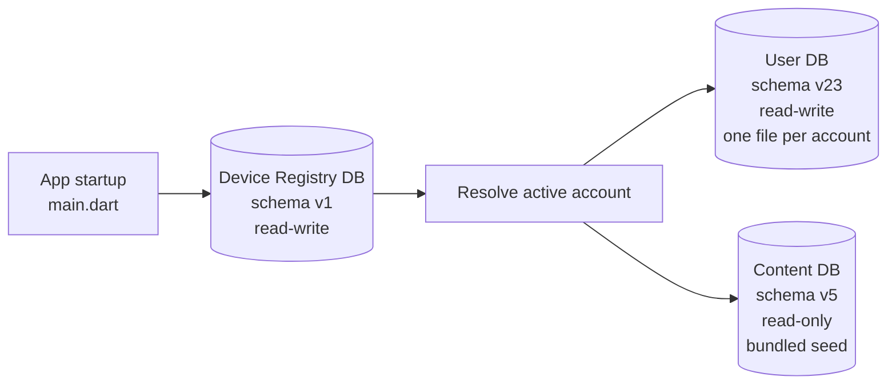
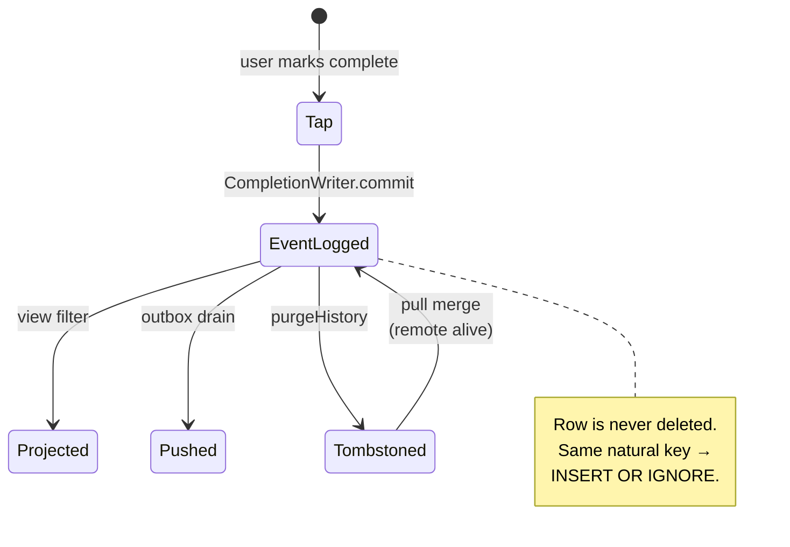
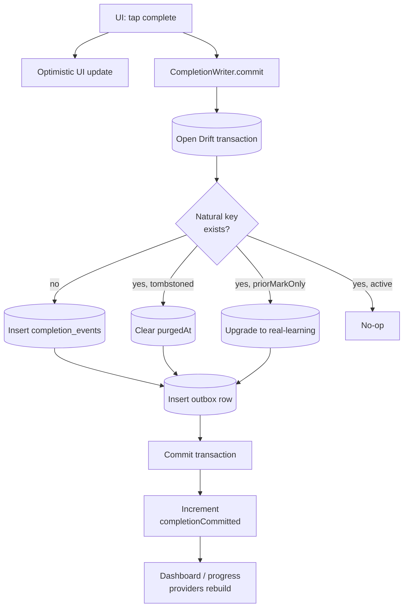

# How the Data Model Works

> Concept explainer for contributors. Part of the Learning Tracker [documentation set](../index.md).
> Reverse-derived from the codebase as of 2026-05-19. The code is the source of truth; if this document and the code disagree, the code wins.

The data model is the part of the app that has paid the most in bug fixes — and it has the rules to show for it. This document explains *why* the data is shaped the way it is: the three databases, the event-sourced event logs, the projection pattern, what keeps the schema correct, and how a single completion flows from a finger tap to a durable, syncable row.

For the full schema — every table, every column, every DAO — see [data-models.md](../data-models.md). For migrations and seed mechanics, see also the [content database explainer](./content-database.md).

## Three databases, three responsibilities

Learning Tracker stores its data in **three separate SQLite databases**, each managed by [Drift](https://drift.simonbinder.eu). Each has a single, narrow job:



*Figure: at startup, the Device Registry DB opens first, points to the active account's User DB, and the read-only Content DB opens alongside.*

- **Device Registry DB** — a small database that tracks which accounts exist on this device (up to five) and which one is currently active. Opens first, before any user data.
- **User DB** — the main read-write database. **Each account gets its own file** (for example, `user_acc_abc123.db`), so account isolation is a filesystem property, not a careful query. The active filename is resolved at launch from the Device Registry.
- **Content DB** — read-only. Holds the bundled Torah text and the pre-computed learning-calendar entries. Shipped inside the app and never written to at runtime. The full lifecycle is covered in the [content database explainer](./content-database.md).

This split keeps three different update cadences cleanly separated: device state, per-account user data, and the content library.

## Completions are events, not state

The single most important design decision in the data model: **completions are not a mutable row that you update**. They are events appended to a log.



*Figure: a completion's lifecycle. The event row is created once and may be tombstoned, but it is never physically removed.*

Two tables are involved:

- **`completion_events`** — the append-only log. Every completion is one row, inserted with `INSERT OR IGNORE` against a UNIQUE natural-key index on `(profileId, sefariaRef, stageId, trackType, curriculumId)`. Two devices marking the same item complete collapse into one row safely.
- **`completions_view`** — a read-only projection over `completion_events` (with `WHERE purged_at IS NULL`). All read paths go through this view, never the legacy `completions` table.

The same shape applies to streaks: `streak_events` is the log; the `Streaks` table is a derived cache that the reducer fills in by replaying the log.

### Why event-sourcing here?

Three reasons, learned the hard way:

- **Sync becomes trivial.** Two devices appending the same event are idempotent — no merge logic needed. Tombstones plus idempotent inserts make convergence a property of the schema, not a code path.
- **History is durable.** A user can delete a track without losing the history of what they learned under it. The `learning_ledger` is a sibling append-only table that preserves lifetime learning across track deletions.
- **Bugs cannot silently corrupt counts.** When the projection looks wrong, the event log still has the truth. Several of the N1–N8 regression invariants — invariants the project has fixed bugs to keep green — depend on this property.

### The tombstone rule (N8)

The event log's row count **never decreases**. To "delete" a completion, the writer sets `purgedAt`; the projection filters tombstoned rows out, existence checks query the raw table so the tombstone is not invisible to deduplication, and a pull from another device can resurrect the row (clear `purgedAt`) if the remote still has it alive.

This rule is **enforced by the N8 regression invariant** in `test/story_acceptance/regression_invariants_test.dart`. If you find yourself wanting to physically delete an event row, you almost certainly want a tombstone instead.

## profileId scoping

The app supports up to ten learner profiles per account. Every user-facing table carries a **`profileId`** column; seven of them have a real foreign key onto `LearnerProfiles(id) ON DELETE CASCADE`. Profile isolation is therefore both a query convention (DAOs scope by `profileId`) and a schema property (deleting a profile cleans up its rows).

A shared mixin, `BaseDao`, gives any profile-scoped DAO the standard `getById`, `getByProfile`, `count`, and `exists` queries — so the pattern is uniform across the codebase.

**Cross-profile reads are deliberately rare.** The few callers that need them (parent analytics, full data export, sync restore) go through a single allowlisted surface, `ParentAnalyticsRepository`, which takes a `CrossProfileScope` enum stating the business reason for the read.

## Writing a completion, end to end

The completion write is the **single most performance- and correctness-sensitive operation** in the app. Everything that records progress goes through one path: `CompletionWriter.commit`.



*Figure: the completion write — one transaction, four idempotent outcomes, one notifier.*

A handful of properties make this work:

- **Atomicity.** The event row and the outbox row are written in the same transaction. Either both land or neither does — there is no state where a local row exists without a queued cloud push.
- **Idempotency.** The natural key is a 5-tuple: `(profileId, sefariaRef, stageId, trackType, curriculumId)`. The same completion arriving twice (a sync round-trip, a duplicate tap) cannot create duplicates.
- **Tombstone resurrection.** If the user previously deleted this completion and a remote pull says it is alive elsewhere, the writer clears the tombstone instead of inserting a second row.
- **Bulk-prior upgrade.** A row first inserted as "I learned this before I had the app" (`priorMarkOnly = 1`) is upgraded to real learning when the user actually completes it, so a later expunge of prior marks does not destroy real history.
- **A single notifier.** `completionCommittedProvider` is a monotonic counter that every progress-, dashboard-, and gamification-related provider watches. One increment refreshes the whole graph — there is no manual `ref.invalidate` chain.

The path is the same for one completion and for hundreds: `CompletionWriter.commitBatch` wraps the same logic in one transaction, with the same idempotency guarantees.

## Last-write-wins for the mutable rows

Not everything is event-sourced. Bookmarks, goals, learning order, study-day configurations, profile programs, and several preference rows are mutable state — they have an `updatedAt` column, and sync uses **last-write-wins**: on merge, remote wins only if strictly newer than local. Ties go to local, to avoid flap loops.

For cross-device identity on these tables, the rule is to derive a key from the data rather than rely on the autoincrement `id`. The `LearningLedger` table goes further and stamps every row with a client-generated [ULID](https://github.com/ulid/spec), so a row written on Device A and a row written on Device B can be recognized as the same logical entry.

## What keeps the schema correct

Five mechanisms work together:

1. **Drift migrations.** Every schema change adds a migration step and bumps `schemaVersion`. The migrations are tested in `test/migration/` — one test per version bump, opening the database at the old schema and asserting the upgrade behaves.
2. **Connection-scoped foreign keys.** SQLite enforces foreign keys per-connection. `UserDatabase.beforeOpen` runs `PRAGMA foreign_keys = ON` on every connection, so cascades and FK constraints actually fire.
3. **`tool/schema_check.dart`.** A CI gate that parses the Drift table definitions and asserts every profile-scoped table keys on `profileId` and has at least one composite index. Drift cannot express these invariants natively, so a code-generation pass enforces them.
4. **The `make audit` greps.** Thirteen targeted greps catch the patterns the schema cannot — for example, `DateTime.now()` outside `core/time/`, raw `print()` in production code, hardcoded `currentAccountId = 1`, and several layering-rule shortcuts.
5. **The N1–N8 regression invariants.** Encoded in `test/story_acceptance/regression_invariants_test.dart`. They are the production-derived rules the schema has to satisfy.

Run all of these locally before you push:

```bash
# from the repository root
make schema-check                    # profileId + composite-index invariants

# from learning_tracker/
cd learning_tracker
make audit                           # 13 enforcement greps
flutter test test/migration/         # per-version migration tests
make test-invariants                 # the N1–N8 regression net
```

The two Makefiles are split deliberately: `schema-check` parses Drift table sources at the repo level (it lives in the root `Makefile` and runs `dart run tool/schema_check.dart`), while the app-test targets live in `learning_tracker/Makefile`.

## What is in each database (quick map)

For the column-level reference, see [data-models.md](../data-models.md). The conceptual map:

- **User DB** (22 tables + 1 view) — accounts, learner profiles, curriculum tracks and their scopes, stage definitions, study-day configurations, completion events and the projection view, daily plans, the learning ledger, bookmarks, two ordering tables, goals, the streak cache and event log, the outbox and the legacy sync queue, text-download status, and the Sacred-Time window cache.
- **Content DB** (4 tables) — the Sefaria text cache, pre-computed calendar cycles, pre-resolved daily content keyed by calendar ref, and a single-row metadata table describing the seed build. See the [content database explainer](./content-database.md).
- **Device Registry DB** (2 tables) — one row per account on the device, and a small key-value store for device-level state (`lastActiveAccountId`).

## Where the code lives

```text
lib/core/database/
├── user/                    # UserDatabase + its migrations
├── content/                 # ContentDatabase + read-only DAOs
├── registry/                # DeviceRegistryDatabase
├── tables/                  # 22 User-DB table definitions
├── daos/                    # User-DB DAOs (BaseDao mixin lives here)
├── views/                   # completions_view
├── seed/                    # Bundled program / test-date seeds (Dart constants)
└── seed_manager.dart        # First-launch extraction, version checks, .bak rollback
```

The completion write path lives one level up:

```text
lib/core/learning/
├── completion_command.dart        # The Freezed command type
├── completion_writer.dart         # The single authoritative write path
└── completion_writer_providers.dart
```

For migrations, see the `onUpgrade` chain in `lib/core/database/user/user_database.dart` and the corresponding tests in `test/migration/`.
