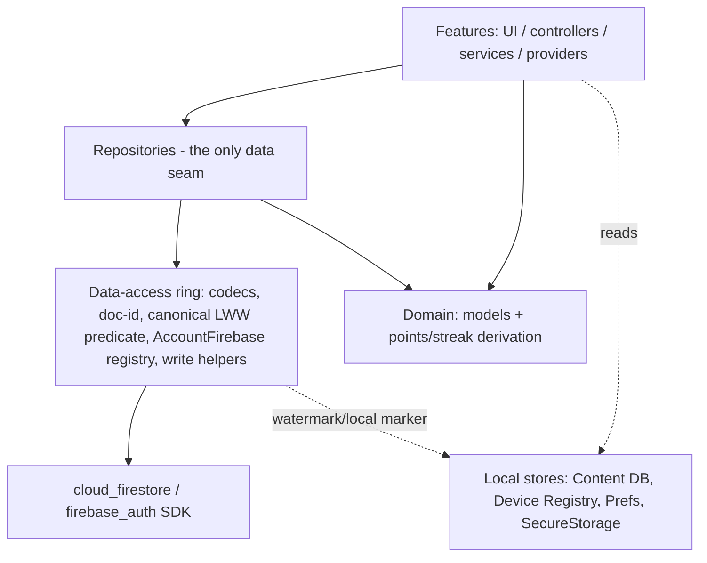
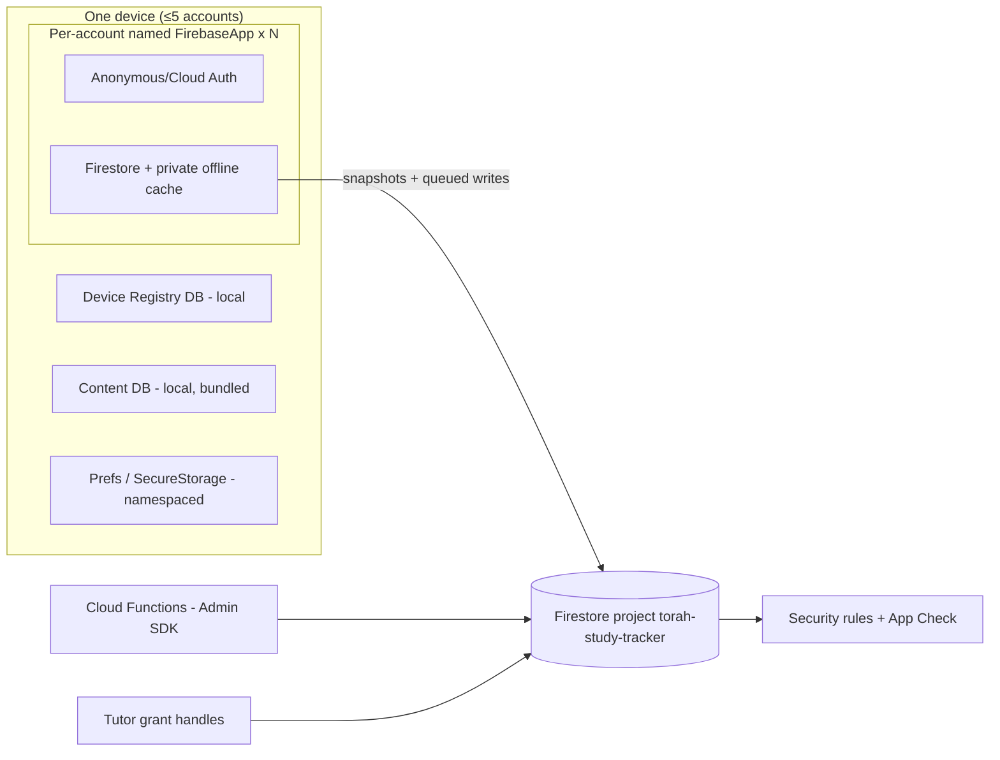
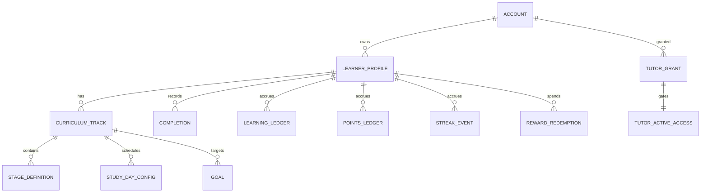

# Architecture Spine — Drift→Firestore-Native Migration

## Design Paradigm

**Repository-gated Firestore-native with per-account FirebaseApp scoping.**

The custom sync engine collapses into three durable ideas: (1) the SDK's offline cache is the local read model, (2) every account owns an isolated `FirebaseApp` (its own Auth + Firestore + cache file), and (3) the repository layer is the sole seam between features and Firestore. Conflict resolution, doc-id derivation, and write atomicity move from bespoke engine code into a thin, single-owned data-access ring around the SDK.

| Layer | Directory (target) | May depend on |
| --- | --- | --- |
| Features (UI, controllers, services, providers) | `lib/features/**` | repositories, domain models |
| Domain (models, derivation, invariant logic) | `lib/domain/**` (points/streak reducers move here) | — |
| Repositories (the ONLY data seam) | `lib/data/repositories/**` | data-access ring, domain models |
| Data-access ring (SDK-facing) | `lib/data/firestore/**` — codecs, doc-id formulas, canonical conflict predicate, `AccountFirebase` handle registry, write helpers | `cloud_firestore`, `firebase_core`, `firebase_auth` |
| Local-only stores | `lib/data/local/**` — Content DB (Drift, bundled), Device Registry (Drift), SharedPreferences, SecureStorage | `drift`, `sqlite3` |

`cloud_firestore` is importable **only** under `lib/data/firestore/**` and `lib/data/repositories/**`.

**This is a deliberate reorganization, not a continuation of today's structure.** Today `lib/` is `app / core / features`, repositories live **feature-scoped** (`lib/features/*/data/repositories`), and today's layering **Rule 3** is *"Firebase symbols (`FirebaseAuth`/`FirebaseFirestore`/`FirebaseStorage`) are confined to `lib/core/sync/` + `lib/core/auth/`"* — enforced by the shipped `make audit` grep `no-firebase-outside-core` (DNI-387), a hard gate. This spine **retires and replaces** Rule 3: it moves repositories from feature-scoped vertical slices to a global-horizontal data ring (`lib/data/**` + `lib/domain/**`) and retargets the Firebase-confinement gate to the new allowed-dir list (`lib/data/firestore/**`, `lib/data/repositories/**`). AD-3/AD-23/AD-28 own that retire-and-replace; without it, every file AD-3 mandates would be flagged by the existing `no-firebase-outside-core` gate. The *intent* — a single narrow data seam, features never touching the SDK directly — is continuous with Rule 3's spirit; the directory list and enforcement target are not.

## Invariants & Rules

### AD-1 — Per-account named FirebaseApp isolation `[ADOPTED]`
- **Binds:** all; MCF-feasibility, MCF-collision, MCF-35, owner decision #1
- **Prevents:** cache/identity bleed between the ≤5 device accounts; loss of instant offline account switching.
- **Rule:** each **cloud-backed or Anonymous-Auth-backed** device account (`DeviceAccounts` row, ≤5) gets its own `Firebase.initializeApp(name:'account_<deviceRegistryAccountUuid>')` (app-name identity pinned by AD-24) with a private Auth + Firestore + persistent cache. Apps are created on first activation and torn down on account removal. A single `FirebaseFirestore.instance` is forbidden as the data path (see AD-2). The default app is reserved for pre-auth/registry concerns only.
- **Topology — `[CONFIRMED]` empirically (Story 2.1, 2026-08-02).** The shape this rule relies on — N named apps against the **same** project/database, differing only by app name + Auth identity, each retaining a **fully independent persistent cache on Android** — was a `[ASSUMPTION]` (API-supported but not an officially blessed configuration; all official secondary-app docs are multi-project/flavor). Phase 0's mandated smoke test has now **run and passed** on real hardware: `integration_test/firestore_multi_app_isolation_test.dart` green on **API 34 and API 28 (oldest supported)**, with distinct on-disk persistence artifacts *directly observed* — `databases/firestore.account_A.<project>.%28default%29` vs `…account_B…`, app identity embedded in the filename — app A's write invisible to app B's cache, a red-demo proving the assertion is not vacuous, and no OOM/fd-exhaustion/crash (API 28: VmRSS 228→281 MB, fds 94→121). **The caveat is retired; the paradigm is settled and load-bearing.** Residual scope note: confirmed at the 2-app shape (the leading edge of the ≤5-account target) against the Firestore/Auth emulators — App Check attestation on secondary named apps in production is a Phase-1 integration concern, not a topology question.
- **Crashlytics/Analytics/Performance are default-app-only** (Firebase documents Analytics/Crashlytics/Perf as attributed to the default app on Android/Apple). Because all per-account operation happens on secondary named apps, per-account crash attribution is **not** automatic. Decision: keep Crashlytics wired to the **default app only** and accept coarse (device-level, not per-account) crash attribution; do not attempt per-named-app Crashlytics. Flagged here as an accepted limitation.

### AD-2 — Firestore handle resolution rule `[ADOPTED]`
- **Binds:** all; MCF-orchestrator, MCF-singleton
- **Prevents:** services reading/writing against the wrong account's cache; the historical uid-under-live-listeners `PERMISSION_DENIED` flood.
- **Rule:** no service, repository, or feature may touch a bare `FirebaseFirestore.instance` / `FirebaseAuth.instance`. All access resolves through the active account's handle: `accountFirebase(activeAccountId).firestore`. Firestore paths are addressed from the **active-account record's** uid, never `currentUser`. Exactly one place (`AccountFirebase` registry) constructs and caches handles.

### AD-3 — Repository layer is the only data seam `[ADOPTED]`
- **Binds:** all; MCF-13-scaffold; today's layering Rule 3
- **Prevents:** the current 27 direct-DAO bypasses re-forming as 27 direct-`cloud_firestore` bypasses.
- **Rule:** feature/service/provider files MUST NOT import `cloud_firestore`. They depend on repository interfaces returning domain models or streams of domain models. An import-boundary lint (CI gate) enforces the allowed-directory list. The 10 empty `repositories/` scaffold dirs are filled or their features re-pointed at a real repository before that feature's collection is cut over.

### AD-4 — Derived-not-counter for points and streak
- **Binds:** points_ledger, points_balance, streak_events; MCF-2, MCF-24-streak
- **Prevents:** the classic counter LWW lost-update and double-credit P0s that the ledger model specifically eliminated.
- **Rule:** balances and streak state are NEVER stored as synced counters. `PointsBalance` is re-derived by summing the append-only `points_ledger` (clamped `[0,2^30)`); streak state is replayed from `streak_events`. No `FieldValue.increment` on a synced aggregate. Derivation is idempotency-gated on ULID-doc non-existence.
- **Points vs streak are NOT the same shape — do not share one replay allowance.** `PointsBalance` is a **cumulative all-time sum**; it MUST sum the *full* ledger and is therefore backed by a **local denormalized cache rebuilt in full on a cold cache** — date-bounding a cumulative aggregate is **forbidden** (it silently drops pre-window credits → the lost-points class, and makes the same account show two different balances across two devices). The date-bounded (windowed) reducer is permitted **only** for streak state, which is provably reconstructable from a bounded recent window. Retire the unbounded full-history *replay-on-every-read*; the full sum lives in the rebuildable cache, not re-walked per read.

### AD-5 — Deterministic doc-id; no autoincrement ids in payloads
- **Binds:** all synced collections; MCF-3, MCF-4, MCF-5, MCF-8, MCF-11
- **Prevents:** duplicate remote docs on retry; cross-device FK breakage from device-local ids; orphaned historical documents.
- **Rule:** every document id is a deterministic function of a natural key or a ULID — never `collection.add()`, never a device-local Drift autoincrement id, and no autoincrement id may appear inside any payload. Doc-id formulas are reproduced **exactly** as today except where AD-25 mandates a one-time re-key (see AD-13, AD-25). The **`learner_profiles` doc-id is a profile-scoped stable key (ULID)** minted per profile — NOT the account/Firebase UID. (The uid addresses the *path* `users/{uid}/learner_profiles/{profileId}`; an account owns *many* profiles, so keying the profile doc-id by the uid would collide every child of an account onto one document. Path uid ≠ profile doc-id.) Track-scoped children carry the **single canonical stable track key defined in AD-25**, not the per-device `track_id`; the `resolveLocalTrackId` remap is retired by construction. An audit sweeps for autoincrement-id-in-payload landmines outside `merge/` (MCF-11 class) before cutover.

### AD-6 — Append-only + tombstone semantics
- **Binds:** completions, learning_ledger, streak_events, points_ledger, reward_redemptions; MCF-5, MCF-6, MCF-7
- **Prevents:** hard-delete data loss; the completion tombstone-resurrection defect (H2/D11); wrong-stage resolution.
- **Rule:** these collections are insert-only + tombstone (`purgedAt` field), never hard delete. Resurrection matches the natural-key doc WITHOUT a timestamp filter and clears the tombstone transactionally. The `stage_id_format` marker (v37) travels verbatim. SR-1 rules (deny delete; allow update only on identical replay) are preserved, so offline-queue retries collapse by doc-id.

### AD-7 — Single canonical conflict-resolution predicate
- **Binds:** every LWW collection; MCF-1, MCF-26
- **Prevents:** the hand-copied test-double drift that already shipped a lost-update bug (AUD-t-cross-68).
- **Rule:** the LWW decision (±5s clock-skew window → `synced_at` server-timestamp tie-break → D15 prefer-newer-un-pushed-local → remote-wins-on-true-tie) lives in **exactly one** module and is called by every reconciliation path. **Exactly one predicate governs every LWW collection — there is no per-merger exception.** The `SyncKv` watermark job is re-solved, not reused: fold last-applied markers into the same doc/transaction as the entity write. The FB-3 cache-echo guard (`hasPendingWrites`/`isFromCache`) is preserved. Bespoke per-merger predicates (RewardRedemption plain-isAfter, F3) are standardized onto the canonical predicate **unconditionally** — this standardization is NOT gated on AD-21. (AD-21 is `[ADOPTED]` for the *completions write-path* folding and `fulfilRedemption` transactionality; the RewardRedemption *conflict predicate* is settled here regardless of AD-21.)

### AD-8 — Write atomicity replaces outbox pairing
- **Binds:** CompletionWriter and every data+marker write; MCF-20, MCF-writer, MCF-25, MCF-8b, MCF-7-delete, MCF-cascade
- **Prevents:** partial writes that leave a stale watermark or orphaned rows; the FK-drop-order rollback that silently fails profile deletion.
- **Rule:** the SDK offline write queue replaces the Outbox; the Outbox table and OutboxProcessor are deleted. Multi-document atomic operations (completion + tombstone-resurrection + prior-import upgrade; ledger/points/reorder + amnesty stamp) use a Firestore `WriteBatch`/transaction, or fold co-written markers into a single document. Profile deletion and tutor-mirror-wipe delete the full set of per-profile collections defined by AD-26 — **NOT** the Drift-era "6 no-cascade tables" list, and **without** a "dependency order" (Firestore has neither cascade nor FK ordering; an ordering constraint here is a meaningless no-op). See AD-26 for the enumeration basis and the SR-1 append-only-history delete path (MCF-cascade, MCF-7-delete). The reorder-amnesty stamp (`lastReorderAt`) is written in the same atomic op as the ordering change.

### AD-9 — Listener resubscribe-on-error and lifecycle parity
- **Binds:** all `snapshots()` listeners; MCF-23, MCF-28; R-1, R-8, E-5
- **Prevents:** dead channels staying dark for the session (the #1 fickleness, and the App-Check-recovery gap).
- **Rule:** `snapshots()` streams are terminal-on-error, so every listener wraps a mark-dead + bounded-exponential-backoff resubscribe. Connectivity-online and resume paths trigger resubscribe of dead channels. Listener parking (own AND tutored — see AD-22) has parity. Recovery-pull at-limit loops are bounded by cursor-advance, not raw page fill.
- **No permanent give-up while connectivity is up.** Backoff **caps** the retry interval; it never stops retrying a dead channel while the network is up. The terminal "backoff exhausted, connectivity up" condition therefore does not exist as a resting state — it degrades to "still retrying at the cap," surfaced as `syncing` (never falsely `synced`), per AD-11. A **write** that permanently fails (a genuine rules rejection, not an offline/backoff case) is a different class — its user-facing recovery is owned by AD-30.
- **Resume network reset is gated, not unconditional (E-5).** Do NOT call a global `resetFirestoreNetwork` (disable/enable network, forcing a full listener teardown + re-handshake) on every app resume. Trigger a reset only on a real **network-identity change** (not a trivial few-second app-switch), restrict resume handling to the `paused`/`hidden` lifecycle states (never `inactive`), and debounce it. A healthy connection on a brief foreground bounce is left untouched.

### AD-10 — Arrival-order tolerance (idempotent skip-and-re-merge)
- **Binds:** track-scoped children; MCF-15
- **Prevents:** FK breakage when independent listeners fire out of order (no pull-ordering guarantee natively).
- **Rule:** there is no cross-collection ordering guarantee. Every reconciliation of a track-scoped child (settings/stage_definitions/goals/study_day_configs) tolerates a missing parent by skipping-and-re-merging idempotently, never inserting against an unresolved key. Correctness must not depend on `curriculum_tracks` arriving first.

### AD-11 — Slim 3-state sync status from SDK signals `[ADOPTED]`
- **Binds:** sync status UI; MCF-22, MCF-8-conn; owner decision #2; R-2, R-3, R-4
- **Prevents:** reintroducing app-level outbox/queue accounting; error status masking real backlog.
- **Rule:** status is exactly `synced | syncing | offline`, derived only from SDK signals (`hasPendingWrites`, `isFromCache`, connectivity) and per-account app state. No app-level "N pending / N stuck" bookkeeping, no dead-letter counter. Connectivity is sourced from the hardened `connectivityStreamProvider` / platform events (backed by the now-**direct** `connectivity_plus` dependency), never the raw 5-second demo-host poller (E-1). Cold launch of an existing session eagerly reconciles.
- **Exhausted-dead channel maps to `syncing`, never `synced`.** A listener that has hit its backoff cap while connectivity is up (AD-9) is still trying; its data is stale, so it is surfaced as `syncing` (in-flight/unsettled), NOT `synced` (which would lie) and NOT `offline` (the network is fine). This is the explicit rule that keeps the 3-state model total without reviving an `error` state. A **permanently-rejected write** is not represented in this tri-state at all — it is surfaced through the AD-30 recovery affordance, out of band from the ambient status chip.

### AD-12 — Security-rules-as-boundary + App Check posture
- **Binds:** firestore.rules, all direct-SDK surface; MCF-5, MCF-10, MCF-appcheck, SR-1, SR-3
- **Prevents:** widening the rules-only (no App Check) authorization surface as direct-SDK reads/writes expand.
- **Rule:** security rules remain the authorization boundary: append-only SR-1 semantics and SR-3 real-`Timestamp ≤ request.time` fields are preserved (native SDK Timestamps satisfy SR-3 for free). App Check is currently CF-layer only; because the migration expands the direct-SDK surface, App Check enforcement MUST be extended to `firestore.rules` (`request.app`) before the strangler waves ship broadly. Client date fields are always real Timestamps, never JSON-bridged without coercion.

### AD-13 — Cloud-schema continuity
- **Binds:** all reused collections; MCF-3-continuity, MCF-16, MCF-17, MCF-19
- **Prevents:** existing users' historical documents orphaning or ceasing to round-trip.
- **Rule:** reproduce every doc-id formula byte-for-byte **except** the track-scoped children that AD-25 re-keys (where byte-for-byte reproduction is provably impossible because the old formula embeds the per-device track id AD-5 abolishes — AD-25 owns the one-time re-key + backfill), and keep decoding every legacy field alias (`sefaria_ref`??`content_item_id`; `state`/`is_active`; `pace_unit`/`pace_period`; ledger snake↔camel). The legacy `settings/{curriculumId}` `stages[]` shape stays READ-compatible; new writes never emit it. Tutor read continues to hinge on `tutor_active_access` `exists()` (one CF-maintained doc per active triple). `gamification_settings` embedded `points_config[]` is remodeled to a subcollection via a one-time fan-out that keeps the old array readable; the two-store fan-out (Firestore + SharedPreferences) gets a single owner and a rebuildable-projection rule per **AD-27** (not a co-equal second store).

### AD-14 — Cross-account defect remediation in scope `[ADOPTED]`
- **Binds:** identity/multi-account; MCF-blastradius, MCF-globalflags, MCF-collision; owner decision #3
- **Prevents:** carrying the shipped cross-account data-loss defects into the new architecture.
- **Rule:** the three cross-account defects are fixed as part of this migration, not deferred: (a) `deleteAccount()` must NOT `prefs.clear()`/`secureStorage.deleteAll()` device-wide — it deletes only the target account's namespaced keys; (b) `initial_sync_complete` / `device_restore_state` become per-account keys, not global write-once flags; (c) key namespacing per AD-15.

### AD-15 — Key namespacing `(accountId, profileId)` `[ADOPTED]`
- **Binds:** SharedPreferences, SecureStorage; MCF-collision; owner decision #3
- **Prevents:** two accounts' first children both hitting `profileId==1` and sharing locale/font/PIN/notification keys.
- **Rule:** every non-Firestore per-profile key is namespaced by `(accountId, profileId)`, never the bare Drift autoincrement `profileId`. A one-time on-device key-migration re-homes existing keys under the namespaced scheme.

### AD-16 — Content DB and device registry stay local `[ADOPTED]`
- **Binds:** Content DB, Device Registry; MCF-35; owner decision #4
- **Prevents:** moving ~87K bundled read-only rows into the wrong-shape/wrong-cost store; breaking pre-auth first-launch.
- **Rule:** the bundled Content DB (Drift, ~87K rows, `SeedManager` gzip + `.bak` self-heal) and the Device Registry (Drift, account picker, pre-auth) NEVER migrate to Firestore and remain fully offline-from-first-launch. `CitiesRepository` bundled sqlite is out of scope.

### AD-17 — Routing parity preserved
- **Binds:** entity/collection routing; MCF-30, MCF-32
- **Prevents:** a future entity kind silently dropping because it was never registered.
- **Rule:** every synced collection has an explicitly registered repository + codec; the parity invariant (kind ↔ collection ↔ registration ↔ codec) is enforced by an acceptance test. `tutor_grant` routing stays registered even though it is a live no-op read (MCF-30 is the template, see AD-18-slice in the plan).

### AD-18 — Firestore persistence configured per named app
- **Binds:** every `AccountFirebase` handle; MCF-feasibility; E-8
- **Prevents:** silent reliance on platform-default cache behavior; unbounded cache growth.
- **Rule:** each named app pins `Settings` with persistence enabled and a bounded `cacheSizeBytes` **immediately after obtaining the handle, before its first Firestore use** — via the `FirebaseFirestore.settings` setter, NOT a constructor parameter (`instanceFor(app:, databaseId:)` accepts no `settings` argument). The `AccountFirebase` registry (AD-2) is the single place this "set-before-first-use" ordering is enforced. Merge/read logic may assume persistence is on (the `isFromCache` guard depends on it). Web (persistence off by default) is an explicit non-target of the offline-switch guarantee unless separately funded.

### AD-19 — Local-born account principal → Anonymous Auth `[ADOPTED]`
- **Binds:** local-born tier, Upgrade-to-Cloud; MCF-localborn; §10 Q1-adjacent
- **Prevents:** the credential-less offline tier having no Firebase principal to scope a named app + cache to.
- **Rule:** each credential-less local-born account is backed by a Firebase **Anonymous Auth** user inside its own named app, giving it a real uid + private cache from creation. "Upgrade to Cloud" becomes account-**linking** (anonymous → permanent credential), preserving the three collision-merge options. **Anon-uid instability is handled explicitly (AD-24):** the anonymous uid is late-bound (does not exist until after `initializeApp` + `signInAnonymously`) and does NOT survive reinstall or an App-Check-debug-token wipe. Therefore the named app is keyed by the stable device-registry account UUID (never the anon uid), and the Firestore-path uid is a **persisted field** with an explicit **remap-on-anon-reset / relink** step: on a fresh anon uid for the same registry account, re-home `users/<oldUid>/…` to the new uid so the prior cache + document tree are not stranded.

### AD-20 — `curriculum_scopes` becomes full bidirectional owner sync `[ADOPTED]`
- **Binds:** curriculum_scopes; MCF-24-orphan; §10 Q5
- **Prevents:** perpetuating a collection with no coherent owner round-trip and an orphan-on-delete gap.
- **Rule:** treat `curriculum_scopes` like its 15 siblings — full bidirectional owner sync via its repository — and add it to the delete list to close the orphan gap. The tutor CF write path is unchanged. **MCF-24-orphan names *two* omitted collections, not one:** both `curriculum_scopes` **and** `import_metadata` are missing from today's `deleteUserData`. Both are added to the AD-26 delete set unconditionally; a delete path that closes only `curriculum_scopes` leaves MCF-24-orphan half-open.

### AD-21 — Uniform write path; completions-facade asymmetry retired `[ADOPTED]`
- **Binds:** all writes; MCF-1-facade, MCF-13; §10 Q6
- **Prevents:** a highest-volume kind (completions) taking a different write path than everything else.
- **Rule:** all writes go through the repository → `docRef.set(..., SetOptions(merge:true))` (or batch); there is no separate write-tee/facade tier and no completions bypass. `fulfilRedemption` becomes transactional to match `declineRedemption` (close the TOCTOU asymmetry). *(Note: the RewardRedemption LWW **predicate** is already standardized onto the canonical predicate unconditionally by AD-7 — that was never gated on this decision. What this AD covers is only the completions write-path folding and `fulfilRedemption` transactionality.)*

### AD-22 — Tutored listener lifecycle + isolation parity `[ADOPTED]`
- **Binds:** tutored listeners; MCF-28; E-3; §10 Q7
- **Prevents:** 16 tutored gRPC streams staying live 24/7 when backgrounded; cross-context SDK misuse.
- **Rule:** tutored-mirror listeners get park/unpark parity with own-account listeners and are re-scoped to genuinely collaborative data. Tutored context reads through the grant's own named-app handle and never issues writes; cross-account isolation is enforced by security rules + the handle-resolution rule (AD-2), not convention.

### AD-23 — Dependency direction (this diagram is a rule)
- **Binds:** all; enforces the paradigm's layer table.
- **Prevents:** feature code reaching past repositories into the SDK; domain logic depending on data-access.
- **Rule:** dependencies flow only downward. No edge may be added against the arrows.



### AD-24 — Named-app identity and Firestore-path uid are pinned to distinct stable ids
- **Binds:** `AccountFirebase` registry; AD-1, AD-2, AD-19; MCF-feasibility, MCF-orchestrator/singleton, MCF-collision
- **Prevents:** two registries resolving the same account to different apps/caches/document trees (adversary Pair 1); cache + `users/{uid}/…` stranding on anon-uid reset.
- **Rule:** two identifiers, never conflated:
  1. **Named-app key = the stable device-registry account UUID** (`account_<deviceRegistryAccountUuid>`), known pre-auth, before any sign-in. NEVER the Firebase uid, NEVER `currentUser`. This resolves the bootstrap paradox (a local-born app must be named and created *before* `signInAnonymously`, so its name cannot depend on the not-yet-existing anon uid) and keeps the app + cache directory stable across anon-uid resets.
  2. **Firestore-path uid = a persisted uid field** on the active-account record (the resolved cloud uid, or the anon uid after `signInAnonymously`), with an explicit **remap-on-anon-reset** step (AD-19). Neither identifier may be derived from the live auth uid at call time.
- Exactly one place (the `AccountFirebase` registry) constructs, names, and caches handles and owns this pinning.

### AD-25 — The canonical stable track key, and mandatory re-key of track-scoped history
- **Binds:** `curriculum_tracks` and all track-scoped children (`stage_definitions`, `study_day_configs`, `goals`); AD-5, AD-13; MCF-4, MCF-15
- **Prevents:** two doc-id modules choosing different "stable track keys" so cross-device docs stop matching (adversary Pair 2); the false promise that AD-13 byte-for-byte and AD-5 remap-retirement can both hold for track-embedded formulas.
- **Rule:** the single canonical stable track key is **`curriculum_id`** (consistent with the live `curriculum_tracks/{curriculum_id}` doc-id). *Every* track-scoped child formula is re-expressed against it explicitly in `doc_ids.dart` (e.g. `stage_definitions/{curriculum_id}_{stageOrder}`) — a track ULID is NOT used as the track key. Because historical cloud docs were written as `{oldPerDeviceTrackId}_{…}`, byte-for-byte reproduction is **impossible** for these collections; AD-13's byte-for-byte rule is explicitly **superseded here** by a **one-time doc-id re-key + backfill** of the historical `{perDeviceTrackId}_*` docs to the `curriculum_id`-keyed form (Phase 3 Wave A, atomic across all track-scoped collections — see plan). This migration is mandatory, not optional.

### AD-26 — Profile hard-delete: registry-derived set; append-only history via server path
- **Binds:** profile deletion, tutor-mirror-wipe; AD-8, AD-12, AD-16, AD-17; MCF-cascade, MCF-7-delete, MCF-24-orphan, SR-1
- **Prevents:** deleting the Drift-era "6 no-cascade" set and orphaning the other ~13 collections (adversary Pair 3); the client path being rejected by SR-1 `deny delete` on append-only history.
- **Rule:** the delete set is derived from the **Firestore collection registry (AD-17 parity)** — every per-profile collection that actually exists in Firestore — NOT the Drift no-cascade list, and NOT any local-only (AD-16) or already-deleted (Outbox) table. It explicitly includes `curriculum_scopes` and `import_metadata` (AD-20). There is **no "dependency order"** (Firestore has no cascade and no FK ordering — an ordering constraint is a no-op). Append-only history (`completions`, `learning_ledger`, `streak_events`, `points_ledger`, `reward_redemptions`) carries SR-1 **`deny delete`**, so the client/repository seam **cannot** hard-delete it: a compliant profile hard-delete is **NOT a pure client operation** — it routes those collections through the **Admin-SDK / Cloud Function `recursiveDelete`** server path (the existing server route). Client-deletable collections go through the AD-8 batched delete; history goes through the CF path; the two together are the "cascade."

### AD-27 — Cross-store fan-out: single owner, Firestore authoritative, prefs a rebuildable projection
- **Binds:** `gamification_settings` and any entity spanning Firestore + a local store; AD-13, AD-8, AD-15; MCF-14, MCF-19, MCF-uiprefs-sor
- **Prevents:** two owners applying the same source doc at different times, or a crash tearing a Firestore-write / SharedPreferences-write pair with no coordinating transaction (adversary Pair 6). AD-8 atomicity is structurally **Firestore-only** and cannot span SharedPreferences.
- **Rule:** an entity whose data fans into Firestore **and** a local store has **exactly one repository owner**. **Firestore is authoritative**; the SharedPreferences copy is a **rebuildable projection re-derived on read from the Firestore doc**, never a co-equal store of record. A torn fan-out therefore self-heals on the next read (the projection is recomputed) rather than persisting split-brain. (This narrows MCF-uiprefs-sor "prefs store-of-record" to: prefs is the *cache/projection*, Firestore is the *record*, for fanned entities. Prefs-only keys with no Firestore counterpart — locale/font/PIN — remain prefs-owned per AD-15.)

### AD-28 — Enforcement is bound to real `make audit` greps, not custom_lint
- **Binds:** AD-1, AD-2, AD-3, AD-5, AD-23; today's Rule 3 (retired/retargeted)
- **Prevents:** boundary rules with no mechanical gate drifting silently — exactly the AUD-t-cross-68 hand-copied-predicate class the spine keeps citing.
- **Rule:** every mechanical boundary rule names a concrete `make audit` grep, because `dart run custom_lint` is **documented non-functional in this repo** (it reports "No issues found!" even on violations) and the greps are the only enforcement that actually runs. Bindings:
  - **AD-3 import boundary:** retarget the shipped `no-firebase-outside-core` grep (DNI-387) from `lib/core/sync|auth` to the new allowed-dir list `lib/data/firestore/**`, `lib/data/repositories/**`; feature/service/provider files importing `cloud_firestore` fail the gate.
  - **AD-2 bare-instance ban:** a grep for `FirebaseFirestore.instance` / `FirebaseAuth.instance` outside the `AccountFirebase` registry.
  - **AD-5 autoincrement-in-payload:** the MCF-11 landmine sweep becomes a **standing** grep gate (not a one-time audit) for autoincrement-id-in-payload outside `merge/`.
  - **AD-23 dependency direction:** a grep/analyzer check that no `lib/features/**` or `lib/domain/**` file imports the data-access ring past a repository interface.
  - "lint (CI gate)" phrasing elsewhere in this spine means these greps, not custom_lint.

### AD-29 — Verification strategy for SDK-signal and named-app invariants
- **Binds:** AD-1, AD-7, AD-9, AD-11, AD-18; MCF-feasibility
- **Prevents:** the load-bearing runtime-metadata invariants shipping untested because the chosen fake cannot model them.
- **Rule:** `fake_cloud_firestore` does **not** model named multi-`FirebaseApp` instances, offline persistence, cache-vs-server emission, `isFromCache`/`hasPendingWrites`, or App Check — so a three-tier verification split is mandatory:
  1. **Pure-unit (fake or plain Dart):** the canonical LWW predicate (AD-7) is unit-pinned so **no second copy can exist** (a grep-gated single-module test plus golden branch cases: ±5s / `synced_at` / D15 / true-tie); codec legacy-alias round-trips (AD-13); doc-id formulas (AD-5/AD-25).
  2. **Firestore emulator / instrumented integration:** `isFromCache`/`hasPendingWrites`-dependent logic (AD-7 cache-echo, AD-11 status), resubscribe-on-error (AD-9), App-Check-in-rules (AD-12).
  3. **On-device (emulator-5556 seeded multi-account, Parent PIN 2580):** the AD-1 named-app isolation smoke test, instant offline account switch, and per-account cache independence — the items no fake or emulator can certify.
  The Phase 0 AD-1 topology smoke test (two named apps / one project / two anon users) is the first item in tier 3 and gates the paradigm.

### AD-30 — Permanent-write-failure recovery affordance
- **Binds:** all writes; AD-8, AD-9, AD-11; R-4, R-7
- **Prevents:** the slim-status migration silently dropping the old design's only "stuck — here's how to get unstuck" user path when the `error` status and dead-letter bookkeeping are retired (reconcile: R-4/R-7 successor gap).
- **Rule:** a write that **permanently** fails (a genuine `permission-denied` rules rejection or other non-retryable error the SDK will NOT drain on its own — distinct from offline/backoff cases it *will* retry) surfaces a **user-visible, out-of-band recovery affordance** (a tap-to-retry / surfaced failure on the affected item), separate from the ambient 3-state status chip (AD-11). This is a narrow, per-failed-write surface — NOT a revived dead-letter counter or app-level queue accounting (which AD-11 forbids). The SDK offline queue remains the sole durability owner (AD-8); this affordance only exposes the residual non-retryable class the queue cannot clear.

## Consistency Conventions

| Concern | Convention |
| --- | --- |
| Naming | Collections keep current Firestore names; repositories `<Entity>Repository`; codecs `<Entity>Codec`; account handle `AccountFirebase`. |
| Doc ids | Deterministic natural-key formula (reproduced exactly) or ULID; never `collection.add`; never a device-local autoincrement id in a payload. |
| Dates | Real Firestore `Timestamp`, `≤ request.time`; never a client int/string on the wire for `completed_at`/`created_at`/`synced_at`. |
| Delete | Tombstone (`purgedAt`) for append-only kinds; profile hard-delete set is registry-derived (no "dependency order"); client-deletable via batch, SR-1 append-only history via CF `recursiveDelete` (AD-26). |
| Identity | Named-app key = stable device-registry account UUID; Firestore-path uid = persisted field w/ remap-on-anon-reset; never the live auth uid at call time (AD-24). |
| Enforcement | Mechanical boundary rules bind to `make audit` greps, never custom_lint (non-functional here); each boundary AD names its grep (AD-28). |
| Writes | Repository → batch/transaction or `set(merge:true)`; co-written markers folded into the same atomic op. |
| Conflict | One canonical LWW predicate module; no per-call-site re-implementation. |
| Legacy | Always keep decoding legacy field aliases; never emit retired shapes (legacy `settings.stages[]`). |
| Errors | Narrow `on Exception` (EH-4), never bare `catch`; listener errors → mark-dead + backoff resubscribe. |
| Keys (local) | `(accountId, profileId)` namespace for every SharedPreferences/SecureStorage per-profile key. |
| Handles | Resolve `accountFirebase(activeAccountId)`; bare `FirebaseFirestore.instance` is banned outside the registry. |

## Stack

Verified against `learning_tracker/pubspec.yaml` on 2026-07-30 (constraints, not locked resolutions).

| Name | Version |
| --- | --- |
| Dart SDK | ^3.10.8 |
| firebase_core | ^4.4.0 |
| cloud_firestore | ^6.1.2 |
| firebase_auth | ^6.1.4 |
| firebase_app_check | ^0.4.4+1 |
| cloud_functions | ^6.2.0 |
| firebase_crashlytics | ^5.2.0 |
| flutter_riverpod | ^3.3.1 |
| riverpod_annotation | ^4.0.2 |
| drift (Content DB + Device Registry only) | ^2.31.0 |
| sqlite3 | ^2.9.4 (Content DB / Device Registry only, AD-16) — see note below |
| fake_cloud_firestore (test) | ^4.1.0 — cannot model named apps / persistence / `isFromCache`; see AD-29 |
| connectivity_plus (status source) | **promote to a direct dependency** (currently transitive-only in lock) before the status path relies on it (AD-11) |
| internet_connection_checker (retire from status path) | ^3.0.1 |
| ULID generator | **existing in-repo `lib/core/time/ulid.dart`** — standardize on it; no pub.dev package is added (the only viable one, `ulid: ^2.0.1`, is unneeded given the hand-rolled generator already ships). Confirm all emission routes through this one module before Phase 0. |

- **`sqlite3` version note (out of scope):** the pin `^2.9.4` excludes the current `3.5.0`; the 2→3 jump is a real breaking major (build-hooks native loading replacing `DynamicLibrary`, `dispose()`→`close()`, WASM VFS changes). This touches only the local-only Content DB / Device Registry (AD-16) and is a **deliberately deferred, separate decision** — see Deferred. The pin is not raised as part of this migration.

## Structural Seed

### Target source tree

```text
learning_tracker/lib/
  features/**                      # UI, controllers, services, providers — NO cloud_firestore import
  domain/**                        # models; points/streak reducers (moved out of DAOs)
  data/
    repositories/**                # the only data seam; interface + Firestore impl per entity
    firestore/
      account_firebase.dart        # named-app registry + handle resolution (AD-1/AD-2/AD-18)
      doc_ids.dart                 # deterministic doc-id formulas (AD-5/AD-13)
      conflict.dart                # single canonical LWW predicate (AD-7)
      codecs/**                    # <Entity>Codec (legacy-alias tolerant, AD-13)
      write.dart                   # batch/transaction helpers (AD-8)
    local/
      content_db/**                # Drift, bundled, read-only (AD-16)
      device_registry/**           # Drift, pre-auth account picker (AD-16)
      prefs/**                     # (accountId,profileId)-namespaced (AD-15)
      connectivity/**              # cross-cutting status source; relocate connectivityStreamProvider here (out of lib/features/account/…) — direct connectivity_plus dep (AD-11)
  migration/**                     # existing-user Drift→Firestore backfill + verifier (Phase 5)
firestore.rules                    # SR-1/SR-3 preserved; App Check request.app added (AD-12)
functions/**                       # tutor invite/accept/revoke unchanged (MCF-17)
```

### Deployment / operational envelope



- **Environments:** existing Firebase project (`torah-study-tracker`); no new backend services introduced. App Check debug-token discipline preserved (wipes regenerate the token → 403).
- **Rollout:** strangler per collection behind the repository seam; existing-user backfill is device-local and per-account; no server-side data migration except the `gamification_settings` fan-out (client-driven, idempotent).

### Core-entity map (names + relationships)



## Capability → Architecture Map

Every MCF-1..35 (and suffixed variants) → target location + governing AD. This is the completeness contract.

| MCF | Lives in (target) | Governed by |
| --- | --- | --- |
| MCF-1 LWW 5-step + SyncKv | `data/firestore/conflict.dart` (single owner) | AD-7 |
| MCF-2 derived PointsBalance | `domain/**` reducer; full-ledger sum via rebuildable local cache (no date-bounding) | AD-4 |
| MCF-3 deterministic doc-id + atomic entity+marker | `data/firestore/doc_ids.dart`, `write.dart` | AD-5, AD-8 |
| MCF-3-continuity doc-id formulas + aliases | `doc_ids.dart`, `codecs/**` (byte-for-byte except track-scoped, re-keyed) | AD-13, AD-25 |
| MCF-3-atomicity tx seam | `write.dart` batch/transaction | AD-8 |
| MCF-4 track-id remap → stable key | `doc_ids.dart` — canonical track key = `curriculum_id`, remap retired | AD-5, AD-25 |
| MCF-5 append-only + dedup + SR-1 | codecs + rules | AD-6, AD-12 |
| MCF-6 tombstone resurrection | completion repository (tx) | AD-6, AD-8 |
| MCF-7 stage_id_format marker | completion codec | AD-6 |
| MCF-7-delete profile-delete collection set | delete helper (registry-derived, no ordering) | AD-8, AD-26 |
| MCF-cascade 6-no-cascade tables / no Firestore cascade | `write.dart` batched delete (client-deletable) + CF `recursiveDelete` (SR-1 history) | AD-8, AD-26 |
| MCF-8 double-credit uniqueness | doc-id=ULID | AD-5 |
| MCF-8b prior-import upgrade | completion repository (tx) | AD-8 |
| MCF-8-conn connectivity duplication | status source consolidation | AD-11 |
| MCF-9 pre-v30 ledger never migrate | migration verifier gate | AD-4; Phase 5 |
| MCF-9-prefs per-profile pref namespacing | `data/local/prefs/**` | AD-15 |
| MCF-9-counter completionCommitted staleness | reactive streams from repository | AD-3 |
| MCF-10 SR-3 real Timestamp | codecs emit Timestamp | AD-12 |
| MCF-10-codegen Riverpod return types | hand-written StreamProvider fallback | AD-3 (convention) |
| MCF-11 identity remap / autoincrement audit | UID-keyed profile; landmine sweep | AD-5 |
| MCF-11-listeners subscription de-dup | shared repository streams | AD-3, AD-9 |
| MCF-12 TrackLearningOrder profileId integrity | migration verifier | Phase 5 |
| MCF-13 RewardRedemption bespoke LWW | standardized onto canonical predicate (unconditional) | AD-7 |
| MCF-13-scaffold empty repo dirs | fill/re-point before cutover | AD-3 |
| MCF-14 gamification two-store fan-out | single owner; Firestore authoritative, prefs a rebuildable projection | AD-13, AD-27 |
| MCF-15 pull/merge ordering | idempotent skip-and-re-merge | AD-10 |
| MCF-16 settings dual write path | read-compat only; single write shape | AD-13 |
| MCF-17 tutor_active_access exists() | functions unchanged; repository reads gate | AD-13 |
| MCF-19 gamification embedded array remodel | subcollection fan-out (single owner) | AD-13, AD-27 |
| MCF-20 outbox atomicity boundary | SDK queue + batch/tx | AD-8 |
| MCF-21 outbox no-UNIQUE dedup | doc-id dedup | AD-5 |
| MCF-22 no native pending/dead-letter | slim 3-state; drop bookkeeping | AD-11 |
| MCF-23 terminal-on-error listeners | resubscribe-on-error; gated resume reset (E-5); capped retry never lies-synced | AD-9, AD-11 |
| MCF-24-orphan deleteUserData omissions | registry-derived delete set incl. `curriculum_scopes` **and** `import_metadata` | AD-8, AD-20, AD-26 |
| MCF-24-streak unbounded replay | bounded/windowed streak reducer (points is NOT windowed) | AD-4 |
| MCF-25 reorder-amnesty atomic stamp | same-op write | AD-8 |
| MCF-26 FB-3 cache-echo guard | preserved in reconciliation | AD-7 |
| MCF-27 GoalMerger F4 tie-break | targeted test then canonical predicate | AD-7; Phase 3 test gate |
| MCF-28 tutored park/unpark | lifecycle parity | AD-9, AD-22 |
| MCF-29 dead batch writer | moot (cost model corrected) | Deferred |
| MCF-30 tutor_grant native precedent | vertical-slice template; routing kept | AD-17 |
| MCF-31 stale docs | re-derive from code (method) | Phase 0 discipline |
| MCF-32 4-way parity | parity acceptance test | AD-17 |
| MCF-35 registry+content local | never migrate | AD-16 |
| MCF-view completions_view purged_at filter | repository query re-implements filter | AD-6 |
| MCF-writer CompletionWriter atomicity | completion repository tx | AD-8 |
| MCF-collision unpartitioned prefs | (accountId,profileId) namespace; app keyed by registry UUID | AD-15, AD-24 |
| MCF-blastradius deleteAccount wipe | scoped delete | AD-14 |
| MCF-globalflags write-once flags | per-account keys | AD-14 |
| MCF-localborn credential-less tier | Anonymous Auth principal; app keyed by registry UUID, uid remap-on-reset | AD-19, AD-24 |
| MCF-uiprefs-sor prefs store-of-record | prefs-only keys prefs-owned; fanned entities → prefs is projection, Firestore is record | AD-15, AD-27 |
| MCF-outbox-isolation don't destroy unsynced | SDK queue + removal guard | AD-8 |
| MCF-feasibility N named apps | `account_firebase.dart`; Phase 0 topology smoke test + on-device verification | AD-1, AD-18, AD-29 |
| MCF-orchestrator/singleton uid-from-record | handle resolution; app-name vs path-uid pinned | AD-2, AD-24 |
| MCF-appcheck rules-only surface | add request.app to rules | AD-12 |
| MCF-1-facade completions bypass | uniform write path | AD-21 |

## Deferred

| Deferred | Why it can wait |
| --- | --- |
| Delta pull with per-collection watermark + composite indexes (E-4 full, review item A) | Native listeners already replace pull; watermark is a cost optimization, not a correctness gate. Land dedup first, watermark after cutover. |
| Real-time re-scope to only-collaborative data (review item B) | Correctness holds with full listeners; this is a standing-cost cut, safe post-migration. |
| Metered/cellular-aware mode (review item C, E-8) | Orthogonal to the data layer; a UX/cost refinement layered after the seam stabilizes. |
| Append-only batch-write wiring (E-6) | Correctness-neutral efficiency; the dead `pushLedgerEntriesBatch` cost model is corrected (MCF-29) — no urgency. |
| CitiesRepository sqlite | Static reference data, out of migration scope. |
| `sqlite3` 2.x→3.x upgrade (Content DB / Device Registry) | Live latest `3.5.0` is outside the `^2.9.4` pin and a real breaking major (build-hooks loading, `dispose()`→`close()`, WASM VFS). Touches only local-only AD-16 stores; a deliberate separate decision, not part of this migration. |
| E-3.2 batch 3 single-doc preference listeners → 1 collection-level listener | A small standing-cost read-count cut, distinct from the bigger real-time re-scope (item B). Correctness-neutral; land after the seam stabilizes. |
| E-9 park-delay tuning (60s) + early-out on empty-backlog throttled resume | Efficiency tuning of *how* parking behaves, not *whether* (AD-9 owns parity). Correctness-neutral; defer with its efficiency siblings. |
| Web offline-switch parity | Web persistence differs; explicitly non-target unless separately funded (AD-18). |
| Recovery of audit-code scenarios C3/H3/M1 (§10 Q13) | Investigation task; does not block the paradigm — mergers already tolerate the cases. |
