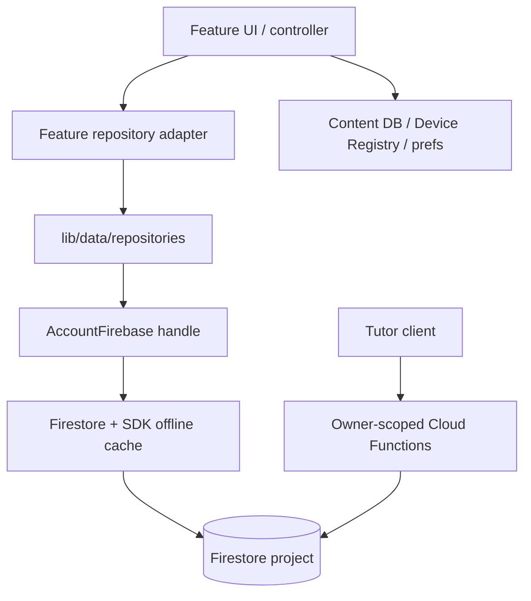

# Architecture Spine — Current State

## Reading this document

This is a current-state reference, not a migration plan. The old phased rollout,
backfill, strangler waves, shadow writes, feature flags, rollback machinery, and
back-compat contract are gone: the product is greenfield, has no supported users,
and the Drift user database was removed. The code is nevertheless not finished.
Every status below is based on the checked-out source, not on the intended target
tree in an older planning document.

The current implementation is a hybrid of the following shape:

| Area | Current implementation | Status |
| --- | --- | --- |
| User data | Firestore repositories in `lib/data/repositories/`, with feature-local adapters still present | Partially rewired |
| Account Firestore handles | `AccountFirebase` named-app registry, private Auth/Firestore/cache/App Check | Implemented as a subsystem; production sign-in is not fully wired to it |
| Local data | Bundled Content DB and Device Registry DB only; both are Drift | Adopted |
| Sync durability | Firestore SDK offline persistence and queued writes; no user-data Outbox or custom sync engine | Adopted in native repositories |
| Identity | Profile ULIDs and `CurriculumId` are used by the new repositories; integer-shaped feature seams remain | Incomplete |
| Listener recovery | Shared resilient stream wrappers in repository code; some UI listeners still use raw `snapshots()` | Partial |

## Design paradigm

The durable design is: Firestore owns cloud user data, one repository owns each
entity, and each account's Firestore handle is intended to be isolated behind a
named `FirebaseApp`. Firestore's offline persistence is the local cloud-data read
model. Content and the device account registry are separate local stores.

The real source tree is not the original target tree from the 2026-07-30 draft:

```text
learning_tracker/lib/
  app/                         # bootstrap, routing, application composition
  core/
    auth/                      # current default-app Auth gateway
    database/content/           # bundled read-only Drift DB
    database/registry/          # device-account Drift DB
    preferences/               # SharedPreferences/SecureStorage helpers
    ...                        # shared domain and platform utilities
  data/
    firestore/                 # AccountFirebase, active-account bridge,
                               # doc ids, stream recovery, repository providers
    repositories/               # Firestore repositories and codecs/adapters
  features/**                  # UI, services, domain models, and local adapters
```

There is no `lib/domain/`, no `lib/migration/`, and no `lib/core/sync/` in the
current source tree. Feature-scoped repository directories still exist because
they are the adapters used by the feature interfaces; the global data ring has
not replaced every feature-local seam.

`cloud_firestore` is intended to be confined to `lib/data/firestore/**` and
`lib/data/repositories/**` (with the retained Auth boundary in `lib/core/auth/**`).
That boundary is not yet clean: `features/settings/domain/services/data_export_import_service.dart`
and `features/settings/presentation/providers/firestore_sync_status_providers.dart`
still contain direct Firestore code, while `lib/core/providers/firebase_providers.dart`
retains the documented Firebase Storage exception.

## Invariants and rules

### AD-1 — Per-account named FirebaseApp isolation `[PARTIAL — subsystem implemented, production wiring incomplete]`

- **Binds:** account handles, Firestore cache isolation, multi-account operation.
- **Prevents:** one account reading another account's cache or Auth identity.
- **Rule:** `AccountFirebase` creates `account_<deviceRegistryAccountId>` named
  apps, each with its own `FirebaseAuth`, `FirebaseFirestore`, App Check handle,
  and bounded persistent cache. The registry enforces a five-account bound and
  pins Firestore settings before first use. The default app is not returned as a
  per-account Firestore data handle.
- **Verification:** the implementation is in
  `lib/data/firestore/account_firebase.dart`; `account_firebase_providers.dart`
  keeps the registry alive. The production account sign-in and sign-up flows,
  however, still use `FirebaseAuthGatewayImpl` and the default
  `FirebaseAuth.instance`. No production call site currently invokes
  `createAnonymousAccount`, `signInCloudAccount`, or `linkCredential`. Setting
  `activeAccountIdProvider` therefore does not by itself establish a named-app
  Auth session; a named-app repository resolution can still fail with
  `AccountNotAuthenticatedException`.

### AD-2 — Account-scoped handle and path resolution `[PARTIAL]`

- **Binds:** every Firestore repository provider.
- **Prevents:** using the wrong account's Firestore cache.
- **Rule:** new repository providers resolve
  `activeAccountFirebaseProvider` and pass `handles.firestore`, not a bare
  Firestore singleton. Profile paths use the active handle's uid and a profile
  ULID. Bare default Auth remains in the current pre-existing Auth gateway.
- **Verification:** `lib/data/firestore/repository_providers.dart` funnels
  profile-scoped repositories through one `(handles, ownerUid, profileId)`
  resolution seam and validates tutor grants. `PathUidResolver` exists, but it
  has no production callers; `AccountFirebaseHandles.uid` is still obtained
  from the live named-app Auth user. The persisted-path-uid rule from the old
  spine is therefore not yet enforced end to end.

### AD-3 — Repository layer is the data seam `[PARTIAL]`

- **Binds:** Firestore repositories and feature adapters.
- **Prevents:** feature screens directly depending on Firestore.
- **Rule:** new Firestore reads and writes belong in `lib/data/repositories/**`;
  feature-local `data/repositories/` files may adapt those repositories to
  feature interfaces. Presentation code should depend on those interfaces.
- **Verification:** the global repository ring and its provider registry exist,
  and `tool/check_dependency_direction.dart` gates imports of the data ring
  from non-repository feature/domain files. The intended universal SDK boundary
  is not complete: the two settings files named above still import or use
  Firestore directly, and `lib/domain/**` does not yet exist.

### AD-4 — Derived points and streak state `[ADOPTED, with a bounded reactive caveat]`

- **Binds:** `points_ledger`, `streak_events`, reward and progress reads.
- **Prevents:** a replicated counter diverging from its append-only history.
- **Rule:** points balance is derived from the Firestore points ledger and clamped
  as the domain rule requires; streak state is reduced from streak events. No
  Firestore `PointsBalance` counter is used as the source of truth.
- **Verification:** `FirestorePointsBalanceReaderAdapter` reads the native ledger
  path and `FirestoreStreakStateRepository` reduces the event log. Its reactive
  stream is limited to the repository's recent-event window; one-shot reads page
  the full log. This is a known scalability caveat, not permission to add a
  stored balance.

### AD-5 — Deterministic document ids and storage identities `[PARTIAL]`

- **Binds:** every new Firestore repository.
- **Prevents:** retry duplicates and device-local integer identity leakage.
- **Rule:** new writes use `DocIds`, natural keys, `CurriculumId` storage keys,
  and profile ULIDs. `learner_profiles/{profileId}` is keyed by a profile ULID,
  not the account uid. Stage definitions use
  `{curriculum_id}_{stage_order}`; study-day configs use the curriculum and day
  key; append-only entries use deterministic keys or ULIDs.
- **Verification:** `lib/data/firestore/doc_ids.dart` contains the new formulas,
  but also retains legacy integer and pre-AD-25 helpers. The remaining feature
  graph still carries integer-shaped model fields and placeholder identities;
  see AD-24/AD-25 and the open-work table below. This is not a back-compat
  promise: the legacy helpers are residue awaiting deletion.

### AD-6 — Append-only rules and tombstone semantics `[ADOPTED for current Firestore paths]`

- **Binds:** completions, learning ledger, streak events, points ledger, and
  other history-shaped collections.
- **Prevents:** client-side deletion or mutation of immutable history.
- **Rule:** Firestore rules enforce the collection-specific append-only policy;
  repositories use deterministic ids and legal tombstone/update shapes. Where
  rules deny document deletion, current code tombstones fields or routes a
  destructive operation through an owner-scoped Cloud Function.
- **Verification:** `firestore.rules` and the native repositories are the
  authority. The old Drift cascade/order language is obsolete and is not part
  of this rule.

### AD-7 — Client LWW conflict predicate `[DORMANT — not a current data path]`

- **Finding:** `lib/data/firestore/conflict.dart` exists, but no production file
  imports it. It is a preserved pure helper with tests, not a governing merger.
- **Current rule:** the deleted Drift merge engine and its client-side LWW
  pipeline are not architectural dependencies. Firestore is the current write
  authority; do not describe `conflict.dart` as a universal reconciliation
  predicate unless a second writer is deliberately introduced.

### AD-8 — SDK offline queue plus Firestore atomic writes `[ADOPTED in native repositories]`

- **Binds:** multi-document native writes and offline durability.
- **Prevents:** rebuilding the deleted Outbox/PushPipeline pair.
- **Rule:** the Firestore SDK owns offline queued writes. Repository operations
  use `WriteBatch` or transactions where several documents must change together;
  co-written markers stay in the same batch. There is no user-domain Outbox,
  SyncKv table, custom pull pipeline, or user Drift database in `lib/`.
- **Verification:** `find lib` shows only Content DB and Device Registry Drift
  definitions. Native order, stage, completion, ledger, and reward repositories
  use batch/transaction seams. The account-removal path still contains vestigial
  deletion of a `user_acc_*.db` file; that is cleanup residue, not a live data
  store, and remains open work.

### AD-9 — Listener recovery `[PARTIAL]`

- **Binds:** native repository `snapshots()` listeners.
- **Prevents:** a terminal Firestore stream error leaving a screen dark.
- **Rule:** repository listeners use `resilientDocStream` or
  `resilientQueryStream`, which resubscribe with capped jittered backoff and
  cancel cleanly when the last subscriber leaves.
- **Verification:** the wrappers are used throughout
  `lib/data/repositories/**`. The settings sync-status provider still opens a
  raw account-document `snapshots()` stream and exposes an explicit retry UI;
  universal listener lifecycle parity is therefore not yet true.

### AD-10 — Arrival-order tolerance `[REMOVED — no current cross-collection merge engine]`

- **Binds:** formerly track-scoped child reconciliation.
- **Finding:** the old skip-and-re-merge rule belonged to the deleted pull/merge
  engine. Current repositories do not maintain cross-collection arrival-order
  state or perform foreign-key re-merges.
- **Current rule:** no separate AD-10 runtime contract remains. Atomic and
  idempotent multi-document writes are covered by AD-8; independent stream
  recovery and per-document decode isolation are covered by AD-9. Child reads
  use their own current Firestore paths and do not wait for a parent listener.
- **Verification:** there is no `lib/core/sync/`, `SyncKv`, or user-data merge
  pipeline in the checked-out source. This identifier remains so the removal
  of the former invariant is explicit.

### AD-11 — SDK-derived sync status `[PARTIAL — current status has four states]`

- **Binds:** settings backup/sync status UI.
- **Prevents:** reviving queue counters or claiming a failed listener is synced.
- **Rule:** the native status source uses `hasPendingWrites` and `isFromCache`.
  The current enum is `unknown | synced | syncing | offline`; `unknown` is
  intentional when no account is active or the listener has no settled value.
  A listener error is surfaced with a retry affordance.
- **Verification:** `firestore_sync_status_providers.dart` maps live snapshot
  metadata and `backup_sync_section.dart` renders error/retry. The old exact
  three-state claim is false for the current code and is retired here.

### AD-12 — Firestore rules and App Check boundary `[PARTIAL]`

- **Binds:** owner/tutor authorization and direct SDK access.
- **Prevents:** client code bypassing Firestore authorization rules.
- **Rule:** `firestore.rules` remains the authorization boundary; native SDK
  writes use real Firestore timestamps and collection field whitelists. Default
  and named apps attempt App Check activation.
- **Verification:** `firebase_bootstrap.dart` and `AccountFirebase` contain the
  activation paths, but `firestore.rules` has no `request.app` enforcement in
  the checked-out source. App Check is therefore not a completed rules-side
  invariant; do not claim the old “rules plus App Check” posture as done.

### AD-13 — Schema continuity and migration compatibility `[REMOVED]`

- **Finding:** byte-for-byte continuity, legacy aliases as a contract, existing-
  user backfill, and migration rollback were requirements of the abandoned
  user migration. The current product is greenfield and has no supported legacy
  user data.
- **Current rule:** keep only the fields and formulas required by the current
  Firestore schema. Any legacy decoding that remains in a codec is implementation
  residue, not a supported compatibility guarantee.

### AD-14 — Account deletion and local-state isolation `[INCOMPLETE]`

- **Binds:** account removal, profile/account-local preferences, Auth sessions.
- **Prevents:** deleting one account's device state while leaving another's.
- **Rule:** account teardown should be account-scoped and should dispose the
  account's named app when that app is actually wired into production.
- **Verification:** `AccountManagementService.clearLocalDeviceState()` still
  calls `SharedPreferences.clear()` and `FlutterSecureStorage.deleteAll()`;
  `AccountLifecycleService` still deletes the vestigial `dbFileName` and does
  not dispose an `AccountFirebase` session. The old spine's claim that this
  defect is adopted is false.

### AD-15 — Local preference namespacing `[PARTIAL]`

- **Binds:** SharedPreferences, SecureStorage, per-profile UI state.
- **Prevents:** two profiles colliding on preference keys.
- **Rule:** current profile-scoped keys use the profile ULID (`*_p<profileId>`)
  and tutor/parent PIN namespaces are separate. Account identity must still be
  considered when deleting or migrating device state.
- **Verification:** `ProfileScopedPreferenceKeys` confirms profile scoping, but
  the keys are not explicitly `(accountId, profileId)` tuples and legacy keys
  remain readable. Global teardown in AD-14 means the stronger old invariant is
  not adopted.

### AD-16 — Content DB and Device Registry stay local `[ADOPTED]`

- **Binds:** first launch, account picker, bundled content.
- **Prevents:** moving device/workspace state into the Firestore user tree.
- **Rule:** `ContentDatabase` is the bundled read-only Drift database and
  `DeviceRegistryDatabase` is the pre-auth, device-level account registry.
  Neither is part of the Firestore user-data rewrite.
- **Verification:** these are the only current Drift database definitions under
  `lib/core/database/`; the registry still has a five-account cap.

### AD-17 — Repository/provider coverage `[PARTIAL]`

- **Binds:** the Firestore collections currently cut into the new data ring.
- **Prevents:** a newly-created repository being unreachable or a feature
  silently continuing to use the deleted user database.
- **Rule:** each migrated entity has a Firestore repository and a provider or
  feature adapter. A collection is not “done” merely because its repository
  file exists; its full feature read/write graph must use it.
- **Verification:** the repository provider registry covers the current native
  set, while many feature adapters still contain migration-era seams and
  comments. Coverage is therefore a current inventory, not a completion claim.

### AD-18 — Firestore persistence configured per named app `[ADOPTED in the registry]`

- **Binds:** every `AccountFirebase` Firestore session.
- **Prevents:** relying on an unbounded or platform-default cache.
- **Rule:** `AccountFirebase._sessionFor` sets persistence enabled and a 20 MiB
  cache limit immediately after resolving the Firestore handle and before Auth
  or repository use. Web remains outside the offline-account guarantee.
- **Verification:** the ordering and constant are in
  `lib/data/firestore/account_firebase.dart`. This applies to sessions the
  registry creates; AD-1 remains open until production account flows use them.

### AD-19 — Anonymous Auth for local-born accounts `[PARTIAL — API exists, flow not wired]`

- **Binds:** device-only account creation and upgrade to a cloud credential.
- **Prevents:** an account with no Auth principal being unable to use rules-gated
  Firestore.
- **Rule:** `createAnonymousAccount` signs in on the account's named app;
  `linkCredential` upgrades that same user without changing its uid.
- **Verification:** both operations are implemented and unit-injectable in
  `AccountFirebase`, but no production sign-up flow calls them. Current account
  creation/sign-in remains on the default Auth gateway, so this is not an
  adopted end-to-end behavior.

### AD-20 — Curriculum-scope ownership `[ADOPTED in the native repository]`

- **Binds:** `curriculum_scopes` owner reads/writes and delete coverage.
- **Prevents:** leaving a schema collection without a coherent owner path.
- **Rule:** `FirestoreCurriculumScopeRepository` is the owner-side Firestore
  seam; tutor writes use the existing owner-scoped Cloud Function path.
- **Verification:** the repository and provider exist in `lib/data/`. This does
  not imply that every feature caller has completed the wider identity cleanup.

### AD-21 — Native write paths `[PARTIAL]`

- **Binds:** Firestore repository writes, completions, ledgers, and rewards.
- **Prevents:** a second local write queue or an unowned write tee.
- **Rule:** native writes go through the repository that owns the entity and use
  `set`, batch, or transaction semantics appropriate to that entity. Tutor
  writes to owner data use the Cloud Functions proxy.
- **Verification:** the new repository layer follows this rule, but production
  feature orchestration still includes adapters and unfinished identity seams;
  the old “every write has completed the uniform cut” claim is not made here.

### AD-22 — Tutor isolation and owner-path access `[PARTIAL]`

- **Binds:** tutored reads and owner-scoped tutor writes.
- **Prevents:** reading the tutor's own profile when the selected context is a
  learner, or writing the owner's tree directly from the tutor client.
- **Rule:** a tutored read resolves `(tutor-authenticated handle, owner uid,
  learner profile ULID)` and validates the active grant. Tutor mutations route
  through owner-scoped Cloud Functions; unsupported owner-only writes remain
  disabled rather than pretending to succeed.
- **Verification:** `repository_providers.dart` validates the grant and returns
  the owner path; track/program writes use `TutorWriteService`. Point-config
  editing is intentionally disabled in tutor mode because the available tutor
  callable writes a different settings document. Tutor coverage is therefore
  real but not universal.

### AD-23 — Dependency direction `[INCOMPLETE]`

- **Binds:** features, adapters, repositories, data-access ring.
- **Prevents:** feature/domain code coupling directly to data-access details.
- **Rule:** the intended direction is `features → feature repository interface →
  data/repositories → data/firestore`, with local stores behind their own
  boundaries.
- **Verification:** `tool/check_dependency_direction.dart` exists as a hard
  gate for imports of `data/firestore` outside repository implementation paths,
  but the `lib/domain` target layer does not exist and the broader SDK boundary
  still has the violations recorded under AD-3.

### AD-24 — Distinct app identity, profile identity, and path uid `[INCOMPLETE]`

- **Binds:** account registry and all profile-scoped paths.
- **Prevents:** conflating a device account id, Firebase uid, profile ULID, and
  retired Drift integer ids.
- **Rule:** the named-app key is the stable device-registry account id; the
  profile document key is a ULID; the Firestore path uid must be an explicitly
  persisted account value and must not be inferred from a live user at each
  call.
- **Verification:** the named-app key and profile ULID portions are present.
  `PathUidResolver` only defines the persisted-uid/remap mechanism and has no
  callers; the current handle exposes the live named-app user's uid. The
  anon-reset re-home half is not implemented.

### AD-25 — CurriculumId is the track identity `[PARTIAL]`

- **Binds:** tracks, stage definitions, study-day configs, goals, order, and
  completion payloads.
- **Prevents:** different devices choosing different local integer track ids.
- **Rule:** new Firestore repositories and Cloud Functions use `CurriculumId`
  storage keys and profile ULIDs. Stage/order APIs no longer require a local
  track row id.
- **Verification:** current native repository signatures and Cloud Functions
  accept the new identities, but `RewardMilestone.kGlobalTrackSentinel`,
  `profileId: 0`, `trackId: 0`, and other integer-shaped sites remain in `lib/`.
  The identity refactor is still open.

### AD-26 — Destructive operations use the rules-legal owner path `[PARTIAL]`

- **Binds:** account/profile/track deletion and append-only history.
- **Prevents:** a client claiming success after a rules-denied delete.
- **Rule:** use client batches/tombstones only where the rules allow them; use
  owner-scoped Cloud Functions/Admin SDK for recursive or append-only history
  deletion.
- **Verification:** current account and track deletion code invokes server paths,
  and `stage_definitions`/`track_learning_order` use legal tombstones. The full
  deletion surface is still coupled to the unfinished account-lifecycle and
  identity work; no old Drift “dependency order” claim survives.

### AD-27 — One owner for Firestore/local fan-out `[ADOPTED for reward settings]`

- **Binds:** `preferences/gamification_settings` and other entities with a
  Firestore plus local projection.
- **Prevents:** two independent stores of record drifting apart.
- **Rule:** Firestore owns the reward catalogue; local service state is a
  rebuildable projection/cache. Prefs-only UI settings remain local-owned.
- **Verification:** `FirestoreRewardSettingsRepository` is used by the reward
  controller for hydrate and write. Do not generalize this one completed fan-out
  to every preference until its caller graph is audited.

### AD-28 — Mechanical boundary enforcement `[PARTIAL]`

- **Binds:** AD-2, AD-3, AD-23, and future repository additions.
- **Prevents:** new boundary violations silently accumulating.
- **Rule:** the repository uses source-based checks for Firebase confinement,
  bare-instance ratcheting, dependency direction, and profile-path keying.
- **Verification:** the checkers and Make targets exist. The bare-instance
  baseline is stale relative to the checked-out source (the source has one
  non-comment default `FirebaseAuth.instance` site while the baseline records
  two), and Firebase confinement retains a documented Storage exception plus
  the two settings offenders. The gates are useful guardrails, not proof that
  the target layering is complete.

### AD-29 — Evidence must match the SDK signal being claimed `[PARTIAL]`

- **Binds:** named apps, persistence metadata, pending writes, cache state, and
  listener recovery.
- **Prevents:** declaring an SDK invariant proven by a fake that cannot model it.
- **Rule:** pure logic may use unit-level evidence; Firestore metadata requires
  emulator/instrumented evidence; named-app cache isolation requires an actual
  device/emulator run.
- **Verification:** the repository contains the corresponding unit and
  integration-test scaffolding, and the historical memlog records a successful
  two-named-app topology run. This document does not claim a new test run for
  this rewrite, and the production wiring gaps in AD-1/AD-24 remain.

### AD-30 — Recovery for non-retryable writes `[INCOMPLETE]`

- **Binds:** user-visible handling of permanent Firestore write rejection.
- **Prevents:** a write disappearing behind an ambient sync chip.
- **Rule:** a genuine non-retryable write failure needs a per-item or otherwise
  explicit retry/recovery affordance; it must not recreate an app-level queue.
- **Verification:** the settings listener has a retry affordance, but the source
  audit did not find a general per-failed-write recovery surface. This remains
  unfinished and is not represented as an `error` sync state.

## Current data-flow shape



The default Auth gateway is still used by current sign-in flows. The named-app
path is the intended Firestore path, but it is not yet the only end-to-end Auth
path. Features should not infer readiness from a natural empty value when a
write backend is unavailable; current adapters are mixed, so each call site must
be reviewed before tightening that rule globally.

## Current identity and collection conventions

| Concern | Current convention |
| --- | --- |
| Account app key | `account_<DeviceAccounts.accountId>` in `AccountFirebase` |
| Firestore account path | `users/{uid}`; current repository providers use the resolved handle uid |
| Profile path | `users/{uid}/learner_profiles/{profileUlid}` |
| Track key | `CurriculumId.storageKey` in new repositories/functions |
| Stage/order ids | Deterministic `DocIds` formulas; no new `collection.add()` for these entities |
| Dates | Firestore timestamp-shaped values through `FirestoreCodec`/repository writes |
| History | Append-only rules; legal tombstone or Cloud Function for deletion cases |
| Offline durability | Firestore SDK persistence/queue; no custom user-data Outbox |
| Local stores | Bundled Content DB, Device Registry DB, SharedPreferences, SecureStorage |
| Auth | Default-app `FirebaseAuthGateway` still live; named-app Auth registry exists but is not fully wired |

## Verified open work

These are source-backed gaps, not inherited plan prose:

| Finding | Current evidence / consequence |
| --- | --- |
| Integer sentinels remain | `RewardMilestone.kGlobalTrackSentinel` still equals `0`; `profileId: 0` and `trackId: 0` call sites remain; the planned identity cleanup is not complete. |
| Path uid remap is only a registry mechanism | `PathUidResolver` and breadcrumb columns exist, but no production caller performs the Firestore tree re-home after an uid change. |
| Named-app Auth is not the production sign-in path | `sign_in_controller.dart` and `signup_screen.dart` use the default Auth repository; the registry's account-creation methods have no production callers. |
| SDK boundary still leaks | Settings data-export and sync-status files directly use Firestore; the confinement checker also documents a Firebase Storage exception. |
| Old user-DB cleanup residue remains | No user DB/Outbox/SyncKv tables or custom sync engine files remain, but `DeviceAccounts.dbFileName`, `drift_db_file.dart`, `user_acc_*.db` cleanup, and many stale Drift-era comments remain. |
| Listener policy is not universal | Native repositories use resilient wrappers; the sync-status UI uses a raw snapshot listener and retry UI. |
| Finish-line throw items were repaired | Current `track_learning_order.resetToDefault`, stage completion checks, and stage deletion paths no longer contain `UnimplementedError`; platform-specific `UnsupportedError` guards in `firebase_options.dart` are unrelated. |
| D-E/readiness behavior is mixed | Some adapters throw named not-ready exceptions for writes, while other feature adapters still return `null`/`[]` for unresolved providers. Each path needs a deliberate user-facing classification. |

## Deliberately absent migration machinery

There is no supported phased rollout, feature flag, shadow write, rollback-to-Drift
path, existing-user backfill, legacy database reader, or byte-for-byte cloud
continuity obligation. The SDK's offline queue is the durability mechanism. Any
future work should extend the current repository/identity design or explicitly
record a new decision; it must not revive the abandoned migration machinery by
copying old phase language into this spine.
