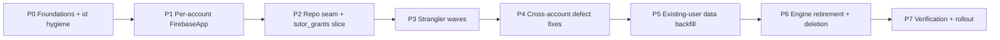

# Drift → Firestore-Native Migration Plan

Owner-facing, phased. No dates — **effort classes only** (S / M / L / XL). Every phase names its scope, entry/exit criteria (including the repo's `make ci` + `make audit` + red-demo test gates), what ships to users, risk register, rollback, and effort class. AD references are to the [Architecture Spine](ARCHITECTURE-SPINE.md).

## Strategy at a glance

Strangler-fig behind the repository seam (AD-3), collection by collection, risk-ordered. Nothing is deleted until its native replacement ships and shadow-verifies. The custom engine (12.2k lines, Outbox, 18 mergers) is retired only in Phase 6, after every collection is native and existing-user data is backfilled and verified. `tutor_grants` (already Firestore-native, MCF-30) is the working template.

---

## Phase 0 — Foundations & id hygiene · **L**

**Scope.** Extract the single canonical LWW predicate (AD-7), unit-pinned as the single module (AD-29 tier 1) so no second copy can exist. Establish deterministic doc-id formulas as a standalone module reproducing today's formulas exactly **except** the track-scoped children, which are re-expressed against the canonical track key `curriculum_id` (AD-25) — the `{perDeviceTrackId}_*` re-key + backfill itself lands in Phase 3 Wave A, but the target formulas are fixed here. Kill every device-local autoincrement id from payloads: sweep for MCF-11-class landmines outside `merge/` (§10 Q12), and make `learner_profiles` doc-id a profile-scoped ULID distinct from the path uid (AD-5). Standardize on the **existing in-repo `lib/core/time/ulid.dart`** generator (no new package). **Retarget the `make audit` greps per AD-28**, not custom_lint (documented non-functional here): retarget `no-firebase-outside-core` (DNI-387) to the new allowed-dir list, add the bare-`FirebaseFirestore.instance` grep, promote the MCF-11 sweep to a standing grep gate, add the dependency-direction check (AD-23) — enforced but not yet tripped (no feature imports Firestore yet). Promote `connectivity_plus` to a direct dependency. Re-derive every behavioral count from code, not stale docs (MCF-31).

**AD-1 topology de-risk spike (gates the whole paradigm).** Run the two-named-app / one-project / two-anonymous-user smoke test on the **oldest supported device** (AD-1 topology caveat, AD-29 tier 3): confirm writes + listeners in app A are invisible to app B's cache, and no cache-directory collision. This is the single existential-risk check ("What could kill this" #1) and must pass before Phase 1 commits.

**Landable-now reliability quick-wins (independent of the rewrite).** The reliability review's cheap, low-risk fixes that **survive** the migration as native requirements can land immediately on the *current* engine, decoupled from the freeze decision below: resubscribe-on-error (R-1 → AD-9), connectivity-source/status rebuild off the raw poller (E-1 → AD-11), drain-in-catch-path (R-4). These are not blocked by Phase 1; ship them as short-term reliability insurance. (This is where **AD-11**'s slim-status/connectivity work is owned — it has no later phase.)

**Entry.** Spine ratified; owner sign-off on the four ADOPTED decisions.
**Exit.** Canonical predicate (single-module, grep-pinned) + doc-id module land with unit tests reproducing current outputs byte-for-byte (track-scoped formulas tested against the new `curriculum_id` key); landmine sweep report attached; ULID standardized on the in-repo generator; retargeted `make audit` greps green; **AD-1 smoke test passes on oldest supported device**; lints green in `make ci`; `make audit` clean; red-demo for the predicate (drive the ±5s / synced_at / D15 branches).
**Ships to users.** Nothing from the refactor; the three quick-wins above ship as real reliability fixes if the owner greenlights landing them on the current engine.
**Risk register.** (a) The MCF-11 sweep finds landmines on paths outside `merge/` (likely) → scope creep; budget for it. (b) A doc-id formula is subtly non-reproducible → orphans later; the byte-for-byte test is the guard. (c) **The AD-1 smoke test fails on old hardware → the paradigm is infeasible; surface before any Phase 1 investment.**
**Rollback.** Pure additive/refactor; revert commits. No data touched.

## Phase 1 — Per-account FirebaseApp subsystem · **XL**

**Scope.** Build `AccountFirebase` registry: create/tear down `Firebase.initializeApp(name:'account_<deviceRegistryAccountUuid>')` per device account (≤5) — app-name keyed by the **stable device-registry UUID**, path uid a **persisted field with remap-on-anon-reset**, never the live auth uid (AD-24) — each with private Auth + Firestore + `Settings` pinned via the `.settings` setter immediately after obtaining the handle, before first use (AD-18). Wire handle resolution (`accountFirebase(activeAccountId)`); ban bare `FirebaseFirestore.instance` behind the AD-28 grep. Move listener teardown/rebind onto per-app lifecycle, with **gated resume network reset** (real network-identity change only, `paused`/`hidden` states, debounced — E-5/AD-9). **This is the scope-defining subsystem** (MCF-feasibility) and the largest single integration.

**Entry.** Phase 0 exit.
**Exit.** ≤5 named apps create/switch/tear-down cleanly on emulator with seeded multi-account data (Parent PIN 2580 setup); instant offline switch between two previously-synced accounts verified with network disabled; identity-mismatch guard reproduced against the active-account record's uid (AD-2); no PERMISSION_DENIED flood on switch; `make ci` + `make audit` green; red-demo for offline account switch.
**Ships to users.** Nothing yet — the subsystem is live but no collection reads through it until Phase 2/3.
**Risk register.** (a) Named-app teardown leaks native resources / cache files → OOM (note the `api29-learn-oom` thread) — bound app count, verify disposal. (b) Anonymous-Auth-per-local-born (AD-19 `[ADOPTED]`) — Phase 4 implements it; verify Anonymous Auth quota/limits per project don't constrain rollout. (c) Per-account cache disk cost ×5 → set bounded `cacheSizeBytes`.
**Rollback.** Feature-flag the subsystem; fall back to the single-instance path (still present until Phase 6). No data written through it yet, so rollback is flag-flip.

## Phase 2 — Repository seam + tutor_grants vertical slice · **L**

**Scope.** Fill/re-point the 10 empty repository scaffold dirs and close the 27 direct-DAO bypasses (AD-3, MCF-13-scaffold) so every feature reads through a repository interface. Prove the end-to-end Firestore-native repository pattern on `tutor_grants` (MCF-30) — the one collection already native — as the reference implementation: codec, doc-id, canonical-predicate reconciliation, resubscribe-on-error listener (AD-9), routing parity test (AD-17).

**Entry.** Phase 1 exit.
**Exit.** Zero feature/service/provider files import `cloud_firestore` (lint proves it); `tutor_grants` reads/writes entirely through its repository over a named app; resubscribe-on-error red-demo passes; parity acceptance test green; `make ci` + `make audit` green.
**Ships to users.** Tutor-grant reads now flow through the named-app path — low blast radius, already-native data; a safe first production exposure of the new stack.
**Risk register.** (a) Closing bypasses touches 27 files across hot paths → regression surface; land behind per-feature review, keep repositories thin pass-throughs first. (b) Riverpod-return-type friction with model types (MCF-10-codegen) → use hand-written StreamProvider fallback.
**Rollback.** Per-feature: repositories can delegate back to DAOs; revert the tutor_grants native path to the existing no-op-merger read.

## Phase 3 — Per-collection strangler waves (risk-ordered) · **XL**

**Scope.** Cut collections from Drift+merger to native repository, one risk-ordered wave at a time. Each wave: implement the repository (codec with legacy aliases AD-13, deterministic doc-id AD-5, append-only/tombstone where applicable AD-6, atomic writes AD-8, arrival-order tolerance AD-10), run it in **shadow** (write native + keep legacy path, compare) before flipping reads. Suggested order (safe → dangerous):

1. **Wave A (track-scoped identity cluster — cut *atomically*, doc-level LWW):** `curriculum_tracks`, `stage_definitions`, `study_day_configs`, `goals`, plus `bookmarks`, `learning_order`, `profile_programs`. **All track-scoped collections (`curriculum_tracks` + its children `stage_definitions`/`study_day_configs`/`goals`) MUST cut over in this single wave** — splitting them across waves strands a child written in the gap against a track identity that has moved layers (old per-device `track_id` in Drift vs. new `curriculum_id` key in Firestore; adversary structural defect). This wave carries the **AD-25 one-time doc-id re-key + backfill** of historical `{perDeviceTrackId}_*` docs to the `curriculum_id`-keyed form. Drive the `goals` F4 tie-break test first (MCF-27).
2. **Wave B (config + prefs fan-out):** `gamification_settings` subcollection remodel (MCF-19 fan-out — single owner, Firestore authoritative, prefs a rebuildable projection, AD-27), `notification_settings`/`ui_preferences` (SharedPreferences per AD-15/AD-27, MCF-14).
3. **Wave C (append-only history):** `learning_ledger`, `streak_events`, `points_ledger`, `reward_redemptions` — derived balances (AD-4), uniqueness by doc-id (MCF-8), RewardRedemption predicate decision (AD-21).
4. **Wave D (highest volume + tombstones):** `completions` — tombstone resurrection (AD-6/MCF-6), CompletionWriter atomicity (MCF-writer), `stage_id_format` marker, prior-import upgrade (MCF-8b), `completions_view` filter re-implementation (MCF-view).

Once direct-SDK writes ship, wire the **AD-30 permanent-write-failure recovery affordance**: a `permission-denied`/non-retryable write surfaces a per-item tap-to-retry out of band from the 3-state chip (this replaces the old `error`-status/dead-letter recovery path that AD-11 retires — it is NOT a revived queue counter).

**Entry.** Phase 2 exit; App Check enforcement extended to `firestore.rules` (AD-12) before Wave C/D ship broadly.
**Exit (per wave).** Shadow comparison shows zero divergence over a seeded run; append-only dedup verified by doc-id; parity test stays green; `make ci` + `make audit` green; red-demo per wave (tombstone resurrection, double-credit idempotency, out-of-order arrival). **Wave A additionally:** the AD-25 re-key backfill maps every historical `{perDeviceTrackId}_*` doc to its `curriculum_id`-keyed form with a cross-device match test (a `stage_definition` written on device X resolves on device Y), and all four track-scoped collections flip together (no partial cut).
**Ships to users.** Each wave flips that collection to native for real reads/writes — incremental, reversible per collection.
**Risk register.** (a) A codec drops a legacy alias → historical data stops round-tripping (MCF-3-continuity) — the shadow diff is the guard. (b) Completions volume + tombstone logic is the single most dangerous port (H2/D11) — isolate as its own wave, longest bake. (c) Losing arrival-order tolerance → FK-analogue breakage (MCF-15). (d) `settings`/`stage_definitions` dual-write confusion (MCF-16) — write one shape only.
**Rollback.** Per collection: flip reads back to the legacy merger (still present); shadow writes are idempotent, so no cleanup needed. This is the core reason the engine is not deleted until Phase 6.

## Phase 4 — Cross-account defect fixes + local-born principal · **L**

**Scope.** Fix the three in-scope cross-account defects (AD-14): scope `deleteAccount()` to the target account (MCF-blastradius), per-account sync/restore flags (MCF-globalflags), `(accountId,profileId)` key namespacing with a one-time on-device key re-home (AD-15/MCF-collision). Implement the **AD-26 profile hard-delete**: the delete set is **registry-derived** (every real Firestore per-profile collection — NOT the Drift "6 no-cascade" list), with **no dependency order**, explicitly including `curriculum_scopes` **and** `import_metadata` (MCF-24-orphan, both omissions); client-deletable collections go through the AD-8 batch, SR-1 append-only history routes through the **Admin-SDK / CF `recursiveDelete`** server path (the client seam is denied by SR-1) — this is MCF-cascade. Implement the local-born principal per AD-19 (`[ADOPTED]`): Anonymous Auth + upgrade-as-linking + **anon-uid remap-on-reset/relink** (AD-24). Implement `curriculum_scopes` full bidirectional owner sync (AD-20 `[ADOPTED]`). Apply the uniform write path / completions-facade retirement + `fulfilRedemption` transactionality (AD-21 `[ADOPTED]`; note the RewardRedemption *predicate* is already settled in Phase 0 via AD-7, not gated here).

**Entry.** Phase 3 Waves A–C complete (defect fixes must not race active collection cutovers). AD-19/20/21 ratified 2026-07-30 — no longer a phase gate.
**Exit.** Two accounts on one device keep independent locale/font/PIN/notification state; deleting one account leaves the other intact (red-demo both); second cloud account runs its own sync/restore; local-born create→upgrade round-trips **and survives an anon-uid reset without stranding its cache/tree** (AD-24 remap red-demo); a profile hard-delete leaves **zero orphaned collections** (registry-derived set incl. `curriculum_scopes`/`import_metadata`) and correctly routes SR-1 history through the CF `recursiveDelete` path (MCF-cascade red-demo); key-migration is idempotent and reversible; `make ci` + `make audit` green.
**Ships to users.** Real bug fixes: no more cross-account settings/PIN wipes, no more skipped second-account sync. Ship-worthy on their own.
**Risk register.** (a) The one-time key re-home mis-maps a key → a user loses a setting/PIN → make it additive-then-verify, never destructive. (b) Anonymous-Auth quota/limits per project.
**Rollback.** Key re-home writes new namespaced keys and leaves originals until verified; revert = keep reading originals. Defect fixes are independently revertible.

## Phase 5 — Existing-user on-device data backfill · **XL**

**Scope.** Backfill each existing user's per-account Drift data into their named-app Firestore cache/cloud. Device-local, per-account, idempotent. **This phase owns the point of no return.**

**Design sketch (Drift → Firestore backfill).**
1. **Precondition gates:** refuse to backfill a pre-v30 ledger (MCF-9 — unrecoverable over-credit rows); re-verify `TrackLearningOrder.profileId` integrity (MCF-12); require schema ≥ v37 (`stage_id_format` marker present, MCF-7).
2. **Deterministic replay:** for each synced collection, read Drift rows, encode via the same codec/doc-id used by the live native path (AD-5/AD-13), `set(merge:true)` under the account's named app. Because doc-ids are deterministic and writes are idempotent, a re-run overwrites, never duplicates (MCF-3/MCF-8).
3. **Skip already-native / already-synced:** rows whose doc already exists with equal-or-newer `synced_at` are no-ops (canonical predicate, AD-7).
4. **Local-only stays local:** Content DB, Device Registry, derived caches, prefs — never backfilled (AD-16).

**Dual-run / shadow-verification stage.** Before flipping any user to "Firestore is now the source of truth," run a verifier that reads both the Drift projection and the Firestore projection and asserts equality (counts + per-doc field diff) for every synced collection, per account. Divergences are logged, not auto-resolved. A user is eligible for the point of no return only after a clean verifier pass.

**Point of no return.** Per account, once verified: mark the account `firestoreSourceOfTruth=true`, stop dual-writing to Drift, and freeze the legacy path for that account. Before this flag, everything is reversible; after it, the Drift user DB is retained read-only (not yet deleted) as a safety copy until Phase 6.

**Entry.** Phase 4 exit; every collection native (Phase 3 complete).
**Exit.** Backfill + verifier run green on the seeded emulator accounts and on a representative heavy/long-tenured account (E-4's ~2,300-doc user); zero-divergence verifier pass; point-of-no-return flag gated on that pass; `make ci` + `make audit` green; red-demo for a re-run (idempotent, no duplicates) and for a mid-backfill crash (resumable).
**Ships to users.** Silent, per-account backfill on launch; no UX change if clean. A migration progress/telemetry surface for support.
**Risk register.** (a) **Highest-stakes phase.** A codec asymmetry between backfill and live path duplicates or corrupts → the verifier + deterministic doc-ids are the guard; do not flip source-of-truth without a clean pass. (b) A heavy user's backfill is slow / hits offline-queue limits → chunk + resume. (c) Pre-v30 / pre-v36 / pre-v37 users on old schemas → precondition gates must block, not silently skip.
**Rollback.** Until the point-of-no-return flag flips, the account still reads Drift — revert = clear the flag, Drift is untouched. After the flag, the read-only Drift copy (retained through Phase 6) is the recovery source; backfill can be re-driven idempotently.

## Phase 6 — Engine retirement & deletion · **L**

**Scope.** Delete the custom sync engine now that no account depends on it: `lib/core/sync/**` (~12.2k lines), Outbox table + OutboxProcessor + PushPipeline + PullPipeline + ListenerSupervisor + MergeRouter + all 18 mergers + SyncKv, per-account Drift **user** DB schema, and the retired dead paths (`SettingsCodec.encode`, `pushLedgerEntriesBatch`, `merge_rules.dart` after §10 Q14 confirms no skipped-test reference). Drop the read-only Drift user-DB safety copies once retention window passes. Delete the now-orphaned 84 sync test files, replacing coverage with native-path tests.

**Entry.** Phase 5 exit; all accounts past point of no return; retention window on read-only Drift copies elapsed.
**Exit.** `lib/core/sync/**` gone; no `cloud_firestore` import outside `data/firestore` + `data/repositories`; app builds and passes full `make ci` + `make audit` with the engine absent; binary size / dependency graph confirms deletion; red-demo full regression on emulator.
**Ships to users.** Smaller, faster app; the "fickle + heavy" sync behavior (RC-1/2/3) is structurally gone. No new features.
**Risk register.** (a) A latent live reader of a "dead" path (the baseline flags several *suspected*-dead paths, MCF-16/F2) → grep + shadow window before deletion. (b) Deleting Drift user DB while a stale device still on old app version writes to it → gate on min-app-version. (c) Active `sync-wave1/2/3` threads are still *improving* the engine being deleted — **coordination conflict, see below.**
**Rollback.** This is the least reversible phase (code deletion) — but it is gated on Phase 5's verified point of no return, so data is already native. Rollback = git revert of the deletion PR; retain a tagged pre-deletion commit.

## Phase 7 — Verification, telemetry & rollout · **M**

**Scope.** Instrument what the reliability review said was unmeasurable (§5): per-collection read counts per launch/resume, listener onError/resubscribe events, backfill/verifier outcomes, offline-queue depth proxy for the slim status. Stage rollout by min-app-version + cohort. Confirm the App Check enforcement path (AD-12) is green in production (the debug-token discipline). Sign-off checklist against the MCF register.

**Entry.** Phase 6 exit.
**Exit.** Telemetry dashboards live; a full MCF-1..35 sign-off (every row demonstrably handled by its AD); staged rollout complete with no cross-account regression; `make ci` + `make audit` green.
**Ships to users.** General availability of the Firestore-native app.
**Risk register.** (a) Post-App-Check read volume rises as masked traffic bills (review §1) → the deferred delta-pull (Spine Deferred) becomes the fast-follow if cost spikes. (b) A cohort surfaces a backfill divergence in the wild → keep the verifier + read-only Drift copy retention long enough to diagnose.
**Rollback.** Cohort/version-gated; halt rollout, hold at last-good cohort.

---

## What could kill this (honest failure modes)

1. **The named-app model doesn't hold up at ≤5 accounts on real low-end devices.** N Firestore caches + N Auth + N gRPC fleets may blow memory (the `api29-learn-oom` thread is a live warning) or exhaust file handles. If per-account isolation is infeasible on target hardware, AD-1 — the whole premise — needs the reduced-experience fallback (only most-recent account offline), which the owner explicitly rejected. **This is the single existential risk; de-risk it in Phase 1 on the oldest supported device before committing to Phase 3.**
2. **Local-born (credential-less) tier's Anonymous Auth principal (AD-19, ratified) has an operational gap at scale.** Anon-uid instability (reinstall, App-Check-debug-token wipe) is handled by the AD-24 remap-on-anon-reset step; if that remap path misses an edge case, the offline-first account model has a hole exactly where the app's onboarding lives.
3. **A codec/doc-id asymmetry between the live path and the backfill path corrupts real user data at the point of no return.** The deterministic-doc-id + shadow-verifier discipline is the only thing standing between "idempotent re-run" and "silent duplication of a year of completions." If verification is weak, this is unrecoverable.
4. **Legacy alias / doc-id continuity is imperfect.** Any historical shape not decoded (MCF-3-continuity) orphans that user's data invisibly — it looks like "some old stuff is just gone."
5. **Losing an invariant that lived only in engine code.** The engine encodes ~35 hard-won corruption guards; the risk is porting the happy path and dropping a guard (tombstone-without-timestamp-filter, ±5s tie-break, track-id skip-not-insert). The MCF register is the checklist; narrowing it silently reintroduces a shipped P0.
6. **App Check surface widening.** Expanding direct-SDK writes without extending App Check to rules (AD-12) leaves a larger unattested surface than today — a security regression, not just a perf one.
7. **Coordination collision with in-flight engine work** (see conflict below).

## Coordination conflict surfaced between the ground documents

The **reliability/efficiency review (2026-07-29)** treats the sync engine as fundamentally sound and prescribes ~15 incremental fixes to it (resubscribe-on-error, connectivity source, outbox depth-gating, dead-letter revival, listener re-scope), and notes active agent threads (`sync-wave1/2/3`, `sync-error-telemetry`) already implementing them on `dev`. The **migration baseline + memlog** commit to **deleting** that entire engine (Outbox, OutboxProcessor, mergers, SyncKv). These are not factually contradictory, but they are strategically opposed: **work being invested to improve the engine (Phase-6 deletion target) is partially throwaway.** The baseline itself flags this (§10 Q17). Two of the review's fixes survive the migration as native requirements (resubscribe-on-error → AD-9; connectivity-source/status → AD-11); the rest (outbox tuning, dead-letter accounting, batch-writer wiring) are **mooted by engine deletion** and, if landed now, are effort spent on deleted code. **Decided (Daniel, 2026-07-30): freeze the `sync-wave*` threads to the two migration-surviving fixes.** Only dead-listener resubscribe-on-error (→ AD-9) and the connectivity-source fix + slim-status groundwork (→ AD-11) land now. Every other wave-1/2/3 engine-internal item — outbox depth-gating, batch-writer wiring, at-limit tuning, cold-launch drain, and the remainder of the review's ~15 incremental fixes not named above — is **DROPPED**, mooted by the Phase-6 engine deletion.

**Independent of that freeze decision**, the review is explicit that three specific fixes are *quick wins — cheap, low-risk, ship this week* and should NOT wait for either the freeze call or the architectural rewrite: **#1 R-1 resubscribe-on-error, #2 E-1 connectivity retune (called out as entirely decoupled from Firestore — landable on the current engine immediately), and #5 R-4 drain-in-catch-path.** All three survive the migration (they map to AD-9/AD-11), so landing them now is not throwaway. They are scheduled in **Phase 0's "landable-now quick-wins"** rather than gated behind Phase 1's XL foundation — the review's #1-first urgency would otherwise be inverted by burying AD-9/AD-11 behind two large phases. The freeze decision governs only the *mooted* fixes, not these three. Additionally, the reliability review's "pin `FirebaseFirestore.settings` on the single instance" (E-8) and "decide one durability owner" (item D) are written against the single-instance architecture that AD-1 replaces — reinterpret them as per-named-app settings (AD-18) and "SDK offline queue is the sole durability owner" (AD-8), respectively.
