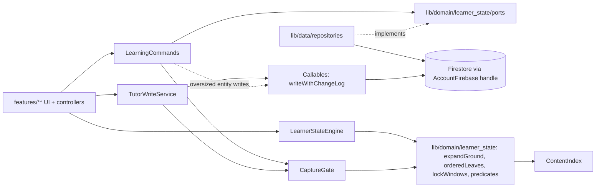
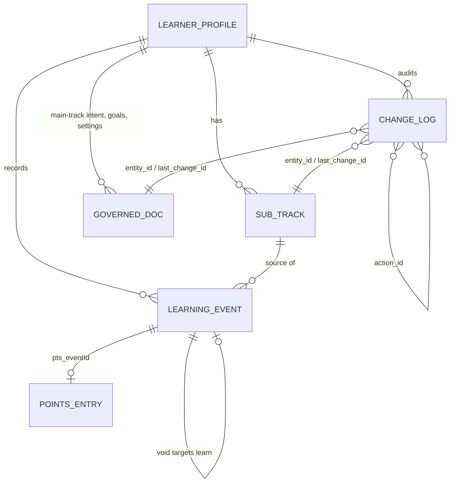
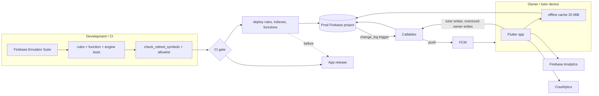

# Architecture Spine — Sub-tracks and the learning-event stack

## Design Paradigm

**Event-sourced learner state.** Everything a learner has learnt, in any curriculum, lives in one append-only `learning_events` log. Sub-tracks, goals, main-track settings (order, program, study days, stages, scope) and learner settings are stored *intent*. Every number the app shows is computed by **one pure reducer** (`LearnerStateEngine`), run once per learner profile over all curricula. That covers the learnt set, positions, calendar assignments, the review schedule, the schedulable set, daily target, shortfall, projection, streak, siyumim, points eligibility and on-track status. All writes go through **one command layer**: `LearningCommands` on owner devices, and `TutorWriteService` → callables on tutor devices. The command layer applies the capture lock, validation, co-written history, points and analytics.

ADs state the **target** behaviour. Where today's code differs, the AD or the Retirement Inventory names what is replaced.



Dependency direction (a rule):
- `features → LearningCommands | TutorWriteService | LearnerStateEngine`.
- `LearningCommands → lib/domain/learner_state/ports` (interfaces), which `lib/data/repositories` implements.
- Nothing under `lib/domain/**` imports `cloud_firestore`, `lib/data/**`, Riverpod or Flutter. `tool/check_dependency_direction.dart` is extended to fail on those imports.

## Inherited Invariants

These are binding and read-only, inherited from `architecture-learning-tracker-2026-07-30` (system altitude).

| Inherited | Binds here |
| --- | --- |
| AD-1, AD-2, AD-24 | New repositories resolve `activeAccountFirebaseProvider` handles and profile-ULID paths. Production named-app Auth wiring (open work in the parent) is a **prerequisite** of every epic that ships a new repository. |
| AD-3, AD-23, AD-28 | Firestore code lives only in `lib/data/repositories/**`. The checkers cover new files and the new `lib/domain/**`. |
| AD-5 | Deterministic ids: client-generated ULIDs, `pts_{eventId}`, `goals/{curriculumId}_deadline`, `goals/{curriculumId}_pace`, `track_learning_order/{c}_{level}_{ref}`. |
| AD-6 | `learning_events` and `change_log` are append-only, using the SR-1 identical-replay pattern. |
| AD-7 | Stays dormant. AD-38 governs the deliberate second writer, the tutor. |
| AD-8 | The SDK offline queue is the only durability. A carve-out is recorded in the parent: bulk captures and multi-entity actions chunk across batches (AD-54). |
| AD-9 | New listeners use the resilient stream wrappers. |
| AD-12 | Rules are the authorization boundary for client writes; callables (Admin SDK) bypass them and carry the AD-38 callable contract. New client timestamps follow AD-54's skew rule. |
| AD-13 (removed in the parent; its current rule binds) | Greenfield: no data migration. Old collections are retired, not converted. |
| AD-15 | The siyum-shown key uses `ProfileScopedPreferenceKeys` (`*_p<profileId>`). The parent-PIN session is the role source. |
| AD-16 | The Content DB and bundled hierarchy assets stay local and read-only. |
| AD-18 | Per-account 20 MiB cache, covered by AD-54's perf gate. |
| AD-25 | `CurriculumId` storage keys and profile ULIDs. |
| AD-26 | Recursive account/profile deletion covers the new collections automatically. |
| AD-27 | Firestore owns records. Local keys are UI conveniences only. |
| AD-29 | Rules, `existsAfter`/`getAfter`, access-call budgets, offline batches and named-app claims need emulator or instrumented evidence. |
| AD-30 | A genuinely non-retryable write gets an explicit recovery affordance (AD-54). This spine also ships rules and client together (AD-49, AD-54), so supported clients never hit one by design. |

### Amendments to the parent (recorded in the system spine)

- **AD-4 streak half** → superseded by AD-40 (streak derived from `learning_events`, per curriculum).
- **AD-4 points half** → amended by AD-50 (the balance is filtered by the engine's `earningEventIds`).
- **AD-6 Binds** → after cutover, the list is `learning_events`, `change_log` and `points_ledger`.
- **AD-8** → carve-out by AD-54: bulk captures and multi-entity actions chunk across batches sized by the Rules access-call budget; each chunk is self-contained.
- **AD-12 / SR-3** → relaxed by AD-54 for learning and governed batches: client timestamps may be up to `request.time + 10 min`.
- **AD-22 / W3.43** → the policy that tutors cannot mark live completions is superseded by AD-53 for `learning_events`.

## Invariants & Rules

### AD-31 — One learning-event log is the source of truth for "learnt"

- **Binds:** FR-2–FR-4, FR-14, FR-16, FR-17, FR-30–FR-32; every capture surface, in every curriculum.
- **Prevents:** two stores of "learnt"; node-level and leaf-level events being counted differently; un-learning that silently does nothing.
- **Rule:**
  - `learning_events/{ulid}` (profile-scoped; schema in AD-52) is the only record of learning.
  - `kind` is `learn` or `void`. A `void`'s target must be a `learn` event: the command layer and callables reject anything else, and the engine ignores a void that targets a void. Voids form a set of target ids. A void whose target is absent is not an error.
  - A `dated` or `catch_up` event's `ref` is a ContentIndex **leaf**. A `before_tracking` event may instead carry a node `ref` plus `level`. The engine expands it with `expandGround`, and it counts as learnt for every leaf it covers.
  - The ULID is generated client-side before the write and reused on retry.
  - **Effective instant:** `effectiveAt(e) = original_recorded_at ?? recorded_at`. Every rule that reads an event's time uses it: lock (AD-36), `streakDay` and `catchUpWindow` (AD-40), earning order (AD-50), review schedule (AD-35), siyum (Consistency), history order. Raw `recorded_at` is used only by the AD-54 skew rule.
  - **Un-learn:** `unlearn(curriculum, leafSet S)` is the only un-learn command. It voids every counted learn event whose ref is in `S`. For each counted node event `N` covering part of `S`, it voids `N` and writes `before_tracking` events for the maximal ContentIndex nodes covering `expand(N) \ S`, each with `original_recorded_at = effectiveAt(N)`. Chunked per AD-54. Undo of `unlearn` voids the re-issued events and re-copies the voided ones.

### AD-32 — "Learnt" is stage-agnostic; stage is a main-track review tag

- **Binds:** planner, FR-12a, FR-14, FR-30.
- **Prevents:** the PRD's "chazara" (any repeat) diverging from chazara stages (scheduled spaced review).
- **Rule:**
  - A leaf is learnt iff it has ≥ 1 counted `learn` event (not voided, not lock-ignored), from any source, stage or date state.
  - `stage` (a `stage_order` int) appears only on `source = main` events.
  - A spaced-review cycle starts only from a `source = main` event with `stage = firstStageOrder`. A leaf learnt only via a sub-track, a free tick or before-tracking has no review cycle.
  - PRD "chazara" is a derived count and is never stored.

### AD-33 — Store intent, derive state

- **Binds:** FR-2, FR-5–FR-13, FR-12a, FR-19.
- **Prevents:** stale pointers and multi-doc drift under concurrent edits; position, remaining and the plan disagreeing; two order collections colliding.
- **Rule:**
  - A sub-track belongs to one `curriculum_id` and stores only the AD-52 `sub_tracks` fields. `ground` is an ordered list of `{level, ref}` node entries at any ContentIndex level of that curriculum, kept as entered and replaced whole on edit. `rate_per_week` is in that curriculum's leaf units.
  - Never persisted: any track's position or current unit, the schedulable set, remaining, progress, and return-on-end.
  - Sub-track position = the first leaf in `expandGround` order with no counted `learn` event whose `source` is this sub-track.
  - **Main-track order:** `mainTrackOrder` docs are `track_learning_order/{c}_{level}_{ref}` (`curriculum_id`, `level`, `ref`, `user_sort_order`). `orderedLeaves(corpus, orderDocs)` in `lib/domain/learner_state/` is the only order function: at each level it sorts siblings by `user_sort_order` where a non-ended doc exists, siblings without a doc follow in ContentIndex order, then it recurses into children. Reset to default is one logged `mainTrackOrder` change setting `ended_at` on every order doc of the curriculum.
  - **Per curriculum**, with `O = orderedLeaves(corpus, mainTrackOrder)` and `start = tracking_start_ref`:
    - `schedulableRefs` = leaves of `O` with no counted learn event and not in the ground of any `holdsGround` sub-track; ordered as the leaves at or after `start` in `O` order, then the leaves before `start` in `O` order.
    - `mainTrackRemaining = |schedulableRefs|`.
    - **Current unit** = the FR-12a unit (Mishnayos: masechta) containing the later, by time, of the leaf of the latest counted `source = main` `dated`/`catch_up` event (by `effectiveAt`) and `start` (by the `at` of its last `mainTrackProgram` entry). It applies only while it still has a schedulable leaf.
    - **Main-track position** = the first schedulable leaf of the current unit; else the first element of `schedulableRefs`.
  - The engine is the only implementation of order, current unit, position and `schedulableRefs`. A manual jump is a governed change to `tracking_start_ref`. Ordering is at node-entry granularity only.
  - Calendar-program curricula use AD-35 `programAssignments` instead of position for planning.

### AD-34 — One ground-expansion function and one set of activity predicates

- **Binds:** FR-2, FR-6a, FR-9–FR-12, FR-15, FR-19.
- **Prevents:** surfaces disagreeing on ground or on which sub-tracks are "active".
- **Rule:** in `lib/domain/learner_state/`, these are the only implementations:
  - `expandGround(entries)`: entries in list order, each in `ContentIndex` order, with later duplicates dropped.
  - `holdsGround(s, today) = !ended_at && today ≤ window_end`. This includes future sub-tracks, whose ground leaves the main track now.
  - `inForecast(s, today) = holdsGround && capacity interval non-empty`.
  - `onHome(s, today) = !ended_at && window_start ≤ today ≤ window_end`.

  A null `window_end` is +∞ in every predicate; only AD-44 capacity substitutes `target_date` for it. Main-track remaining, the schedulable set and the AD-44 numerator use `holdsGround`. Home rows use `onHome`.

### AD-35 — One pure engine computes all learner state

- **Binds:** FR-9, FR-12, FR-12a, FR-14–FR-21, FR-24, FR-25, FR-29–FR-32.
- **Prevents:** a second implementation of any derived number (UI, planner, server, tutor view, reports); review scheduling outside the engine; points judged against config that was not in force.
- **Rule:**
  - **Signature:** `LearnerStateEngine(events, subTracks, mainTrackIntent, goals, intentHistory, calendars, corpora, nowUtc) → LearnerState`, pure, run once per profile. Inputs are keyed by `curriculum_id`. `mainTrackIntent` is the governed track, order, program, study days, stages and scope. `corpora` is a map of AD-42 corpora. `calendars` is `program_id → [(civilDate, nodeRef)]`, loaded by the provider from `CalendarProgramService` and passed in as data. `today = civilDate(nowUtc)` per AD-41.
  - **Evaluated curricula:** only those whose `curriculum_tracks` doc has `state == active` and no `ended_at` get sub-tracks, forecast, plan and streak. Events of every curriculum still count for lifetime and siyum.
  - **Per curriculum, `LearnerState` gives:** the learnt set, current unit, positions, `schedulableRefs`, `mainTrackRemaining`, `programAssignments(date)`, `programBacklog(today)`, `reviewsDue(date)`, `dailyTarget`, `paceRate`, shortfall, projection, completed units, and streak.
  - **Profile-wide, `LearnerState` gives:** `countedEventIds` and `earningEventIds` (AD-50).
  - **Review schedule:** `reviewsDue(date)` = the (leaf, `stage_order`) pairs due on that civil date from AD-32 cycles, each step computed under the `mainTrackStages` and `mainTrackStudyDays` in force at the `effectiveAt` of the event that completed the previous step. This is the only review scheduler.
  - **Calendar programs:** `programAssignments(date)` returns **leaves**: each assigned node expanded by `expandGround`, intersected with the corpus. `programBacklog(today)` = assigned leaves dated before `today` and on or after `amnestyFrom`, with no counted learn event, where `amnestyFrom = max(tracking_start_date, civilDate(at) of the latest mainTrackOrder or mainTrackProgram entry)`. For such a curriculum `dailyTarget` and shortfall come from the calendar (assigned through today − learnt), and AD-44 is not computed. `curriculum_tracks.last_reorder_at` and `activated_at` are not anchors; a missing `tracking_start_date` is a validation error.
  - **Projection:** velocity = distinct leaves newly learnt per civil day (`learned_on`), from `dated` and `catch_up` events and excluding chazara and before-tracking. It is taken over the trailing 28 days; with 14–27 days of tracked history it uses all of it; under 14 days, no projection is made. There is no pace reset.
  - **Complete inputs:** `events` and `intentHistory` are always complete. Repositories page at ≤ 500 until exhausted and emit a loading state until then. `intentHistory` is the complete read of `change_log` where `entity in ['learnerSettings','mainTrackOrder','mainTrackProgram','mainTrackStages','mainTrackStudyDays']`, paged by document id (no composite index). The value of an entity in force at instant t is reconstructed from its current docs and these entries' `before`/`after`, ordered by `original_at ?? at`.
  - **Tutor list:** FR-29 runs the engine one learner at a time, for visible rows only, and caches `LearnerState` in memory.
  - There is no server-side summary. The non-calendar daily target follows PRD FR-19 with AD-44 arithmetic.

### AD-36 — Capture lock: one window function, an unreadable lock, enforced again by derivation

- **Binds:** FR-23–FR-25; every write and every surface.
- **Prevents:** a surface locking on different windows; leaked writes; rules rejecting queued writes by sync time; lock-ignored events being laundered back in; multi-learner devices locking inconsistently.
- **Rule:**
  - `lockWindows(settingsHistory, fromUtc, toUtc)` in `lib/domain/learner_state/` is the only window function (`settingsHistory` = the `learnerSettings` slice of `intentHistory`). It serves the capture gate, the lock overlay, notification suppression and reminders. `ZmanimWindowService.computeWindows` is deleted.
  - **Constants** live in `lib/domain/learner_state/lock_constants.dart`: 10 min before candle-lighting and 10 min after tzeis. Changing one is a new AD.
  - Day iteration uses the learner's IANA `time_zone` in force (AD-41), never the device offset.
  - **Fail-closed fallbacks** per FR-23: with no location, Fri 12:00–Sun 01:00 learner-local and the yom tov equivalent; at high latitude, a fixed conservative window. The fail-open path in `sacred_window_repository` is removed.
  - **During a lock** the app is covered by the full-screen `SacredTimeLockOverlay` and is neither readable nor usable (`prd-deviations` #10). The planned list is an erev surface only.
  - **Multi-learner devices:** the overlay window is the union of `lockWindows` over every learner profile of the signed-in account. Learners viewed through a tutor grant do not drive the overlay: while one is locked, that learner's screens are covered and the FR-29 row shows "Shabbos / Yom Tov" with no data or controls.
  - **Write path:** every write passes `CaptureGate` on owner and tutor devices, using the target learner's settings.
  - **Derivation:** the engine ignores any event whose `effectiveAt` falls inside a window computed with the settings in force at that instant. Undo is not offered for a lock-ignored event. History labels it "not counted — recorded during Shabbos/Yom Tov".
  - **Tutor callables** return the server-stamped `recorded_at`. The client re-runs `CaptureGate` on it and reports "not recorded" if locked.
  - Config writes stamped inside a lock by a bad clock are an accepted risk, like a forged `recorded_at`.

### AD-37 — Learner settings live on the learner profile, with seeded history

- **Binds:** FR-23, FR-25, AD-36, AD-41.
- **Prevents:** a tutor's phone or a sibling's profile locking on the wrong zmanim; retroactive re-evaluation after a move or an import; ordinary profile edits colliding with governed settings.
- **Rule:**
  - `latitude`, `longitude`, `time_zone` (IANA, required, seeded from the creating device) and `in_israel` are learner-profile fields and form the governed entity `learnerSettings` (AD-38).
  - Profile creation writes the seed settings plus a `learnerSettings` seed entry (an ordinary entry with `before` all-null) in one batch. The tutor path does the same in `writeWithChangeLog`. Undo is never offered for a `learnerSettings` entry whose `before` is all-null. Instants before the first entry use that entry's `after`. A profile with no entry uses the doc's current values from the beginning of time.
  - **Rules:** the profile rule applies the AD-38 owner-rule branch only when the write's affected keys include a settings key or `last_change_id`. Other profile writers use field-level `update` of their own fields, and the codec never emits settings fields on a non-settings write. `tutorEditProfile` writes only `display_name`, `avatar` and `mode` with a field-level merge.
  - One provider, `learnerLockSettingsProvider(profileId)`, serves every reader. The `SacredTimePreferences` keys are deleted.

### AD-38 — Governed writes co-write an append-only change log; undo is a new change

- **Binds:** FR-4, FR-8, FR-26–FR-28, §4.9.
- **Prevents:** unaudited changes; spoofed actors; one action logged differently by owner and tutor; undo clobbering later edits; offline "creates" overwriting or ending another device's doc; cross-entity actions being unloggable; callables writing what rules would deny.
- **Rule:**
  - **Governed entities** (`change_log.entity` ↔ collection; `entity_id`):
    - `subTrack` ↔ `sub_tracks` (doc id = ULID)
    - `goal` ↔ `goals` (doc id)
    - `mainTrack` ↔ `curriculum_tracks`
    - `mainTrackOrder` ↔ `track_learning_order` (`learning_order` is retired, AD-49)
    - `mainTrackProgram` ↔ `profile_programs` (`program_id`, `tracking_start_date`, `tracking_start_ref`)
    - `mainTrackStudyDays` ↔ `study_day_configs`
    - `mainTrackStages` ↔ `stage_definitions`
    - `mainTrackScope` ↔ `curriculum_scopes`
    - `learnerSettings` ↔ `learner_profiles` (AD-37 fields; `entity_id` = profileId)

    For `mainTrack*` entities, `entity_id` is the `curriculumId`, and every doc carries a required, immutable `curriculum_id`.
  - **Entry and action.** A `change_log` entry covers exactly one entity and every doc of it changed by one user action; each doc carries the entry's id as `last_change_id`. A user action touching several entities writes one entry per entity, all carrying the same `action_id` (the ULID of the first entry). History shows one row per `action_id`. `before` and `after` are keyed `{collection}/{docId}.{field}` and hold only changed fields. Owner and tutor paths produce identical entries.
  - **Named multi-entity actions:** add track, remove track, re-add track. Reorder logs `mainTrackOrder` only.
  - **Batching:** an entity's docs and its entry are always in one batch or callable transaction. An action's entities may span batches, queued in action order, each batch self-contained; a permanently rejected member surfaces per AD-54 recovery. Batch size follows the AD-54 access-call budget. An entity write over that budget (e.g. a long reorder or order reset) goes through `writeWithChangeLog` on the owner path too, and is online-only.
  - **Writes are field-level** `set(..., merge: true)` of the changed fields only, including first writes. LWW is per field, by server commit order. Governed docs gain `last_change_id` and `ended_at`; `updated_at` and `synced_at` are retired from them. Client `delete` is denied; removal is a tombstone.
  - **Owner rule:** identical replay, or:
    - `last_change_id` is a ULID-regex string and differs from the stored one (or `resource == null` on create);
    - `!exists(change_log/id)` and `getAfter(change_log/id)` exists (2 access calls per doc);
    - the entry's `entity` is the one owning this collection, and its `entity_id` is the doc id (`subTrack`, `goal`), the profileId (`learnerSettings`), or `request.resource.data.curriculum_id` (`mainTrack*`);
    - `actor.uid == request.auth.uid` and `actor.role ∈ {parent, child}`.
  - **Create:** only `writeWithChangeLog` claims a create, after checking in its transaction that the server doc did not exist. The owner path, including profile seeding and import, writes ordinary entries whose `before` is the writer's cached value per field, or `null` per field when absent.
  - **Callable contract (`writeWithChangeLog`):** Admin SDK writes bypass Rules, so the helper itself, on every call:
    - requires `request.auth`;
    - verifies the caller owns the profile path, or holds an active `tutor_grants` grant for it with `can_edit_learning` (AD-53);
    - derives `actor` server-side: `uid` from auth, `role = tutor` for grant callers, `display_name` from the account or grant; owners' `parent`/`child` is accepted as asserted (Roles convention);
    - validates the full payload against AD-52, the AD-38 entity mapping, AD-45 limits and AD-31 void targets before writing;
    - runs in one transaction and is idempotent on the client ULID: an existing ULID with the same actor and entity returns the stored result.
  - **Rerouting:** every legacy writer moves to `LearningCommands` or the helper in the **same release** as the rules: the UI, and `tutorUpsertGoal`, `tutorDeleteGoal`, `tutorUpsertTrack`, `tutorDeleteTrack`, `tutorUpsertStudyDayConfig`, `tutorDeleteStudyDayConfig`, `tutorUpsertStageDefinition`, `tutorUpsertCurriculumScope`, `tutorSetProfileProgram`, `deleteCurriculumTrack`, and `tutorUpsertBookmark` (retired with `bookmarks`). There are no supported older clients (AD-13); deploy order follows AD-49 and AD-54.
  - **Track lifecycle:** `curriculum_tracks.state` (`active` / `retired` / `archived`) is a `mainTrack` field. **Remove track** is one action: a `mainTrack` entry setting `ended_at` on the `curriculum_tracks` doc only, plus one `subTrack` tombstone entry per non-ended sub-track of that curriculum. While a track has `ended_at`, every reader treats its other governed docs as ended. **Re-add** clears the track's `ended_at` through a logged change and keeps the prior config. Neither touches `learning_events` or `points_ledger`. `ended_at` replaces `purged` / `purged_at`. No Admin hard delete of governed docs remains outside account or profile deletion.
  - **History:** `change_log` is the only change history; `tutor_grants/*/audit_log` stays security-audit only. History = `change_log ∪ learning_events`, both paged 100 at a time by time descending, merged client-side and grouped by `action_id`. `change_log` is kept for the profile's lifetime and deleted only with the profile or account (AD-26); no purge job touches it.
  - **Undo** is offered per `action_id` and writes one new action that undoes each member entry U: for each field whose current value still equals `U.after[f]`, write `U.before[f]`; other fields are listed as "changed since by <actor>".
  - **An undo is final:** its entries carry `reverts_action_id` = the undone action's id; an action or void whose entries carry `reverts_action_id` offers no undo (voids written by an undo carry it too), and history marks the reverted action "Undone" on every device.
    - Undo of a create sets `ended_at` only if the doc's `last_change_id` still equals U's id; otherwise it is "changed since".
    - Undo of a learn event is a void. Undo of a void is a new learn copy carrying `original_recorded_at = effectiveAt(target)`.

### AD-39 — Parent push on tutor goal / main-track change

- **Binds:** FR-27.
- **Prevents:** the push reaching the child; each epic inventing its own path; one action sending several pushes.
- **Rule:**
  - The trigger `onChangeLogCreated`, in a new `functions/src/notifications.ts`, pushes via FCM when `actor.role = tutor` and `entity ∈ {goal, mainTrack, mainTrackOrder, mainTrackProgram, mainTrackStudyDays}`. At most one push per `action_id`: the trigger pushes only for the push-eligible entry with the smallest id among entries sharing its `action_id` (all are committed in one callable transaction).
  - **Tokens:**
    - Tokens live in the account doc's `fcm_tokens` map (install id → `{token, updated_at}`).
    - The parent-PIN session (`pin_flow_controller` on unlock, `pin_guard` on lock or timeout) registers this device's token on unlock and deletes it on lock.
    - Tokens that fail are pruned on send.
  - **Platform setup:** on iOS, an APNs key, push capability, and `getAPNSToken()` before other calls. On iOS and Android 13+, `requestPermission()`.

### AD-40 — Streak and catch-up derive from learning events, keyed by defined day functions

- **Binds:** FR-4, FR-16, FR-25, FR-6b; home/dashboard streak, streak alert, streak analytics, tutor row, reports.
- **Prevents:** backdated ticks filling streak gaps; restored or undone events losing their day; epics defining "locked day", the catch-up window, card contents or "the" streak differently.
- **Rule:**
  - The streak is **per curriculum**. It counts that curriculum's counted `source = main` learn events by `streakDay(e)`:
    - a `dated` event counts on `learned_on` iff `learned_on == civilDate(effectiveAt(e))`;
    - a `catch_up` event counts on `learned_on` iff `learned_on ∈ lockedDays(L)` for the lock L preceding it, and `effectiveAt(e) ∈ catchUpWindow(L)`;
    - `before_tracking` never counts.
  - `lockedDays(L)` = learner-local civil dates D (time zone in force at `L.start`) for which `JewishCalendar.fromDateTime(D)..inIsrael = in_israel` (settings in force at `L.start`) gives `isAssurBemelacha()`. The day the lock starts on is not a locked day.
  - `catchUpWindow(L)` = the non-locked time from `L.end` to the end of the first civil day after `L.end` that contains no locked instant. Each pending card has its own window.
  - **The catch-up card** covers at most three consecutive locked days. Per curriculum, it covers the main track and every `onHome` sub-track with `learns_on_shabbos`, and nothing else.
  - **Surfaces:** `LearnerState` has no profile-wide streak. The home/dashboard shows the streak of the curriculum in view. The streak-at-risk alert fires per evaluated curriculum whose streak is at risk, at most once per civil day per curriculum. Streak milestone analytics carry the `curriculum_id` enum. The FR-29 row and reports show streaks per curriculum.
  - These functions live only in `lib/domain/learner_state/`. `streak_events` is no longer written anywhere.

### AD-41 — The day is the learner's civil local date

- **Binds:** FR-3, FR-16, FR-18, FR-19, FR-25, FR-32.
- **Prevents:** UTC or device-timezone days disagreeing with "today"; a move retroactively shifting past days.
- **Rule:**
  - `learned_on`, `window_start`, `window_end`, `tracking_start_date` and goal `target_date` are `YYYY-MM-DD` civil dates in the learner's `time_zone`, inclusive where they bound an interval. `recorded_at`, `original_recorded_at`, `at` and `original_at` are Firestore timestamps used only for ordering, lock and catch-up checks.
  - `civilDate(instant)` uses the `time_zone` in force at that instant per `settingsHistory`. `today` uses the current `time_zone`.

### AD-42 — Refs, corpus and order come from ContentIndex

- **Binds:** FR-10, FR-14, FR-15, FR-17, FR-19.
- **Prevents:** epics counting or ordering a corpus differently.
- **Rule:**
  - A unit of learning is a `ContentIndex` leaf, identified by its `sefariaRef`. Nodes are identified by `{level, ref}`.
  - Corpus membership, hierarchy, default order and counts come from `ContentIndex` (`lib/core/content/content_index.dart`, backed by `assets/content/hierarchy/<curriculum>.json` `sortOrder`). Nothing is hardcoded. The learner's order is AD-33 `orderedLeaves`.
  - A learner's corpus for a curriculum is `ContentIndex(curriculum) ∩ curriculum_scope` when a scope exists. The same set drives progress, forecast and siyum.

### AD-43 — One deadline goal and one pace goal per curriculum, at fixed ids

- **Binds:** FR-18–FR-21.
- **Prevents:** duplicate goals from concurrent offline creates; epics disagreeing on "the deadline" or the pace.
- **Rule:**
  - A curriculum's deadline goal is `goals/{curriculumId}_deadline` (`goal_type = 'deadline'`, `target_date`). Its pace goal is `goals/{curriculumId}_pace` (`goal_type = 'pace'`, `pace_value`, `pace_unit`, `pace_granularity`). A second create is structurally an update of the same doc (logged, LWW per AD-38).
  - The engine reads only the deadline doc for the forecast. `paceRate` (leaves per study day) comes from the pace doc and also feeds FR-20. The planner uses `dailyTarget` when a deadline exists, else `paceRate`, else nothing.
  - `target_percent` is retired: a deadline always covers the whole AD-42 corpus.
  - Goals on a calendar-program curriculum are rejected by validation (AD-45); the calendar sets the pace.

### AD-44 — Capacity and target arithmetic

- **Binds:** FR-5, FR-6, FR-6a, FR-19, FR-21.
- **Prevents:** divergent proration, rounding and target terms; held ground vanishing from the target.
- **Rule:**
  - `days([a, b]) = b − a + 1` if `a ≤ b`, else 0.
  - `activeWeeksLeft = weeks_per_year × days([max(today, window_start), min(window_end, target_date)]) ÷ windowLengthDays`, where `windowLengthDays = days([window_start, window_end])` for school-year and `365` for ongoing. An open end uses `target_date`.
  - `capacity = floor(rate_per_week × activeWeeksLeft)`, in leaf units. A sub-track whose capacity interval is empty has capacity 0.
  - `numerator = mainTrackRemaining − Σ expectedNewGround(s) + Σ shortfall(s)` over `holdsGround` sub-tracks of the curriculum. A shortfall leaf is counted once, and not at all if another `holdsGround` sub-track holding it reaches it within capacity.
  - `studyDaysToDeadline` = the count of dates in `[today, target_date]` whose weekday is a study day in that curriculum's `study_day_configs`.
  - `dailyTarget = max(0, ceil(numerator ÷ studyDaysToDeadline))`, or `numerator` when the divisor is 0.
  - With no deadline, capacity is not computed.

### AD-45 — Sub-track limits are shared validation, tolerated by the engine

- **Binds:** FR-5, FR-6, FR-7; calendar programs.
- **Prevents:** Dart and TypeScript validation drifting; crashes on excess from concurrent offline edits; sub-tracks interacting with calendar assignments.
- **Rule:**
  - Limits apply per learner profile **and curriculum**:
    - ≤ 5 non-ended ongoing sub-tracks that are `onHome` or future-start;
    - ≤ 1 non-ended school-year sub-track per `academic_year`, with no overlapping school-year windows;
    - plus the FR-4 child limits.
  - **Calendar programs:** a sub-track cannot be created on a curriculum whose main track follows a calendar program, and a calendar program cannot be set on a curriculum with a non-ended sub-track. Goals are rejected on a calendar-program curriculum (AD-43). `programAssignments` therefore never meets sub-track ground.
  - *Add next year* sets `academic_year + 1`.
  - The rules are checked in `LearningCommands` and in `writeWithChangeLog`, against one fixture suite at `test/fixtures/sub_track_limits/*.json` run in both languages. The engine accepts any number of sub-tracks.

### AD-46 — Collections and rules for the feature

- **Binds:** AD-31, AD-33, AD-38, AD-50, AD-52.
- **Prevents:** an unguarded or unenforceable new collection; arbitrary fields in the log; a Rules budget that caps batches.
- **Rule:**
  - `learning_events`, `sub_tracks` and `change_log` are profile-scoped and readable by the owner and an active tutor.
  - `learning_events` and `change_log` are create-only, plus SR-1 identical replay. Client creates require `actor.uid == request.auth.uid` and `actor.role ∈ {parent, child}`; the `tutor` role is Admin-only. Lists are capped at 500 per query (SR-4 kept).
  - Both use a `hasOnly` whitelist per AD-52 and type checks: `kind ∈ {learn, void}`, `date_state ∈ {dated, catch_up, before_tracking}`, `entity` in the AD-38 enum, `recorded_at` / `at` timestamps, `learned_on` matching `^\d{4}-\d{2}-\d{2}$` or null, `target_id` present iff `kind == void`. These rules make no document-access calls.
  - `sub_tracks` uses a `hasOnly` whitelist per AD-52 and the AD-38 owner rule.
  - `points_ledger` event entries require `docId == 'pts_' + event_id`; no access call. An entry whose `event_id` is not in `earningEventIds` is ignored by the engine (AD-50).
  - Retry payloads never contain a freshly stamped time or `serverTimestamp()`.

### AD-47 — Metrics from one analytics emitter, child-safe

- **Binds:** SM-1–SM-5, §4.10.
- **Prevents:** divergent or missing instrumentation for tutor writes; learner data in analytics.
- **Rule:**
  - **Emitter:** `LearningCommands`, and `TutorWriteService` after a successful callable result, emit through one `LearningAnalytics` emitter in `lib/features/learning/domain/commands/`. Callables emit nothing.
  - **Events:** `capture`, `catchup_completed`, `subtrack_lifecycle`, and `subtrack_forecast_vs_actual` (only on explicit end, delete or *Add next year*). They are registered in `AnalyticsEvent` and checked by `tool/check_analytics_catalog.dart`.
  - **Payloads** carry enums (including `curriculum_id`) and counts only. Per-learner ratios use a salted per-install hash of the profile id as a user property. AAID collection, ad personalization signals and Google Signals are disabled.
  - **Release preconditions:**
    - confirmation that GA4 may be used for under-13 users;
    - a privacy-policy update disclosing tutor access and change history (PRD §4.10).

### AD-48 — Reports render client-side from engine output

- **Binds:** FR-31, FR-32.
- **Prevents:** reports computing their own totals; broken vowel placement.
- **Rule:** reports are built from `LearnerState` only. They are rendered with `pdf` using an embedded Hebrew font and **unpointed** Hebrew text (no nikud or te'amim, because `pdf` has no GSUB/GPOS shaping), and shared with `share_plus`.

### AD-49 — learning_events replaces the old learning stack, app-wide, in one cutover epic

- **Binds:** every curriculum; every consumer in the Retirement Inventory.
- **Prevents:** two stores of "learnt", "position" or "order"; string-keyed consumers surviving the cutover; retirement scheduled before its replacement exists; rules denying owner writes before the rerouted writers ship; a gate that fails its own release.
- **Rule:**
  - **The one write target.** For every curriculum, `learning_events` is the only write target for learning. **Retired collections:** `completions`, `learning_ledger`, `streak_events`, `bookmarks` and `learning_order`. Greenfield, AD-13: no data migration.
  - **Engine-derived:** siyumim and `completion_number` per unit (Consistency → Siyum).
  - **Retired:** `pace_calculator`, `streak_reducer`, `CompletionOrchestrator` and its co-writers, `completion_points_awarder`, `scheduler_engine`'s due-review computation, planner amnesty logic, the `2000-01-01` sentinel (now `before_tracking`), and the callables `tutorResetCompletion`, `tutorBulkPriorCompletions` and `deleteBulkMarkedCompletions`. Their UI becomes `unlearn` (AD-31).
  - **Planner:** it never computes a quantity. It lays out `LearnerState`'s position, current unit and `schedulableRefs` up to `dailyTarget` or `paceRate`; or, for calendar programs, `programAssignments(today) ∪ programBacklog(today)`; plus `reviewsDue(today)` for chazara tasks. The erev planned list for each upcoming locked day is the planner's task list for that date, evaluated live over the current `LearnerState`.
  - **Backup export:** `learning_events`, `sub_tracks`, `change_log`, the governed collections, non-event `points_ledger` entries (spends, adjustments) and `reward_redemptions`. `pts_` entries are not exported for import.
  - **Backup import** is one replay in `LearningCommands`, in order:
    1. `learnerSettings` entries in original order, each written with `original_at = at(old)`, as updates to the import-time seed;
    2. governed entities, as logged updates (never claimed as creates);
    3. sub-tracks, with fresh ULIDs and an id map;
    4. `learn` events, with fresh ULIDs, `source` remapped, `original_recorded_at = effectiveAt(old)`, and `pts_` attached per AD-50 (re-derived, not imported);
    5. `void` events, with `target_id` remapped; a void whose target is unmapped is dropped;
    6. non-event `points_ledger` entries, as new entries.

    Other `change_log` entries are not replayed; the import's own entries are the history.
  - **Sequencing (binding).** Epic 1, *Learning-event cutover*, ships no sub-track UI. Its stories, in order:
    1. AD-52 codecs, the engine and predicates, and `LearningCommands` / `CaptureGate` with ports;
    2. AD-46 rules, `writeWithChangeLog`, and the rerouted callables with emulator tests;
    3. one story per Retirement Inventory group, following each row's Action;
    4. the cutover release.

    Stories 1–3 deploy nothing to production; their rules and functions are verified on the emulator only. AD-54's deploy step runs once, in story 4.
  - **The cutover release:**
    - `firestore.rules` denies all client writes to the retired collections;
    - the retired callables are undeployed;
    - `tool/check_retired_symbols.dart` (CI) fails on any retired collection name, field, type, service or callable in `lib/`, `functions/src/` or `firestore.rules`, except a checked-in allowlist holding exactly the deny-all `match` blocks for the retired collections in `firestore.rules` and their entries in `functions/src/deletes.ts` and `firestore.indexes.json`.
  - The release after removes those matches, `deletes.ts` entries and indexes, and empties the allowlist. No sub-track story starts before the cutover release ships.

### AD-50 — Points: the engine decides earning

- **Binds:** points, achievements, FR-4, FR-16; amends the points half of parent AD-4.
- **Prevents:** double earning from concurrent devices; ineligible entries counting; points farming; past earning changing when config changes; devices disagreeing on achievements.
- **Rule:**
  - **Writers** attach `pts_{eventId}` to **every** `source = main` `dated` or `catch_up` learn event, in the same batch or callable transaction. The amount is `point_configs[curriculum, stage ?? firstStageOrder]`, and `created_at = event.recorded_at`. No reversal entries are written.
  - **The engine is the only authority** on eligibility. `LearnerState.earningEventIds` contains:
    - per leaf, the earliest counted learn event of any source and date state, by (`effectiveAt`, id), only if that event is `source = main` and `dated` or `catch_up` (`prd-deviations` #5);
    - per (leaf, stage > first), the earliest counted `source = main` event carrying that stage such that (leaf, stage) ∈ `reviewsDue(civilDate(effectiveAt(e)))`, judged under the stage settings in force at `effectiveAt(e)` (AD-35), never today's.
  - **Balance** = Σ entries whose `event_id` ∈ `earningEventIds`, plus non-event entries (spends, parent adjustments), clamped as today. `lifetimeEarned` is the same filtered sum and is not monotonic.
  - **Achievement latch** is a record (AD-27): `LearningCommands` array-unions the achievement id into `preferences/gamification_settings.unlocked_achievement_ids` the first time its threshold is crossed on any device. Every surface reads that list.
  - The balance, lifetime, achievement and redemption readers are inventory items (R7).

### AD-51 — Retired

- **Binds:** nothing (retired 2026-10-01).
- **Prevents:** reuse of this ID.
- **Rule:** folded into AD-38 (same-release rerouting) and AD-54 (deploy order). The ID is not reused.

### AD-52 — The storage schema table is authoritative

- **Binds:** rules, codecs, callables.
- **Prevents:** camelCase/snake_case and field-set drift between Dart, rules and TypeScript.
- **Rule:** ADs use Firestore storage field names. Enum values in ADs are written in their storage form. Storage names and types are exactly the Storage Schema table below, and adding a field means editing that table.

### AD-53 — Tutor capability and online posture

- **Binds:** FR-26–FR-29; parent AD-22.
- **Prevents:** inconsistent permission keys; phantom offline tutor writes; a revoked tutor still writing; grants with no write path.
- **Rule:**
  - **One permission:** `tutor_grants/{grantId}.permissions.can_edit_learning` authorizes every learning and governed-entity callable. It is set only by parent action: the invite-form checkbox in `inviteTutor` (pre-checked, `prd-deviations` #7), or the new parent-only callable `updateTutorGrantPermissions` in `functions/src/tutor_invites.ts`, which also removes the legacy keys from existing grants.
  - **Legacy keys removed** from grants and from the permission UI: `can_edit_goals`, `can_edit_stages`, `can_edit_study_days`, `can_reset_completion` and `can_bulk_prior_completion`. `can_view_progress`, `can_view_content`, `can_edit_rewards` and `can_edit_points` remain.
  - **Revocation:** `writeWithChangeLog` checks the active grant and `can_edit_learning` on every call (AD-38 callable contract); no callable checks separately. Rules deny a revoked tutor's reads at once. FR-29's list follows the live set of active grants.
  - **Online-only:** `TutorWriteService` disables tutor capture offline with an "online required" message and shows no optimistic state. PRD §4.9's offline guarantee applies to owner devices only (`prd-deviations` #3).

### AD-54 — Operational envelope

- **Binds:** rules, indexes, functions, releases.
- **Prevents:** client and backend shipping out of order; untested rules; batch, access-call, skew and query-limit failures; silent failures.
- **Rule:**
  - **Environments:** the local Firebase Emulator Suite for development and tests, and one production project. No staging project.
  - **Deploy:** `firebase deploy --only firestore:rules,firestore:indexes,functions` is a gated CI step that runs, and must pass, before the app release that depends on it (once, in the AD-49 cutover release, for Epic 1).
  - **Tests:**
    - rules tests for `learning_events`, `sub_tracks`, `change_log`, `pts_` entries and every AD-38 owner-rule branch, including create, `getAfter`, and a full-budget batch (10 governed docs) passing while an 11th is denied;
    - `writeWithChangeLog` emulator tests, including every callable-contract rejection;
    - an instrumented test that an offline batch lands atomically (AD-29).
  - **Indexes:** none added. History, intent history and engine filtering are client-side over complete paged reads.
  - **Batch sizing (Rules access-call budget):** Rules allow ≤ 20 document-access calls per batch and ≤ 10 per operation. Caching of repeated calls to the same document is documented as possible, not guaranteed, so every call is counted. Costs: each governed doc = 2 (AD-38 `exists` + `getAfter` on its entry); `learning_events`, `change_log` and `pts_` entries = 0. So an owner batch carries **≤ 10 governed docs**; an entity write needing more goes through `writeWithChangeLog` (Admin SDK, no Rules budget). Bulk captures carry no access calls and chunk at ≤ 450 writes to stay well inside the 10 MiB request limit; each chunk is self-contained (an event and its `pts_` entry together). Adding any access call to these rules means re-deriving these numbers here.
  - **Clock skew:** every client timestamp in a learning or governed batch (`recorded_at`, `at`, `ended_at`, `points_ledger.created_at`) follows one rule: `<= request.time + 10 min` (parent AD-12 / SR-3 amendment).
  - **Recovery:** `LearningCommands` surfaces a permanently rejected batch as a per-item "not saved — retry" entry (parent AD-30).
  - **Observability:** callables and the trigger log structured errors (entity, error code, no learner data) to Cloud Logging. Rejected batches, callable failures and engine load timeouts go to Crashlytics as non-fatal errors with enums only. No alerting beyond the existing billing kill switch.
  - **Read cost:** complete paged reads per learner are accepted. The perf gate measures recompute from a warm in-memory log; a cold first load is measured and recorded, not gated.
  - **Perf gate:** an engine benchmark sized on the largest corpus, 20 learners × (40,000 leaf events + 200 node events) on a tutor device within the 20 MiB cache. It must render FR-29 and recompute FR-19 in < 1 s per learner on a mid-range device.

## Storage Schema

Everything below is profile-scoped under `users/{uid}/learner_profiles/{profileId}/` unless noted. Timestamps are Firestore timestamps; dates are `YYYY-MM-DD` strings.

| Collection / doc | Field | Type | Req |
| --- | --- | --- | --- |
| `learning_events/{ulid}` | `kind` | `learn` \| `void` | ✓ |
| | `curriculum_id` | CurriculumId storage key | learn |
| | `ref` | sefariaRef string (leaf, or node for `before_tracking`) | learn |
| | `level` | ContentIndex level, only on a `before_tracking` node ref | – |
| | `source` | `main` \| sub-track ULID | learn |
| | `date_state` | `dated` \| `catch_up` \| `before_tracking` | learn |
| | `learned_on` | date \| null (only `before_tracking`) | learn |
| | `stage` | int (stage_order), `source = main` only | – |
| | `target_id` | ULID of a learn event | void |
| | `reverts_action_id` | id of the undone capture (first event id), only on voids written by an undo | – |
| | `original_recorded_at` | timestamp (undo copies, un-learn re-issues, imports) | – |
| | `recorded_at` | timestamp | ✓ |
| | `actor` | `{uid, role: parent\|child\|tutor, display_name}` | ✓ |
| `sub_tracks/{ulid}` | `curriculum_id`, `name`, `type` (`school_year`\|`ongoing`) | string | ✓ |
| | `academic_year` | int (civil year the academic year starts), `school_year` only | school ✓ |
| | `window_start`, `window_end` | date (`window_end` null = open) | start ✓ |
| | `rate_per_week`, `weeks_per_year` | number (leaf units) | ✓ |
| | `learns_on_shabbos` | bool | ✓ |
| | `ground` | list of `{level, ref}` (any ContentIndex level) | ✓ |
| | `ended_at`, `end_reason` | timestamp, `ended`\|`deleted`\|`undo`\|`track_deleted` | – |
| | `last_change_id` | ULID | ✓ |
| `change_log/{ulid}` | `entity` | `subTrack`\|`goal`\|`mainTrack`\|`mainTrackOrder`\|`mainTrackProgram`\|`mainTrackStudyDays`\|`mainTrackStages`\|`mainTrackScope`\|`learnerSettings` | ✓ |
| | `entity_id` | string (AD-38) | ✓ |
| | `action_id` | ULID (first entry of the action) | ✓ |
| | `reverts_action_id` | ULID of the action an undo reverts | – |
| | `before`, `after` | map keyed `{collection}/{docId}.{field}` of changed fields (`null` per field = absent) | ✓ |
| | `at`, `actor` | timestamp, actor map | ✓ |
| | `original_at` | timestamp (import only) | – |
| `goals/{curriculumId}_deadline` | `goal_type = 'deadline'`, `target_date` (date), `curriculum_id`, `last_change_id`, `ended_at`; `target_percent` retired | – | – |
| `goals/{curriculumId}_pace` | `goal_type = 'pace'`, `pace_value`, `pace_unit`, `pace_granularity`, `curriculum_id`, `last_change_id`, `ended_at` | – | – |
| `curriculum_tracks/{curriculumId}` | `state` (`active`\|`retired`\|`archived`), `curriculum_id`, `last_change_id`, `ended_at`; retired: `state_changed_at`, `purged`, `purged_at`, `pace_reset_date`, `last_reorder_at`, `progress_schema_version`, `progress_computed_at`, `progress_model`, `program_progress`, `self_paced_progress`, `activated_at` (display only if kept) | – | – |
| `profile_programs/{curriculumId}` | `program_id`, `tracking_start_date` (date, ✓ when `program_id` set), `tracking_start_ref`, `curriculum_id`, `last_change_id`, `ended_at` | – | – |
| `track_learning_order/{c}_{level}_{ref}` | `curriculum_id`, `level`, `ref`, `user_sort_order` (int), `last_change_id`, `ended_at` | – | ✓ |
| other governed docs (AD-38) | add `curriculum_id` (✓, immutable), `last_change_id`, `ended_at`; drop `updated_at`, `synced_at` | – | – |
| `learner_profiles/{profileId}` | adds `latitude`, `longitude` (number), `time_zone` (IANA, ✓), `in_israel` (bool), `last_change_id` | – | – |
| `points_ledger/pts_{eventId}` | existing entry shape + `event_id`; `created_at = recorded_at` | – | – |
| `preferences/gamification_settings` | adds `unlocked_achievement_ids` (array of string) | – | – |
| `users/{uid}` (account, top-level) | adds `fcm_tokens` map install id → `{token, updated_at}` | – | – |
| (top-level) `tutor_grants/{grantId}` | `permissions.can_edit_learning` (bool); legacy edit keys removed | – | – |

## Retirement Inventory

This table is the **single source** for retirement work. `reviews/retirement-inventory-v3.md` (Codex, 2026-10-01, runtime references only) is a file locator only; where its "Proposed Action" differs from a row here, this table wins. The binding gate is `tool/check_retired_symbols.dart` (AD-49), with its allowlist. The rows below are the Epic 1 story groups; every one runs after AD-49 stories 1–2 and before the cutover release, and none deploys to production before it.

| # | Group (old symbols) | Representative consumers | Action |
| --- | --- | --- | --- |
| R1 | `completions` / `CompletionEntity` repositories and adapters | `firestore_completion_repository`, `completion_repository_impl`, `scheduler_completion_repository_impl`, `firestore_progress_repository_adapter`, `firestore_chart_data_repository_adapter` | delete (replaced by `learning_event` repository and ports) |
| R2 | Completion write paths | `CompletionOrchestrator`, `completion_streak_recorder`, `completion_points_awarder`, `bulk_mark_completion_use_case`, `manual_completion_use_case`, `mark_live_completion_use_case`, `bulk_prior_completion_service`, `text_display_screen` capture section, `completion_command` | rewire → `LearningCommands` (AD-50 `pts_` attach, AD-31 `unlearn`), then delete the old services |
| R3 | Completion, ledger and pace readers | `progress_providers`, `lifetime_knowledge_providers`, `items_learned_providers`, `journey_providers`, `chart_data_service`, `curriculum_progress_service`, `lifetime_tree_builder`, `track_completion_service`, `track_progress_service`, `completion_detection_service`, `track_detail_screen`, `lifetime_marking_screen`, both `pace_calculator`s | rewire → `LearnerState` |
| R4 | Planner | `daily_task_projection_service`, `scheduler_engine` (order build from `learning_order`, due-review computation, calendar-program path), `amnesty_cutoff` | rewire → `LearnerState` position / `schedulableRefs` / `dailyTarget` / `paceRate` / `programAssignments` / `programBacklog` / `reviewsDue`; delete the review and amnesty computations |
| R5 | `learning_ledger` / `LearningLedgerEntry` | `firestore_learning_ledger_repository`, `learning_ledger_repository_impl`, `learning_ledger_providers`, `firestore_gamification_ledger_repository` | delete |
| R6 | `streak_events`, `streak_reducer` | `firestore_streak_event_repository`, `firestore_streak_state_repository`, `streak_state_service`, `streak_service`, `streak_alert_service`, `streak_milestone_analytics_observer` | rewire → per-curriculum `LearnerState` streak (AD-40 surfaces), then delete |
| R7 | Points and achievement readers | `points_service`, `points_providers`, `firestore_points_balance_reader_adapter`, lifetime-earned and redemption readers, `achievements_overview_provider` | rewire → AD-50 filtered balance and latch record |
| R8 | `bookmarks` | `firestore_bookmark_repository`, `bookmark_repository_impl`, `bookmark_providers`, `TutorWriteService` bookmark call, `tutorUpsertBookmark` | delete (position derived, AD-33) |
| R9 | Lock windows and settings | `ZmanimWindowService.computeWindows`, `sacred_windows_provider`, `sacred_window_repository`, `SacredTimePreferences`, `sacred_location_provider` | rewire → `lockWindows` / `learnerLockSettingsProvider`; delete prefs |
| R10 | Sentinel | `kBulkPriorSentinelDate` (`completion_constants`) and its consumers | delete (now `before_tracking`) |
| R11 | Notifications and backup | `firestore_notifications_completion_adapter`, `DataExportImportService` | rewire → `LearnerState`; backup per AD-49 |
| R12 | Retired callables | `tutorResetCompletion`, `tutorBulkPriorCompletions` (`tutor_bulk_completions.ts`), `deleteBulkMarkedCompletions` (`deletes.ts`); `TutorWriteService.resetCompletion` | delete; UI becomes `unlearn` |
| R13 | Governed writers | owner repositories for `goals`, `curriculum_tracks`, `track_learning_order`, `learning_order`, `profile_programs`, `study_day_configs`, `stage_definitions`, `curriculum_scopes`; `TrackCreationService`; the AD-38 tutor callables; `deleteCurriculumTrack`; `tutorEditProfile` | reroute → `LearningCommands` / `writeWithChangeLog`; move `learning_order` readers and writers to `track_learning_order`; `tutorEditProfile` per AD-37 |
| R14 | Rules, indexes, deletion list | `firestore.rules` matches for the five retired collections (incl. `learning_order`); the `streak_events` index in `firestore.indexes.json`; the retired collections in `deletes.ts` | deny writes in the cutover release (allowlisted), remove in the release after; governed-collection matches are **amended** per AD-38, never removed |
| R15 | Tests and fixtures | repository, entity, orchestrator, sentinel, streak, pace, bookmark, order and export/import tests (see review file) | port to engine/command tests or delete |
| R16 | Retired fields | `curriculum_tracks` fields listed retired in the Storage Schema; `goals.target_percent`; governed `updated_at` / `synced_at`; their codec entries, rules whitelists and `tutor_writes.ts` whitelists; "Reset pace" UI | delete; listed in `check_retired_symbols` |

## Consistency Conventions

| Concern | Convention |
| --- | --- |
| Ids | Client-generated ULIDs. Callables accept the client ULID and are idempotent on it. |
| Writes | Owner devices write only through `LearningCommands` (direct batches, or `writeWithChangeLog` for over-budget entity writes); tutor devices only through `TutorWriteService` → `writeWithChangeLog`. There is no other write path to the AD-52 collections or governed entities. |
| Reads | Screens, planner and reports read `LearnerState`. Nothing else queries `learning_events` to compute a number. |
| Roles | `parent` iff the parent-PIN session is unlocked, else `child`. This is a client assertion (parent AD-15), not an authorization boundary: rules enforce only `uid` and `role ≠ tutor`, and the FR-4 child limits live in `LearningCommands` alone. `points_ledger` amounts are client-asserted too. These are accepted risks. Parent-only surfaces (on-track, shortfall, history, undo) gate on the same source. |
| Siyum | Siyum units: Mishnayos masechta and seder; other curricula their masechta/sefer-equivalent and seder-equivalent ContentIndex levels. For unit U, `count(U, leaf)` = counted learn events covering the leaf, excluding events with `stage` > first; a node event counts once per covered leaf. `completion_number` k is reached when the minimum over U's leaves is ≥ k; `first_completed_at(k)` = `effectiveAt` of the event that achieved it. Celebration fires only for k = 1 (FR-17), including by backfill or correction; higher k appear only in the siyumim timeline. The per-device shown key is `(profileId, U, first_completed_at(1))`, so a void that takes the siyum away and a later re-completion celebrates again on every device (`prd-deviations` #11). Chazara of a complete unit never re-fires. |
| Reminders | One scheduler, `CatchUpReminderScheduler` in `lib/features/sacred_time/`, derives catch-up reminders (FR-25) from `lockWindows` for each profile active on the device. It never runs on tutor devices. |
| Naming | Dart types: `LearningEvent`, `SubTrack`, `NodeEntry`, `ChangeLogEntry`, `LearnerState`, `LearnerSettings`, `MainTrackIntent`. Storage follows AD-52. |

## Stack

| Name | Version |
| --- | --- |
| Flutter SDK floor | 3.41.6 (required by `share_plus` 13) |
| Dart SDK constraint | ^3.12.0 (raised from ^3.10.8 for `pdf`) |
| firebase_core | ^4.15.0 |
| cloud_firestore | ^6.10.0 |
| firebase_auth | ^6.7.0 |
| cloud_functions | ^6.5.0 |
| firebase_messaging | ^16.7.0 (new) |
| firebase_analytics | ^12.6.0 |
| kosher_dart | ^2.0.20 |
| flutter_local_notifications | ^22.3.1 |
| pdf | ^3.13.1 (new) |
| share_plus | ^13.3.0 (v13 raises minimum Flutter to 3.41.6 and Dart to 3.11.0, iOS/macOS to 13.0/10.15, and win32 to 6.0.0) |

The FlutterFire packages move as one atomic bump. These pins are the target; `pubspec.yaml` is bumped in Epic 1.

## Structural Seed

```text
learning_tracker/
  lib/domain/learner_state/              # pure: engine, expandGround, orderedLeaves, predicates, lockWindows, lock_constants, streakDay, reviewsDue, types
  lib/domain/learner_state/ports/        # repository interfaces LearningCommands depends on
  lib/features/learning/domain/commands/ # LearningCommands, CaptureGate, LearningAnalytics
  lib/features/sub_tracks/               # home rows, forms, detail, ground picker
  lib/features/sacred_time/              # SacredTimeLockOverlay, CatchUpReminderScheduler
  lib/data/repositories/                 # learning_event, sub_track, change_log repositories (implement ports)
  functions/src/                         # writeWithChangeLog, learning callables, notifications.ts (onChangeLogCreated), tutor_invites.ts (updateTutorGrantPermissions)
  tool/check_retired_symbols.dart        # cutover CI gate (+ allowlist)
  test/fixtures/sub_track_limits/        # shared Dart/TS validation fixtures
  firestore.rules                        # AD-46 matches + governed-entity rules
```





## Capability → Architecture Map

| Capability / Area | Lives in | Governed by |
| --- | --- | --- |
| Capture (FR-1–FR-3, FR-2a) | `features/sub_tracks`, `LearningCommands` | AD-31, AD-33, AD-34, AD-36, AD-47, AD-50, AD-53, AD-54 |
| Correction (FR-4) | `LearningCommands` void / copy / `unlearn` | AD-31, AD-36, AD-38, AD-40, AD-45 |
| Sub-track CRUD (FR-4a–FR-9) | `features/sub_tracks`, `sub_tracks` repo | AD-33, AD-38, AD-44, AD-45 |
| Ground (FR-10–FR-13, FR-12a) | `expandGround`, predicates, engine position, planner | AD-32, AD-33, AD-34, AD-42, AD-49 |
| Main track and calendar programs | engine `MainTrackIntent`, `orderedLeaves`, planner | AD-33, AD-35, AD-38, AD-43, AD-45, AD-49 |
| Spaced review | engine `reviewsDue`, planner | AD-32, AD-35, AD-49, AD-50 |
| Progress (FR-14–FR-18) | `LearnerStateEngine` | AD-32, AD-35, AD-40, AD-41 |
| Forecast (FR-19–FR-21) | `LearnerStateEngine` | AD-35, AD-43, AD-44 |
| Lock + catch-up (FR-23–FR-25, FR-6b) | `lockWindows`, `CaptureGate`, overlay, reminders | AD-36, AD-37, AD-40, AD-41 |
| Tutor (FR-26–FR-29) | `TutorWriteService`, `functions/src` | AD-35, AD-36, AD-38, AD-39, AD-53, AD-54 |
| Lifetime + reports (FR-30–FR-32) | engine, `pdf` | AD-31, AD-48, AD-49 |
| Points + achievements | `LearningCommands`, `points_ledger`, engine | AD-46, AD-50 |
| Backup | `DataExportImportService` → `LearningCommands` | AD-31, AD-49 |
| Metrics (SM-1–SM-5) | `LearningAnalytics` | AD-40, AD-47 |
| One learning store (CAP-13) | Epic 1, Retirement Inventory, `check_retired_symbols` | AD-49, AD-52, AD-54 |
| Children's data (§4.10) | rules, deletion, analytics config | AD-26, AD-46, AD-47 |
| Operations | CI, emulator, rules, functions, logging | AD-38, AD-49, AD-54 |

## Deferred

- **Success-metric aggregation** (populations, periods, counter-metric guardrails for SM-1–SM-5): owned by the analytics story in the sub-track epic; revisit before release.
- PRD behaviours with no AD (UI interactions, the bein hazmanim pre-fill, child-facing treatment of voided events) bind stories directly through `spec-sub-tracks`. See `reviews/review-reconcile-inputs-v2.md`.

Release preconditions, not design choices: the AD-47 items, and the parent AD-1 and AD-24 named-app Auth wiring.
